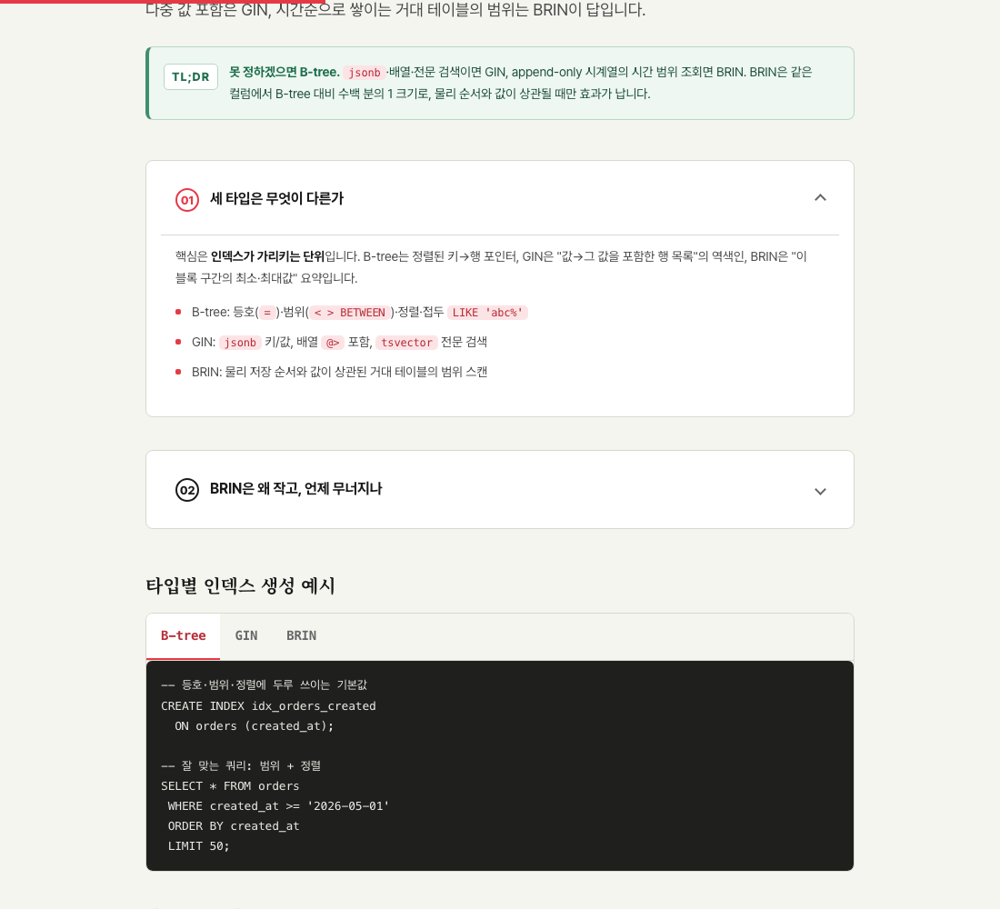
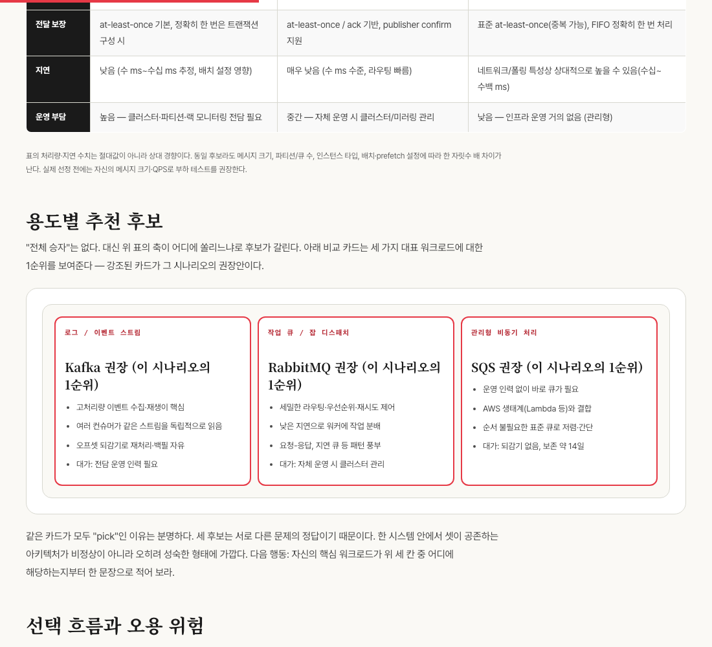
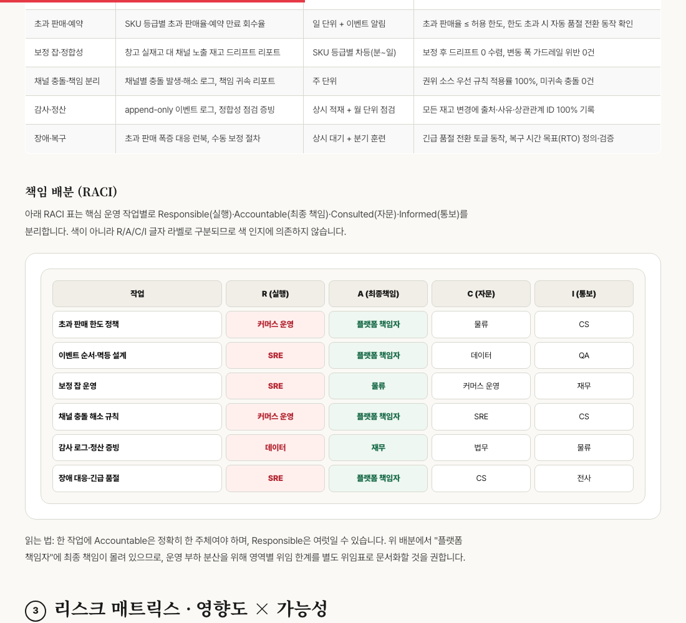

<div align="center">


# 🎨 Adaptive HTML Final

[](skills/adaptive-html-final)
[](skills/adaptive-html-final/CHANGELOG.md)
[](#-14개-모드)
[](#️-비주얼-프로파일)
[](#-최근-업데이트)
[](#️-비주얼-프로파일) [](#️-비주얼-프로파일)
[](#)
[](#-품질-게이트)
[](AGENTS.md)
[](skills/adaptive-html-final/scripts/render_visual_svg.py)

**입력 자료를 14개 모드로 라우팅해 전문가급 한국어 HTML 콘텐츠를 만드는 단일 통합 스킬 — GitHub 저장소 분석, 3-테마(라이트·화이트·다크), 비주얼 프로파일(위젯형·도식형·자동) 선택**

URL·PDF·텍스트·메모·기술 문서·블로그 초안·`SKILL.md`/`.skill`·GitHub 저장소 URL을 받아 학습자료, 전문가 리포트, GitHub 저장소 분석, 아티클, 교육 모듈, 블로그 원고, SEO 대시보드, 플랫폼 변환, 스킬 감사, 레퍼런스, 비교, 케이스 스터디, 랜딩, 체크리스트로 변환합니다.

[Overview](#-overview) · [최근 업데이트](#-최근-업데이트) · [모드](#-14개-모드) · [비주얼 프로파일](#️-비주얼-프로파일) · [쇼케이스 갤러리](#️-쇼케이스-갤러리) · [스킬 구조](#️-스킬-구조) · [사용법](#-사용법)

</div>

---

## 📖 Overview

`adaptive-html-final`은 `html-for-beginners` → `adaptive-html-blog-writer` → `adaptive-html-learning-ultimate` 계열을 하나로 합친 **최종 통합본**입니다. 단순 HTML 변환기가 아니라, 입력을 분석해 **목적별 정보 구조**로 재구성하는 파이프라인을 실행합니다.

```text
┌──────────┐   ┌─────────────────────┐   ┌────────────┐   ┌──────────┐
│ 입력 분석 │ ─▶│ 사실/해석/추론/확인필요 │ ─▶│ 독자 수준 판단 │ ─▶│ 모드 선택 │
└──────────┘   └─────────────────────┘   └────────────┘   └────┬─────┘
                                                                │
   ┌────────────┐   ┌──────────────────┐   ┌────────────┐   ┌──▼───────┐
   │ 파일/링크 제시 │◀─ │ 품질 게이트 검수    │◀─ │ editorial 렌더 │◀─ │ 레이아웃 선택 │
   └────────────┘   └──────────────────┘   └────────────┘   └──────────┘
```

| 원칙 | 내용 |
|---|---|
| 사실성 | 확인되지 않은 최신 정보·수치·가격·날짜는 단정하지 않고 `확인 필요`로 표시 |
| 무 JS | 외부/동작 JavaScript 미사용 (JSON-LD 메타데이터만 허용) |
| 단일 HTML | 코어 CSS(theme·components·visual-components·layouts·print)와 조건부 자산을 inline으로 포함한 자기완결 HTML + 합본 해시 마커 |
| **3-테마** | `#ahf-light` / `#ahf-white` / `#ahf-dark` 라디오 세그먼트 스위처 기반 CSS-only 테마. 기본 라이트, 완전 화이트, proper-black 다크 |
| **비주얼 프로파일** | 기동 시 `widget`(인터랙티브 위젯) / `diagram`(SVG→HTML 도식) / `auto`(둘 다, 기본) 선택 — 코어 공유, 프로파일이 라이브러리만 게이트 |
| **두 위젯 라이브러리** | CSS 뷰 위젯 `wg-01~20`(인터랙션) + SVG→HTML 템플릿 `vt-` 21종(본문 삽입 도식), 둘 다 무 JS·네임스페이스 격리 |
| 크로스-에이전트 결정론 | 루트 [`AGENTS.md`](AGENTS.md)가 결정론 진입점 — Claude Code·Codex·Gemini가 동일 인자로 동일 출력. 정적 게이트 `validate_output.py --profile` |
| 접근성 | `lang="ko"` · skip link(`#main`) · 단일 `h1` · `:focus-visible` · `prefers-reduced-motion` · AA 대비 |
| editorial DNA | 오프화이트 배경, Pretendard + Noto Serif KR, 의미 박스, h2 빨간 원번호 |

---

## 🆕 최근 업데이트

### v5.3.0 (2026-06-06) — GitHub Analysis 14번째 모드 추가

> **전문가 전략 한 줄 결론:** GitHub 저장소 분석은 README 재요약이 아니라 “이 저장소를 이해·실행·채택·감사해도 되는가?”를 판단하게 만드는 실사 리포트다. `github_analysis`는 verdict, quickstart, repo health, file tour, security/license, risk matrix, next actions를 질문 중심 목차로 재구성한다.

| 영역 | 변경 내용 |
|---|---|
| 신규 모드 | `github_analysis` — GitHub 저장소 URL/`owner/repo` 입력을 사용자 질문 중심 HTML 리포트로 변환 |
| 레이아웃 | `assets/layouts/github-analysis.html`, `.layout-github` CSS, repo signal/grid/card 클래스 추가 |
| 결정표 | SKILL.md §0.6, AGENTS.md §3, `references/mode-selection.md`를 14모드로 동기화 |
| 시각 매핑 | vt 1순위 `hero-map`, 보강 `quality-gate`·`file-tour`·`risk-matrix`·`timeline`·`decision-tree`; wg 보강 `wg-11`·`wg-04`·`wg-14`·`wg-16` |
| 전략 문서 | `references/github-analysis-system.md`, `recipes/github-analysis.prompt.md`, 개발 계획 `dev-plan/implement_20260606_003800.md` 추가 |

> 기존 `output/adaptive-html-final-13-topics-20260605_083433/`는 v5.2.3 기준 13-topic 캐노니컬 산출물로 유지합니다. 14-mode 신규 쇼케이스 재생성은 후속 작업입니다.

### v5.2.1 → v5.2.3 (2026-06-05) — 캐노니컬 산출물 정련 + 전문가 팀 콘텐츠 보강 + 가독성 승격

> **전문가 리뷰 한 줄 결론:** 스킬 본체(13모드·3프로파일·무 JS·정적 게이트 3층)는 그대로 견고하고, 이번 차수는 **게이트를 완전 통과하는 단일 캐노니컬 산출물**(`13-topics`)을 디자인·접근성·콘텐츠 모든 면에서 출시 등급으로 끌어올렸다. 결함은 본체가 아니라 "전시 자산"에 몰려 있었고, 그 적자를 해소했다.

**1) 스킬 자산 승격 (v5.2.0 → v5.2.1)**

| 자산 | 변경 |
|---|---|
| `assets/body-icons.css` | `:has()` 기반 icon+text 정렬 규칙 — `.label`/`h1`/`h2`/`h3`가 body-icon을 직접 자식으로 가지면 **왼쪽 아이콘 + 세로중앙 + 일정 간격**으로 정렬(무 JS) |
| `assets/theme.css` | `.header` 48rem 단일측정 캡 해제 → 헤더가 컨테이너 폭(아래 섹션과 동일)으로 정렬 |
| 버전/이력 | `manifest.json`·`SKILL.md`·`CHANGELOG.md` 5.2.1 동기화, 코어 해시 `78f7c0…` → `3b4887…` |

**2) 13-topics 캐노니컬 산출물 정련 (게이트 OK 유지)**

- **콘텐츠**: 13명 전문가 에이전트(아키텍트·에디터·DB 교육설계자·SEO 전략가·SRE·보안 레퍼런스 작성자 등)가 **모든 얕은 섹션을 보강** — 페이지당 표(전부 `<caption>`)·카드그리드·코드 예시·콜아웃·체크리스트를 대폭 확충(각 191–204KB).
- **아이콘**: 번호 헤딩 130개 전부 아이콘 보유(누락 43개 맥락 배정 보강), 헤딩 아이콘 42px, 라이트/화이트/다크 테마 적응 박스.
- **레이아웃**: 모든 콘텐츠 섹션을 카드 뷰로 통일, 이중 박스/그라데이션 정리, a11y·impact 카드 간격·표 첫 열 줄바꿈 등 미세 가독성 보정.
- **검증**: `validate_output.py` **OK**, `test_governance_gates.py` **25/25**, 14개 HTML 전부 h1 1개·표 caption 100%·HTTP 200.

**3) 문서 정리 (저장소 위생)**

- 루트의 v4~v5.0 시점 고정 리뷰/분석/계획 6종을 [`docs/archive/`](docs/archive/README.md)로 이관(SUPERSEDED 배지 + 색인).
- 루트는 현행 3종만 유지: `README.md` · [`AGENTS.md`](AGENTS.md)(머신 고정 절대경로 → 저장소 루트 상대경로로 정정) · [`Guide.md`](Guide.md)(v5.2.1 전면 재작성).

**4) 추가 스킬 승격 (v5.2.2·v5.2.3 — 조건부 자산만, 코어 해시 불변)**

13-topics에서 반복 적용하던 보편적 개선을 스킬 기본값으로 올려, 향후 모든 출력에 자동 적용되게 했습니다.

| 버전 | 자산 | 승격 내용 |
|---|---|---|
| v5.2.2 | `body-icons.css` | 아이콘 박스 배경 **테마 적응**(white=순백/dark=카드 표면) — 다크에서 흰 박스로 떠 보이던 보편 결함 해소. `.lede-note` 컨텍스트 라벨 아이콘 정렬 |
| v5.2.3 | `editorial-patterns.css` | **가독성 승격** — `.a11y-grid`/`.a11y-card`/`.a11y-points` 줄·카드 간격 확대, `.impact-card` 아이콘 하단 여백 |

> 갤러리 취향·출력 전용 디자인(헤더 kicker 폰트·전 섹션 카드 뷰·core-insight 재배경 등)은 전역 기본값화 시 모든 출력 모양이 바뀌므로 의도적으로 13-topics page-local로만 유지했습니다.

> ⚠️ 알려진 한계: 본 저장소는 정적 게이트가 매우 엄격하지만 **CI(GitHub Actions)가 아직 없어** 과거 `output/`·`examples/` 다수는 코어 CSS 진화로 해시가 드리프트해 현재 게이트에서 `FAILED`가 납니다. **신뢰 기준선은 항상 `13-topics`** 산출물입니다.

---

`adaptive-html-final`은 2026-06-05 기준 **v5.2.0**으로 갱신되었습니다. 핵심은 "기존 13모드/3프로파일 구조는 유지하면서, 실제 브라우저 캡처에서 발견된 가독성·레이아웃 회귀를 스킬 자산에 직접 반영"한 것입니다.

| 영역 | 변경 내용 |
|---|---|
| 3-테마 시스템 | `assets/theme-dark.css`에 라이트(크림 기본)·화이트(순백)·다크(proper-black) 토큰을 통합하고, `#theme-toggle` 체크박스를 `name="ahf-theme"` 라디오 3-세그먼트로 교체. 전부 `:has()` 기반 무 JS |
| 모바일 테마바 | 모바일에서는 `.ahf-themebar`를 문서 흐름 안의 static 컨트롤로 전환해 표·체크리스트·메타 칩을 가리지 않도록 보정 |
| CSS 무결성 | 출력 폴더의 `sources/assets/*.css`, `sources/css-integrity.json`, `sources/adaptive-html-final-manifest.json`을 현재 스킬 자산과 동기화. 코어 해시 `3b4887c281115b3c7a5ade783cd05464c14c043e8f888615b4c069fce0029b09` (v5.2.2·v5.2.3은 조건부 자산만 변경 → **코어 해시 불변**) |
| 검증기 강화 | `scripts/validate_output.py`가 source manifest 내용 불일치, stale CSS snapshot, legacy `#theme-toggle`, 외부/동작 JS, table caption, h1/#main 구조를 더 엄격히 검사 |
| 실제 화면 검증 | Playwright 기준 390px 모바일 / 1440px 데스크톱, 라이트·화이트·다크 조합으로 주요 페이지를 재촬영하고 가로 넘침·텍스트 대비·테마 컨트롤 겹침을 확인 |

### 이번 회귀 수정 내역

| 대상 | 수정 |
|---|---|
| `wg-01` three-code-approaches | 카드 가로 넘침과 코드 줄 잘림을 막도록 코드 블록 wrapping/overflow 규칙 보강 |
| `wg-12` postmortem timeline | `SEV-2` 칩 대비를 `--link-on-dark` 배경 + dark text로 보정, 표 body row header가 전역 `th` 다크 스타일을 먹어 검은 칸으로 튀는 문제 수정 |
| `wg-16` implementation-plan | 출시 계획 표 row header 텍스트가 안 보이던 문제를 `background:var(--card)`/테마 추종 스타일로 보정 |
| `vt-02` decision-tree | 3카드 + 2화살표 구조를 5컬럼으로 고정해 comparison 모드의 의사결정 트리가 깨지던 문제 수정 |
| `vt-21` soft-workflow-map | 다크모드에서 카드 제목·본문 대비가 낮아지는 케이스를 보정 |
| `.try` final action | comparison/case 모드의 마지막 실행 섹션이 라이트/화이트에서도 검은 패널로 보이던 문제를 테마 추종 카드로 조정 |
| `.table-scroll` | 모바일 표 폭이 문서 전체를 밀어내지 않도록 `max-width:100%`와 수평 스크롤 래퍼 규칙 추가 |

### 최신 로컬 산출물

이번 점검의 최신 13개 주제 산출물은 [`output/adaptive-html-final-13-topics-20260605_083433/`](output/adaptive-html-final-13-topics-20260605_083433/)에 있으며, **웹 라이브 갤러리**는 [쇼케이스 갤러리](#️-쇼케이스-갤러리)에서 index + 13개 모드를 바로 열 수 있습니다.

| 항목 | 값 |
|---|---|
| 프로파일 | `auto` |
| 스킬 버전 | **`5.2.3`** |
| HTML 수 | `index.html` + 13개 페이지 |
| 콘텐츠 | 13명 전문가 에이전트가 모든 얕은 섹션 보강 (페이지당 표·카드·코드·콜아웃·체크리스트 대폭 확충, 표 caption 100%) |
| 검증 | `validate_output.py`: **`OK`**, `test_governance_gates.py`: **`25/25 checks passed`** |
| 코어 CSS 해시 | `3b4887c281115b3c7a5ade783cd05464c14c043e8f888615b4c069fce0029b09` |

```bash
# 최신 산출물 검증
python3 skills/adaptive-html-final/scripts/validate_output.py \
  output/adaptive-html-final-13-topics-20260605_083433 \
  --skill-dir skills/adaptive-html-final

# 로컬 브라우저 확인
python3 -m http.server 8770 -d output/adaptive-html-final-13-topics-20260605_083433
# → http://127.0.0.1:8770/index.html
```

---

## 📦 14개 모드

요청에서 여러 트리거가 감지되면 우선순위가 높은 모드가 선택되며, 사용자가 모드를 명시하면 그 지시가 우선합니다.

| # | Mode | 언제 쓰나 | Layout |
|--:|---|---|---|
| 1 | `skill_audit` | SKILL.md/.skill 분석·개선·통합 | `skill-audit-report.html` |
| 2 | `platform_blog` | 티스토리·벨로그·네이버·워드프레스 변환 | `platform-adaptation.html` |
| 3 | `seo_dashboard` | 제목·메타·태그·검색 의도 설계 | `seo-dashboard.html` |
| 4 | `education_html` | 강의·온보딩·실습·퀴즈 | `course-module.html` |
| 5 | `github_analysis` | GitHub 저장소 URL/owner/repo 실사·README·이슈·릴리스·라이선스 분석 | `github-analysis.html` |
| 6 | `expert_html` | 전문가 리포트·아키텍처·리스크 진단 | `expert-report.html` |
| 7 | `article_html` | 공개 아티클·매거진형 글 | `magazine-article.html` |
| 8 | `blog_writer` | 블로그 글·포스팅·경험담 | `personal-blog-essay.html` |
| 9 | `beginner_html` | 초보자 설명·비유·용어 풀이 | `beginner-learning.html` |
| 10 | `reference_html` | 레퍼런스·매뉴얼·API 문서 | `reference-manual.html` |
| 11 | `comparison_html` | 비교·장단점·선택 기준 | `comparison-matrix.html` |
| 12 | `case_study_html` | 사례 연구·회고·프로젝트 기록 | `case-study.html` |
| 13 | `landing_brief_html` | 소개·랜딩·요약 페이지 | `landing-brief.html` |
| 14 | `checklist_playbook` | 체크리스트·운영 절차·플레이북 | `checklist-playbook.html` |

---

## 🖼️ 쇼케이스 갤러리

### 🌐 라이브 캐노니컬 갤러리 — 13-topics (v5.2.3, 게이트 OK)

현재 스킬 **v5.2.3**의 정적 품질 게이트를 **0 issue로 완전 통과**하고, 13명 전문가 에이전트가 모든 얕은 섹션을 보강한 **캐노니컬 산출물**입니다. 메인 화면과 13개 모드 페이지를 웹에서 바로 볼 수 있습니다.

**▶ 메인 화면:** **[13개 모드 신규 주제 쇼케이스 (index)](https://coreline-ai.github.io/skills-html-showcase/output/adaptive-html-final-13-topics-20260605_083433/index.html)**

| # | Mode | 주제 | 열기 |
|--:|---|---|---|
| 01 | `beginner_html` | 로컬 RAG 개인 지식 금고 입문 | [▶ 보기](https://coreline-ai.github.io/skills-html-showcase/output/adaptive-html-final-13-topics-20260605_083433/pages/01-local-rag-personal-knowledge-vault.html) |
| 02 | `expert_html` | AI 코드 리뷰 게이트웨이 운영 모델 | [▶ 보기](https://coreline-ai.github.io/skills-html-showcase/output/adaptive-html-final-13-topics-20260605_083433/pages/02-ai-code-review-gateway-operating-model.html) |
| 03 | `article_html` | 작은 팀의 운영 문서와 제품 속도 | [▶ 보기](https://coreline-ai.github.io/skills-html-showcase/output/adaptive-html-final-13-topics-20260605_083433/pages/03-small-team-operating-docs-product-speed.html) |
| 04 | `education_html` | PostgreSQL 쿼리 플랜 읽기 3주 교육 | [▶ 보기](https://coreline-ai.github.io/skills-html-showcase/output/adaptive-html-final-13-topics-20260605_083433/pages/04-postgres-query-plan-3week-course.html) |
| 05 | `blog_writer` | 두 번째 뇌를 다시 작게 만든 30일 회고 | [▶ 보기](https://coreline-ai.github.io/skills-html-showcase/output/adaptive-html-final-13-topics-20260605_083433/pages/05-small-second-brain-30days-retro.html) |
| 06 | `seo_dashboard` | AI 회의록 자동화 검색 허브 | [▶ 보기](https://coreline-ai.github.io/skills-html-showcase/output/adaptive-html-final-13-topics-20260605_083433/pages/06-ai-meeting-notes-automation-seo.html) |
| 07 | `platform_blog` | 컨퍼런스 발표를 플랫폼별 글로 변환 | [▶ 보기](https://coreline-ai.github.io/skills-html-showcase/output/adaptive-html-final-13-topics-20260605_083433/pages/07-conference-talk-platform-adaptation.html) |
| 08 | `skill_audit` | 배포 체크리스트 생성 스킬 감사 | [▶ 보기](https://coreline-ai.github.io/skills-html-showcase/output/adaptive-html-final-13-topics-20260605_083433/pages/08-release-checklist-skill-audit.html) |
| 09 | `reference_html` | Webhook 서명 검증 레퍼런스 | [▶ 보기](https://coreline-ai.github.io/skills-html-showcase/output/adaptive-html-final-13-topics-20260605_083433/pages/09-webhook-signature-verification-reference.html) |
| 10 | `comparison_html` | 벡터 검색 선택 기준 비교 | [▶ 보기](https://coreline-ai.github.io/skills-html-showcase/output/adaptive-html-final-13-topics-20260605_083433/pages/10-vector-db-pgvector-search-engine-comparison.html) |
| 11 | `case_study_html` | 예약 알림 지연 사고 케이스 스터디 | [▶ 보기](https://coreline-ai.github.io/skills-html-showcase/output/adaptive-html-final-13-topics-20260605_083433/pages/11-reservation-reminder-delay-case-study.html) |
| 12 | `landing_brief_html` | LocalNote 팀 지식관리 랜딩 브리프 | [▶ 보기](https://coreline-ai.github.io/skills-html-showcase/output/adaptive-html-final-13-topics-20260605_083433/pages/12-localnote-team-knowledge-landing.html) |
| 13 | `checklist_playbook` | AI 기능 출시 전 안전성 플레이북 | [▶ 보기](https://coreline-ai.github.io/skills-html-showcase/output/adaptive-html-final-13-topics-20260605_083433/pages/13-ai-feature-release-safety-playbook.html) |

> 🌐 라이브(GitHub Pages): **[index 열기](https://coreline-ai.github.io/skills-html-showcase/output/adaptive-html-final-13-topics-20260605_083433/index.html)** · 상단 테마 스위처로 라이트·화이트·다크 전환 · 로컬 확인은 `python3 -m http.server 8788` 후 `127.0.0.1:8788/...`

### 🧩 스킬 적용용 단일 템플릿 HTML 미리보기 (final_20260604)

스킬의 모든 자산·패턴을 한 파일에 담은 **단일 템플릿 HTML** 2종입니다. 클릭하면 전체 화면으로 확인할 수 있습니다.

<table>
<tr>
<td width="50%" valign="top"><b><a href="https://coreline-ai.github.io/skills-html-showcase/output/final_20260604/index.html">▶ Skill Template HTML (와이드·3-테마)</a></b><br><code>final_20260604/index.html</code><br>13모드·프로파일·3-테마·vt/wg·soft-shape·workflow 도판·body-icon을 한 페이지에 집약한 적용용 마스터 템플릿. 상단 테마 스위처로 라이트/화이트/다크 전환.</td>
<td width="50%" valign="top"><b><a href="https://coreline-ai.github.io/skills-html-showcase/output/final_20260604/index-beginner-width.html">▶ Skill Template HTML (beginner-width 변형)</a></b><br><code>final_20260604/index-beginner-width.html</code><br>본문 가독 폭(beginner-width)으로 조판한 변형본. 아이콘+텍스트 배치를 섹션 #37 컴팩트 아이콘 세트 기준으로 통일.</td>
</tr>
</table>

> 🌐 라이브(GitHub Pages): **[index.html](https://coreline-ai.github.io/skills-html-showcase/output/final_20260604/index.html)** · **[index-beginner-width.html](https://coreline-ai.github.io/skills-html-showcase/output/final_20260604/index-beginner-width.html)** · 로컬 확인은 `python3 -m http.server 8788`(캐시 우회 `?v=`)

### 🎞️ 디자인 썸네일 미리보기 (v4 데모 — 참고용)

아래는 디자인 시스템을 한눈에 보는 **v4 스크린샷 데모**입니다(주제는 13-topics와 다름). 캐노니컬 라이브는 위 13-topics 갤러리를 사용하세요. 프로파일별 골든은 [비주얼 프로파일](#️-비주얼-프로파일) 참조.

<table>
<tr>
<td width="50%"><a href="https://coreline-ai.github.io/skills-html-showcase/output/adaptive-html-final-showcase-v4/pages/01-beginner-passkeys-webauthn.html"></a><br><b>01 · <code>beginner_html</code></b><br>패스키와 WebAuthn, 비밀번호 없는 로그인 입문</td>
<td width="50%"><a href="https://coreline-ai.github.io/skills-html-showcase/output/adaptive-html-final-showcase-v4/pages/02-expert-eu-ai-act-governance.html"></a><br><b>02 · <code>expert_html</code></b><br>EU AI Act 기반 생성형 AI 거버넌스 리포트</td>
</tr>
<tr>
<td width="50%"><a href="https://coreline-ai.github.io/skills-html-showcase/output/adaptive-html-final-showcase-v4/pages/03-article-ai-agent-ux-trust.html"></a><br><b>03 · <code>article_html</code></b><br>AI 에이전트 UX의 신뢰 설계 (매거진 아티클)</td>
<td width="50%"><a href="https://coreline-ai.github.io/skills-html-showcase/output/adaptive-html-final-showcase-v4/pages/04-education-github-actions-security-ci.html"></a><br><b>04 · <code>education_html</code></b><br>GitHub Actions 보안 CI 교육 모듈 (퀴즈 포함)</td>
</tr>
<tr>
<td width="50%"><a href="https://coreline-ai.github.io/skills-html-showcase/output/adaptive-html-final-showcase-v4/pages/05-blog-local-ai-workstation.html"></a><br><b>05 · <code>blog_writer</code></b><br>로컬 AI 워크스테이션 구축기 (경험담)</td>
<td width="50%"><a href="https://coreline-ai.github.io/skills-html-showcase/output/adaptive-html-final-showcase-v4/pages/06-seo-rag-vs-finetuning.html"></a><br><b>06 · <code>seo_dashboard</code></b><br>RAG vs Fine-tuning SEO 대시보드</td>
</tr>
<tr>
<td width="50%"><a href="https://coreline-ai.github.io/skills-html-showcase/output/adaptive-html-final-showcase-v4/pages/07-platform-rag-post-platforms.html"></a><br><b>07 · <code>platform_blog</code></b><br>RAG 글을 4개 플랫폼용으로 변환</td>
<td width="50%"><a href="https://coreline-ai.github.io/skills-html-showcase/output/adaptive-html-final-showcase-v4/pages/08-skill-audit-adaptive-html-final.html"></a><br><b>08 · <code>skill_audit</code></b><br>adaptive-html-final 스킬 자체 감사 리포트</td>
</tr>
<tr>
<td width="50%"><a href="https://coreline-ai.github.io/skills-html-showcase/output/adaptive-html-final-showcase-v4/pages/09-reference-openai-responses-api.html"></a><br><b>09 · <code>reference_html</code></b><br>OpenAI Responses API 실무 레퍼런스</td>
<td width="50%"><a href="https://coreline-ai.github.io/skills-html-showcase/output/adaptive-html-final-showcase-v4/pages/10-comparison-postgresql-mysql-sqlite.html"></a><br><b>10 · <code>comparison_html</code></b><br>PostgreSQL vs MySQL vs SQLite 선택 기준</td>
</tr>
<tr>
<td width="50%"><a href="https://coreline-ai.github.io/skills-html-showcase/output/adaptive-html-final-showcase-v4/pages/11-case-cloudflare-thanksgiving-incident.html"></a><br><b>11 · <code>case_study_html</code></b><br>Cloudflare 2023 보안 사고 회고</td>
<td width="50%"><a href="https://coreline-ai.github.io/skills-html-showcase/output/adaptive-html-final-showcase-v4/pages/12-landing-ai-knowledge-hub.html"></a><br><b>12 · <code>landing_brief_html</code></b><br>사내 AI 지식 허브 랜딩 브리프</td>
</tr>
<tr>
<td width="50%"><a href="https://coreline-ai.github.io/skills-html-showcase/output/adaptive-html-final-showcase-v4/pages/13-checklist-web-accessibility-release.html"></a><br><b>13 · <code>checklist_playbook</code></b><br>웹 접근성 배포 전 30분 체크리스트</td>
<td width="50%" valign="top"><br><b>＋ 추가 데모</b><br>· <a href="https://coreline-ai.github.io/skills-html-showcase/output/adaptive-html-final-showcase-v4/pages/14-visual-template-system.html">14 · Visual Template System</a> (8000×6000 SVG 인포그래픽)<br>· <a href="https://coreline-ai.github.io/skills-html-showcase/output/adaptive-html-final-showcase-v4/pages/15-svg-template-gallery.html">15 · SVG 템플릿 20종 갤러리</a><br>· <a href="https://coreline-ai.github.io/skills-html-showcase/output/final_20260604/index.html">final_20260604 · Skill Template HTML</a> (스킬 적용용 단일 템플릿 HTML)</td>
</tr>
</table>

> 🌐 라이브(GitHub Pages): **[v4 데모 index 열기](https://coreline-ai.github.io/skills-html-showcase/output/adaptive-html-final-showcase-v4/index.html)** · 로컬은 `python3 -m http.server 8788` 후 `127.0.0.1:8788/...`

---

## 🎚️ 비주얼 프로파일

스킬을 **기동할 때 비주얼 스타일을 고를 수 있습니다.** 코어(14모드 라우터·레이아웃·코어 CSS 5종)는 100% 공유하고, 프로파일이 *어느 라이브러리·삽입 단계·CSS 번들*을 쓸지만 게이트합니다. 세 프로파일 모두 **외부/동작 JS 0**.

<table>
<tr>
<td width="33%" align="center"><b>🧩 <code>widget</code> (= <code>style=v5</code>)</b></td>
<td width="33%" align="center"><b>📊 <code>diagram</code> (= <code>style=v6</code>)</b></td>
<td width="33%" align="center"><b>🔀 <code>auto</code> (기본)</b></td>
</tr>
<tr>
<td><a href="https://coreline-ai.github.io/skills-html-showcase/output/adaptive-html-final-showcase-v5/pages/04-education-postgres-indexing.html"></a></td>
<td><a href="https://coreline-ai.github.io/skills-html-showcase/output/adaptive-html-final-showcase-diagram/pages/10-message-queue-kafka-rabbitmq-sqs.html"></a></td>
<td><a href="https://coreline-ai.github.io/skills-html-showcase/output/adaptive-html-final-showcase-v6/pages/02-realtime-inventory-sync-operating-model.html"></a></td>
</tr>
<tr>
<td valign="top">CSS 뷰 위젯 <code>wg-01~20</code> — 탭·플로우·아코디언 등 <b>인터랙티브</b> 컴포넌트(CSS-only). 코어5 + <code>widgets.css</code>.</td>
<td valign="top">SVG→HTML 템플릿 <code>vt-</code> 21종 — 리스크 매트릭스·비교 카드·타임라인·soft workflow map 등 본문 삽입 <b>정적 도식</b>. 코어5 + <code>visual-html.css</code>.</td>
<td valign="top">둘 다(vt- 1순위 + wg- 보강). 현행 기본값이자 <b>회귀-0 기준선</b>. 코어5 + 두 라이브러리.</td>
</tr>
</table>

| 프로파일 | 별칭 | 라이브러리 (markup) | CSS 번들 | 골든 쇼케이스 |
|---|---|---|---|---|
| `widget` | `style=v5` | CSS 뷰 위젯 `wg-` | 코어5 + `widgets.css` | [`showcase-v5`](https://coreline-ai.github.io/skills-html-showcase/output/adaptive-html-final-showcase-v5) (정합화) |
| `diagram` | `style=v6` | SVG→HTML `vt-` | 코어5 + `visual-html.css` | [`showcase-diagram`](https://coreline-ai.github.io/skills-html-showcase/output/adaptive-html-final-showcase-diagram) (슬림) |
| `auto` (기본) | — | 둘 다 | 코어5 + `widgets.css` + `visual-html.css` | [`showcase-v6`](https://coreline-ai.github.io/skills-html-showcase/output/adaptive-html-final-showcase-v6) |

```bash
# 기동 인자로 선택 (별칭 v5/v6도 수용 · 미지정 시 auto)
adaptive-html-final  profile=widget      # 또는 style=v5
adaptive-html-final  profile=diagram     # 또는 style=v6
adaptive-html-final                      # 기본 auto

# 검증기는 출력의 sources/profile.json 을 자동 인지(또는 --profile)해
# 교차 누수(diagram에 wg- / widget에 vt-)를 차단한다
python3 skills/adaptive-html-final/scripts/validate_output.py <output_dir> \
  --skill-dir skills/adaptive-html-final --profile diagram
```

> 🤖 **크로스-에이전트 결정론**: 인자가 명시되면 Claude Code·Codex·Gemini가 동일 결과를 낸다(정규화 `profile=` 우선, 무효 토큰은 `invalid_profile` 실패). 비대화형(AGENTS.md 경유)은 미지정 시 무조건 `auto`. 분리 설계·검증 계획(아카이브)은 [`docs/archive/implement_visual_profile_separation.md`](docs/archive/implement_visual_profile_separation.md).

---

## 🏗️ 스킬 구조

### 디자인 시스템 (CSS 레이어)

```text
theme.css        색/폰트/폭 토큰(:root) · skip · focus-visible · reduced-motion   ← 코어 해시
components.css    term · analogy · danger · good · hero-analogy · try · tbl · faq · cta-box ...  ← 코어 해시
visual-components.css   figure.visual-figure (8000×6000 SVG 삽입 셸)               ← 코어 해시 · v4.2
layouts.css       14개 모드별 그리드/구조 (+ github-analysis 레이아웃 포함)              ← 코어 해시
print.css         인쇄 대응(print-color-adjust · break-inside)                    ← 코어 해시
widgets.css       CSS 뷰 위젯 wg-01~20 (탭·플로우·아코디언, 무 JS)  ← v4.4 · widget/auto 프로파일 조건부 인라인
visual-html.css   SVG→HTML 템플릿 vt- 21종 (본문 삽입 도식)        ← v4.5+ · diagram/auto 프로파일 조건부 인라인
body-icons.css    본문 아이콘 bi- 32종                                      ← 프로파일 무관 장식 자산
editorial-patterns.css  chronology/source/insight/a11y 등 본문 패턴 8종      ← 프로파일 무관 구조 자산
shape-visuals.css · workflow-visuals.css  soft-shape 36종 + workflow 도판 10종 ← 프로파일 무관 시각 앵커
theme-dark.css    CSS-only 3-테마 토큰 오버라이드 + 라디오 세그먼트 스위처       ← v5.2 · print 뒤 항상 인라인(코어 해시 제외)
```

> 코어 해시는 **5종**(theme·components·visual-components·layouts·print)의 합본 SHA-256(`adaptive-html-final-core-css-sha256` 마커)이며, `widgets.css`·`visual-html.css`·`theme-dark.css`는 해시 대상이 아닌 조건부/후행 인라인 자산이다.

### 비주얼 템플릿 시스템 (v4.2+)

목적형 정보는 외부 사진 검색이 아니라 **8000×6000 SVG 인포그래픽**을 기본값으로 직접 생성합니다.

| 구성 | 내용 |
|---|---|
| `visual-templates/*.svg.tpl` | hero-map · card-grid · decision-tree · quality-gate · timeline · matrix · checklist-flow (7종) |
| `scripts/render_visual_svg.py` | visual brief(JSON) → 8000×6000 SVG 렌더러 (**stdlib only**, 오프라인 동작) |
| `schemas/visual-brief.schema.json` | 시각 템플릿 입력 스키마 |
| 데모 | SVG 템플릿 [20종 갤러리](https://coreline-ai.github.io/skills-html-showcase/output/adaptive-html-final-showcase-v4/pages/15-svg-template-gallery.html) (risk-heatmap, sankey, treemap, user-journey 등) |

---

## 📁 프로젝트 구조

```text
skills-html-showcase/
├── skills/adaptive-html-final/        # 통합 스킬 + .skill 패키지
│   ├── SKILL.md                       # 라우터 · 워크플로우 · 품질 게이트
│   ├── manifest.json                  # name/version/modes/layouts/profiles/theme_system (v5.3.0)
│   ├── assets/                        # base.html · CSS · 위젯/도식/패턴/테마 자산 · 14개 레이아웃 골격
│   ├── references/                    # 모드/레이아웃/글쓰기/SEO/플랫폼/감사/비주얼 규칙
│   ├── recipes/       (14)            # 14개 모드별 대표 프롬프트
│   ├── schemas/       (3)             # blog-meta · quality-report · visual-brief
│   ├── tests/                         # 품질/레이아웃/시각회귀/접근성/거버넌스 게이트
│   ├── visual-templates/ (7)         # 8000×6000 SVG 템플릿
│   ├── scripts/                       # render_visual_svg.py · validate_output.py 등
│   └── examples/      (8)            # 예시 결과물
├── output/
│   ├── adaptive-html-final-showcase-v4/   # 13모드 쇼케이스 (canonical 13-mode 데모)
│   │   ├── pages/     (15)            # 13모드 + 비주얼 데모 + SVG 갤러리
│   │   └── media/svg-template-demos/ (20)  # 8000×6000 SVG 데모
│   ├── adaptive-html-final-13-topics-20260605_083433/ # ★ v5.2.3 게이트 완전 통과 캐노니컬 기준선(전문가 보강)
│   └── (playwright/ · qa-screenshots/ 는 .gitignore)
├── docs/
│   ├── screenshots/   (13)           # 본 README용 쇼케이스 썸네일
│   └── archive/                      # v4~v5.0 시점 고정 리뷰/분석/계획 기록 (SUPERSEDED)
├── demo/ · orginal_skill/            # 이전 계열 데모 · 원본 스킬
├── AGENTS.md                         # 크로스-에이전트 결정론 진입점
└── Guide.md                          # 사용 가이드 (v5.3.0+)
```

---

## 🔬 스킬 상세 분석

[`docs/archive/ANALYSIS_adaptive-html-final.md`](docs/archive/ANALYSIS_adaptive-html-final.md) — 7개 전문가 에이전트 병렬 분해 + 쟁점 적대적 검증 + 교차 통합 감사로 도출한 정밀 분석 보고서입니다(v4.5.0 시점, 아카이브). v4~v5.0 전 리뷰·계획 기록은 [`docs/archive/`](docs/archive/README.md)에 시점 배지와 함께 보관됩니다.

### 검증으로 입증된 강점

| 항목 | 결과 |
|---|---|
| skip link ↔ `<main id="main">` | **14 / 14** (접근성 회귀 가드로 고정) |
| 단일 `h1` 원칙 | 14 / 14 레이아웃 계약 |
| 외부 동작 JS | **0건** |
| 미정의 CSS 클래스 | **0개** (레이아웃↔CSS 차집합 0) |
| manifest ↔ 디스크 레이아웃 매핑 | 차집합 0 |
| recipes 커버리지 | 14 / 14 모드 |
| blog-writer 상세 규칙 흡수 | 8 / 8 (제목 4계열·도입부 3유형·본문 밀도·톤 매핑·100점·메타·플랫폼·박스) |

### 버전 진화

| 버전 | 핵심 |
|---|---|
| `v4.0.0` | ultimate(13모드 라우터) + blog-writer(블로그/SEO 규칙) **통합** · skip link 버그 수정 |
| `v4.1.0` | 7-전문가 분석 P0~P2 자동 패치 — 모드 ID 통일, recipes 13/13, 스키마 보강, 디자인 토큰 정리(AA 대비·print·reduced-motion) |
| `v4.2.x` | **Visual Template System** 도입 — 8000×6000 SVG 인포그래픽 7종 + stdlib 렌더러 + quality-gate 레이아웃 보정 |
| `v4.3.3` | 13모드 전수 캡쳐 감사 기반 **반응형 폴리시** — dark CTA 대비, 플랫폼 그리드, 모바일 표 밀도, case timeline 구조 + 정적 게이트 |
| `v4.4.0` | **뷰 위젯 시스템** 편입 — CSS 뷰 위젯 `wg-01~20`(무 JS, `widgets.css` + 위젯 템플릿) + 위젯 정적 게이트, 전문가 리뷰 P0/P1 마감 |
| `v4.5.0` | **SVG→HTML 템플릿** 편입(`vt-` 20종, `visual-html.css`) + **하네스 정형화**(루트 `AGENTS.md` 결정론 진입점) + **비주얼 프로파일**(`widget`·`diagram`·`auto`) 도입 — 검증기 `--profile`·교차 누수 게이트·`profiles` 매니페스트 |
| `v5.0.0` | 코어 프리미티브 업그레이드 + 토큰 전용 다크 테마 도입. CTA/SERP/platform primitive를 기존 정본 클래스 안에서 강화 |
| `v5.1.0` | proper-black 다크 보정. vt/wg 표면 색, CTA 태그, 회색 리터럴 토큰화, OS/토글 조합 회귀를 실제 캡처로 검증 |
| `v5.2.0` | **CSS-only 3-테마 시스템**(라이트·화이트·다크) + 라디오 세그먼트 스위처. CSS snapshot/source manifest/legacy toggle 검증 강화, `wg-12`·`wg-16`·`vt-02`·`vt-21`·`.try` 회귀 패치 |
| `v5.2.1` | body-icon `:has()` icon+text 정렬 + 헤더 폭 캡 해제(스킬 자산). **13-topics 캐노니컬 산출물**을 13명 전문가 에이전트로 전 섹션 콘텐츠 보강하고 아이콘·테마·레이아웃 정련(게이트 OK·25/25) |
| `v5.2.2` | body-icons.css에 **아이콘 박스 테마 적응**(white=순백/dark=카드 표면) + lede-note 라벨 정렬 승격. 조건부 자산만 변경 → 코어 해시 불변 |
| `v5.2.3` | editorial-patterns.css **가독성 승격** — a11y 카드/그리드/포인트 간격, impact 카드 아이콘 하단 여백. 조건부 자산만 변경 → 코어 해시 불변 |
| `v5.3.0` | **GitHub Analysis 14번째 모드** — `github_analysis`, `github-analysis.html`, `.layout-github`, GitHub 분석 전략/recipe/검증 문서 추가 |

> 전체 변경 이력: [`skills/adaptive-html-final/CHANGELOG.md`](skills/adaptive-html-final/CHANGELOG.md) · 프로파일 분리 계획(아카이브): [`docs/archive/implement_visual_profile_separation.md`](docs/archive/implement_visual_profile_separation.md)

---

## ✅ 품질 게이트

모든 산출물이 통과해야 하는 최소 조건입니다. (`tests/quality-checklist.md`, `tests/accessibility-checklist.md`)

- [x] 요청 목적과 선택 모드 일치 + 모드별 필수 블록 존재
- [x] `lang="ko"` · viewport · `<title>` · meta description
- [x] `h1` 정확히 1개 · 주요 `h2`에 `.h2-sub`(모드 한정 권장)
- [x] `#main` skip link target · `:focus-visible` · `prefers-reduced-motion`
- [x] 모바일 1컬럼 전환 · 표는 `.tbl` 래퍼(가로 스크롤)
- [x] 3-테마 스위처는 `name="ahf-theme"` 라디오 계약을 사용하고 legacy `#theme-toggle` 없음
- [x] 외부/동작 JS 0 · 확인되지 않은 최신 정보 단정 금지 · 출처 추측 금지
- [x] 교육용=퀴즈+정답 · 전문가용=리스크+검증 · 블로그/SEO=제목+메타+태그 · 감사=개선본
- [x] 비주얼: 8000×6000 캔버스 · `figure`+`figcaption` · 의미 있는 `alt` · 캔버스 잘림 없음

> 🟢 **캐노니컬 빌드 기준선**: `output/adaptive-html-final-13-topics-20260605_083433/`(HTML 14개)는 현재 스킬 **v5.2.3**의 정적 품질 게이트를 **0 issue로 완전 통과**합니다 — 빌드 완성도 검증 기준선(13명 전문가 보강).

```bash
# 재현 (저장소 루트에서)
python3 skills/adaptive-html-final/scripts/validate_output.py \
  output/adaptive-html-final-13-topics-20260605_083433 \
  --skill-dir skills/adaptive-html-final   # → 마지막 줄 OK
```

> 참고: v4~v5.0 시점에 생성된 일부 `output/`·`examples/`는 그 후 코어 CSS가 진화해 해시가 드리프트하면 현재 게이트에서 `FAILED`가 날 수 있습니다(시점 고정 산출물). 최신 기준선은 항상 위 13-topics 디렉토리입니다.

---

## ⚡ 사용법

### 스킬로 콘텐츠 생성 요청

```text
[입력 자료/URL/파일/주제]를 [목적/독자]용 [모드]로 만들어줘.
출력은 [단일 HTML / Markdown+HTML / 플랫폼별 원고]로 해줘.
비주얼: profile=widget | diagram | auto  (또는 style=v5 | v6, 미지정 시 auto)
반드시 포함: [목차, 용어 풀이, 예시, 리스크, FAQ, CTA 등]
주의: [최신 정보는 확인 필요 표시, 외부 JS 금지, 모바일 안전 표]
```

`profile=widget`은 탭·플로우 같은 인터랙티브 위젯(`wg-`)을, `profile=diagram`은 본문 삽입 도식(`vt-`)을, `auto`(기본)는 둘 다 적용합니다. 자세한 선택 규칙은 [비주얼 프로파일](#️-비주얼-프로파일) 참조.

### 비주얼 인포그래픽 직접 렌더

```bash
# visual brief(JSON) → 8000×6000 SVG (stdlib only, 오프라인 동작)
python3 skills/adaptive-html-final/scripts/render_visual_svg.py brief.json output.svg
```

### 쇼케이스 로컬에서 보기

```bash
# 저장소 루트에서
python3 -m http.server 8788
# canonical v4 쇼케이스
# → http://127.0.0.1:8788/output/adaptive-html-final-showcase-v4/index.html

# 최신 v5.2.3 13-topic 산출물(전문가 보강)
# → http://127.0.0.1:8788/output/adaptive-html-final-13-topics-20260605_083433/index.html
```

---

## 📜 License

별도 라이선스가 지정되지 않았습니다. 사용 전 저장소 소유자(`coreline-ai`)에게 확인하세요.

<div align="center">
<sub>생성 도구: <code>adaptive-html-final</code> v5.2.3 · 13-mode · 3-theme · 3-profile editorial HTML engine</sub>
</div>
