<div align="center">


# 🎨 Adaptive HTML Final

[](skills/adaptive-html-final)
[](skills/adaptive-html-final/CHANGELOG.md)
[](#-13개-모드)
[](#)
[](#-비주얼-템플릿-시스템)
[](#-품질-게이트)
[](skills/adaptive-html-final/scripts/render_visual_svg.py)

**입력 자료를 13개 모드로 라우팅해 전문가급 한국어 HTML·SVG 콘텐츠를 만드는 단일 통합 스킬**

URL·PDF·텍스트·메모·기술 문서·블로그 초안·`SKILL.md`/`.skill`을 받아 학습자료, 전문가 리포트, 아티클, 교육 모듈, 블로그 원고, SEO 대시보드, 플랫폼 변환, 스킬 감사, 레퍼런스, 비교, 케이스 스터디, 랜딩, 체크리스트로 변환합니다.

[Overview](#-overview) · [모드](#-13개-모드) · [쇼케이스 갤러리](#️-쇼케이스-갤러리) · [스킬 구조](#️-스킬-구조) · [상세 분석](#-스킬-상세-분석) · [사용법](#-사용법)

</div>

---

## 📖 Overview

`adaptive-html-final`은 `html-for-beginners` → `adaptive-html-blog-writer` → `adaptive-html-learning-ultimate` 계열을 하나로 합친 **최종 통합본**입니다. 단순 HTML 변환기가 아니라, 입력을 분석해 **목적별 정보 구조**로 재구성하는 파이프라인을 실행합니다.

```text
┌──────────┐   ┌─────────────────────┐   ┌────────────┐   ┌──────────┐
│ 입력 분석 │ ─▶│ 사실/해석/추론/확인필요 │ ─▶│ 독자 수준 판단 │ ─▶│ 모드 선택 │
└──────────┘   └─────────────────────┘   └────────────┘   └────┬─────┘
                                                                │
   ┌────────────┐   ┌──────────────────┐   ┌────────────┐   ┌──▼───────┐
   │ 파일/링크 제시 │◀─ │ 품질 게이트 검수    │◀─ │ editorial 렌더 │◀─ │ 레이아웃 선택 │
   └────────────┘   └──────────────────┘   └────────────┘   └──────────┘
```

| 원칙 | 내용 |
|---|---|
| 사실성 | 확인되지 않은 최신 정보·수치·가격·날짜는 단정하지 않고 `확인 필요`로 표시 |
| 무 JS | 외부/동작 JavaScript 미사용 (JSON-LD 메타데이터만 허용) |
| 단일 HTML | `theme + components + layouts + print` CSS를 inline으로 포함한 자기완결 HTML |
| 접근성 | `lang="ko"` · skip link(`#main`) · 단일 `h1` · `:focus-visible` · `prefers-reduced-motion` · AA 대비 |
| editorial DNA | 오프화이트 배경, Pretendard + Noto Serif KR, 의미 박스, h2 빨간 원번호 |

---

## 📦 13개 모드

요청에서 여러 트리거가 감지되면 우선순위가 높은 모드가 선택되며, 사용자가 모드를 명시하면 그 지시가 우선합니다.

| # | Mode | 언제 쓰나 | Layout |
|--:|---|---|---|
| 1 | `skill_audit` | SKILL.md/.skill 분석·개선·통합 | `skill-audit-report.html` |
| 2 | `platform_blog` | 티스토리·벨로그·네이버·워드프레스 변환 | `platform-adaptation.html` |
| 3 | `seo_dashboard` | 제목·메타·태그·검색 의도 설계 | `seo-dashboard.html` |
| 4 | `education_html` | 강의·온보딩·실습·퀴즈 | `course-module.html` |
| 5 | `expert_html` | 전문가 리포트·아키텍처·리스크 진단 | `expert-report.html` |
| 6 | `article_html` | 공개 아티클·매거진형 글 | `magazine-article.html` |
| 7 | `blog_writer` | 블로그 글·포스팅·경험담 | `personal-blog-essay.html` |
| 8 | `beginner_html` | 초보자 설명·비유·용어 풀이 | `beginner-learning.html` |
| 9 | `reference_html` | 레퍼런스·매뉴얼·API 문서 | `reference-manual.html` |
| 10 | `comparison_html` | 비교·장단점·선택 기준 | `comparison-matrix.html` |
| 11 | `case_study_html` | 사례 연구·회고·프로젝트 기록 | `case-study.html` |
| 12 | `landing_brief_html` | 소개·랜딩·요약 페이지 | `landing-brief.html` |
| 13 | `checklist_playbook` | 체크리스트·운영 절차·플레이북 | `checklist-playbook.html` |

---

## 🖼️ 쇼케이스 갤러리

13개 모드를 **각각 다른 주제**로 실행해 만든 실제 결과물입니다. 모든 페이지는 스킬의 editorial 디자인 시스템을 inline으로 포함한 독립 실행 HTML이며, 품질 게이트 적대적 검증을 거쳤습니다. (스크린샷은 [`adaptive-html-final-showcase-v3`](output/adaptive-html-final-showcase-v3) 기준)

<table>
<tr>
<td width="50%"><a href="output/adaptive-html-final-showcase-v3/pages/01-beginner-passkeys-webauthn.html">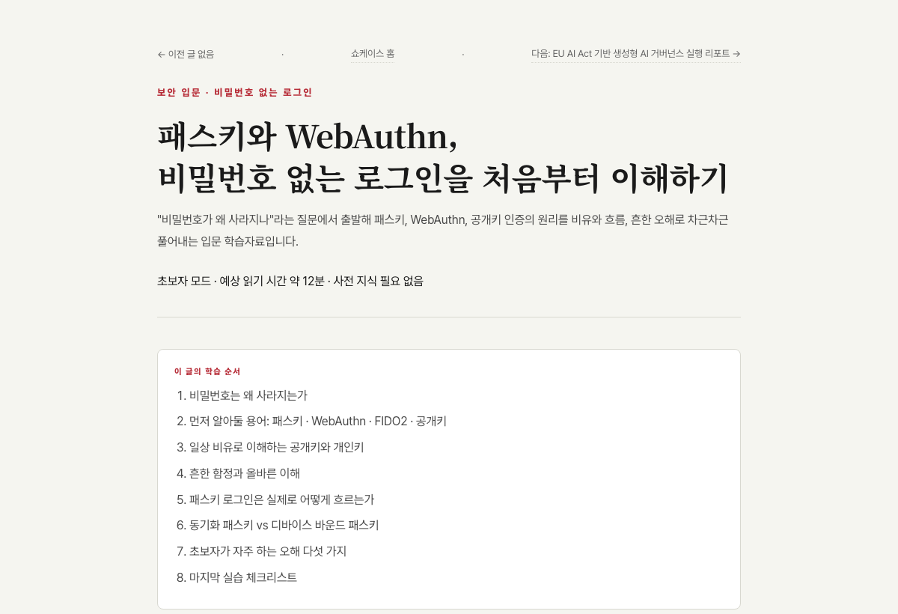</a><br><b>01 · <code>beginner_html</code></b><br>패스키와 WebAuthn, 비밀번호 없는 로그인 입문</td>
<td width="50%"><a href="output/adaptive-html-final-showcase-v3/pages/02-expert-eu-ai-act-governance.html">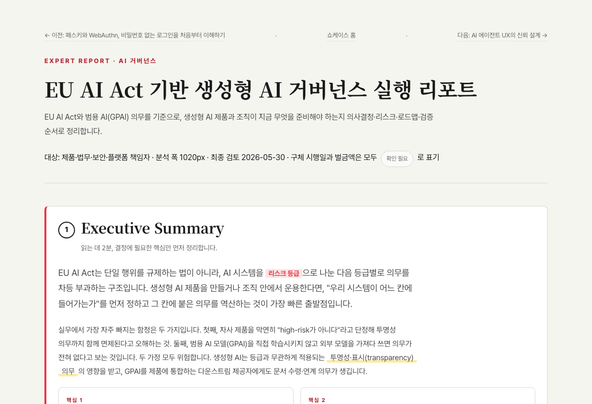</a><br><b>02 · <code>expert_html</code></b><br>EU AI Act 기반 생성형 AI 거버넌스 리포트</td>
</tr>
<tr>
<td width="50%"><a href="output/adaptive-html-final-showcase-v3/pages/03-article-ai-agent-ux-trust.html">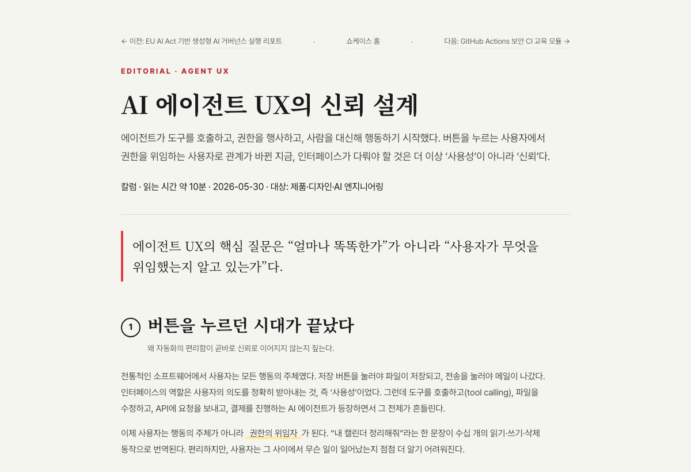</a><br><b>03 · <code>article_html</code></b><br>AI 에이전트 UX의 신뢰 설계 (매거진 아티클)</td>
<td width="50%"><a href="output/adaptive-html-final-showcase-v3/pages/04-education-github-actions-security-ci.html">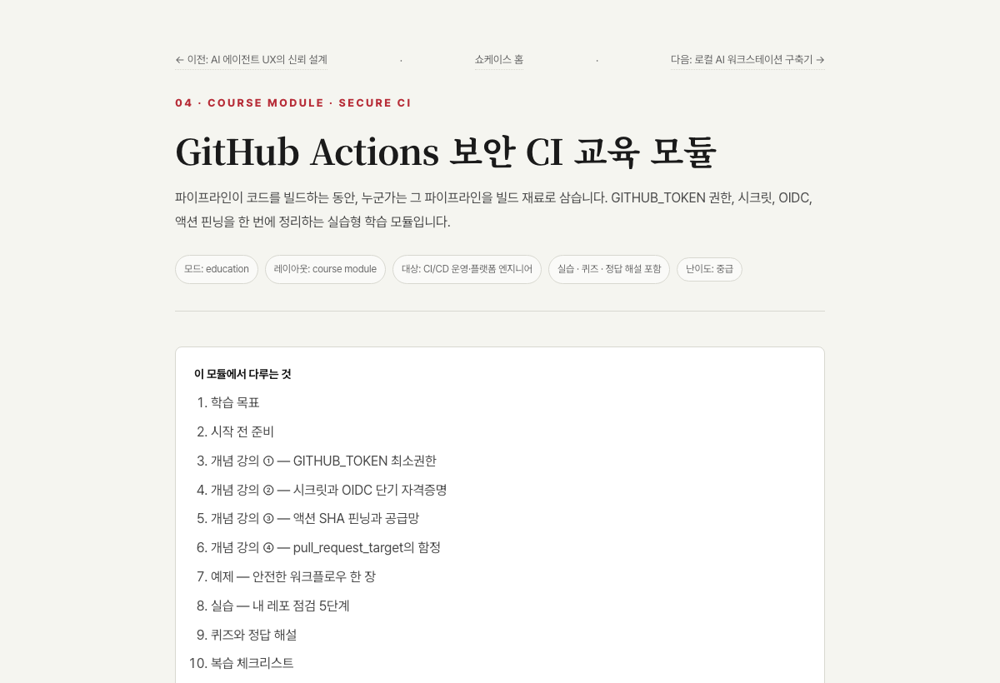</a><br><b>04 · <code>education_html</code></b><br>GitHub Actions 보안 CI 교육 모듈 (퀴즈 포함)</td>
</tr>
<tr>
<td width="50%"><a href="output/adaptive-html-final-showcase-v3/pages/05-blog-local-ai-workstation.html">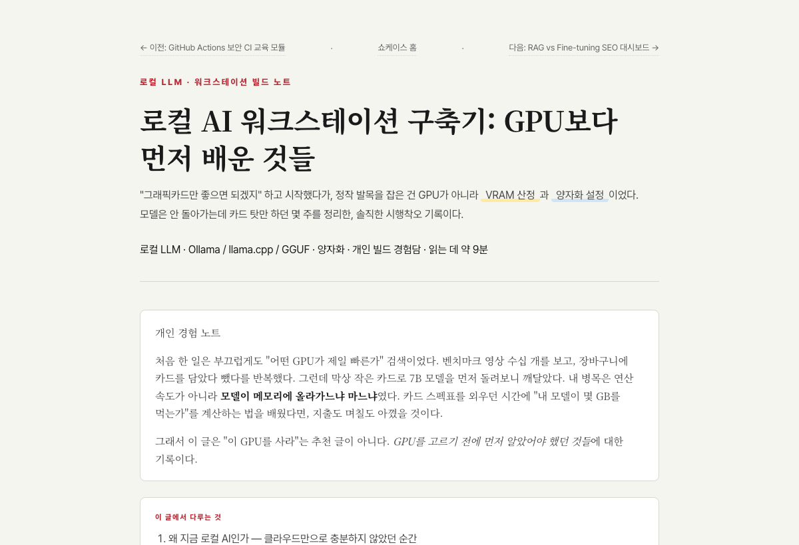</a><br><b>05 · <code>blog_writer</code></b><br>로컬 AI 워크스테이션 구축기 (경험담)</td>
<td width="50%"><a href="output/adaptive-html-final-showcase-v3/pages/06-seo-rag-vs-finetuning.html">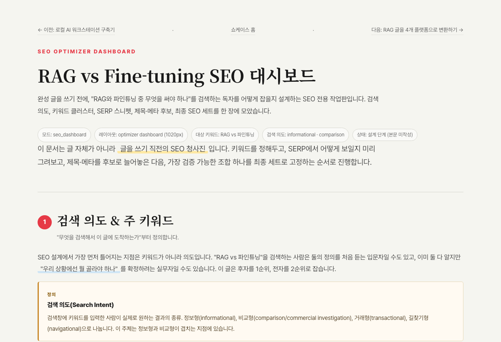</a><br><b>06 · <code>seo_dashboard</code></b><br>RAG vs Fine-tuning SEO 대시보드</td>
</tr>
<tr>
<td width="50%"><a href="output/adaptive-html-final-showcase-v3/pages/07-platform-rag-post-platforms.html">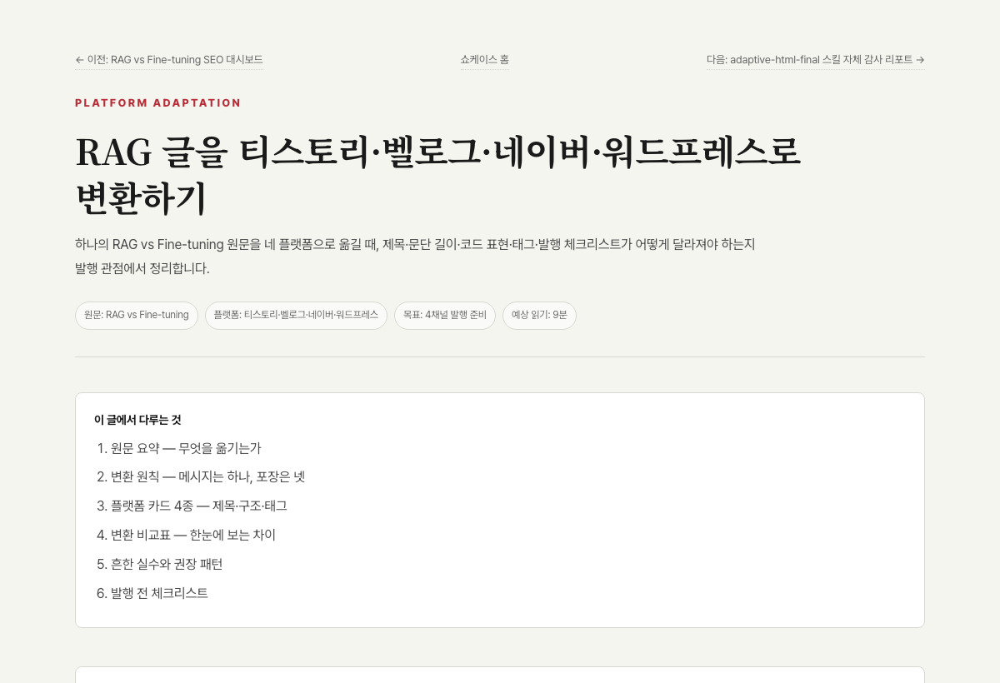</a><br><b>07 · <code>platform_blog</code></b><br>RAG 글을 4개 플랫폼용으로 변환</td>
<td width="50%"><a href="output/adaptive-html-final-showcase-v3/pages/08-skill-audit-adaptive-html-final.html">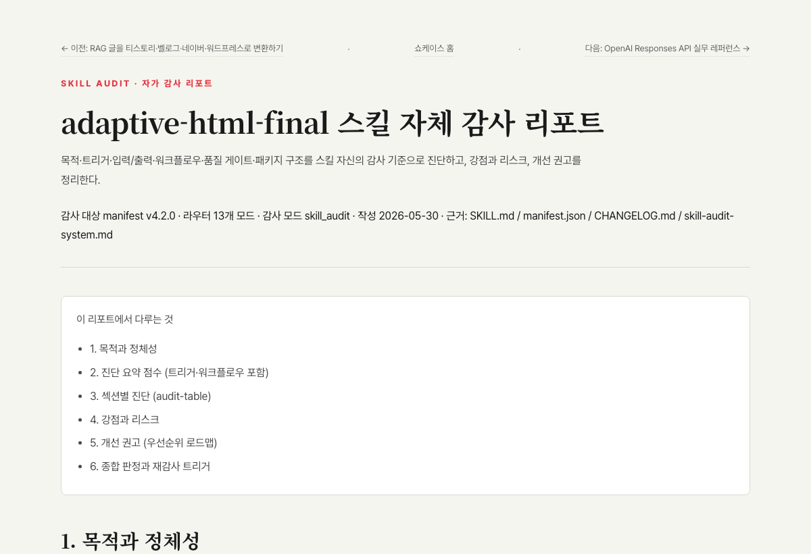</a><br><b>08 · <code>skill_audit</code></b><br>adaptive-html-final 스킬 자체 감사 리포트</td>
</tr>
<tr>
<td width="50%"><a href="output/adaptive-html-final-showcase-v3/pages/09-reference-openai-responses-api.html">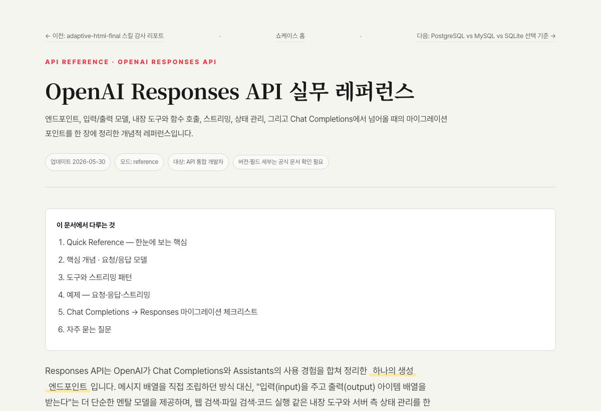</a><br><b>09 · <code>reference_html</code></b><br>OpenAI Responses API 실무 레퍼런스</td>
<td width="50%"><a href="output/adaptive-html-final-showcase-v3/pages/10-comparison-postgresql-mysql-sqlite.html">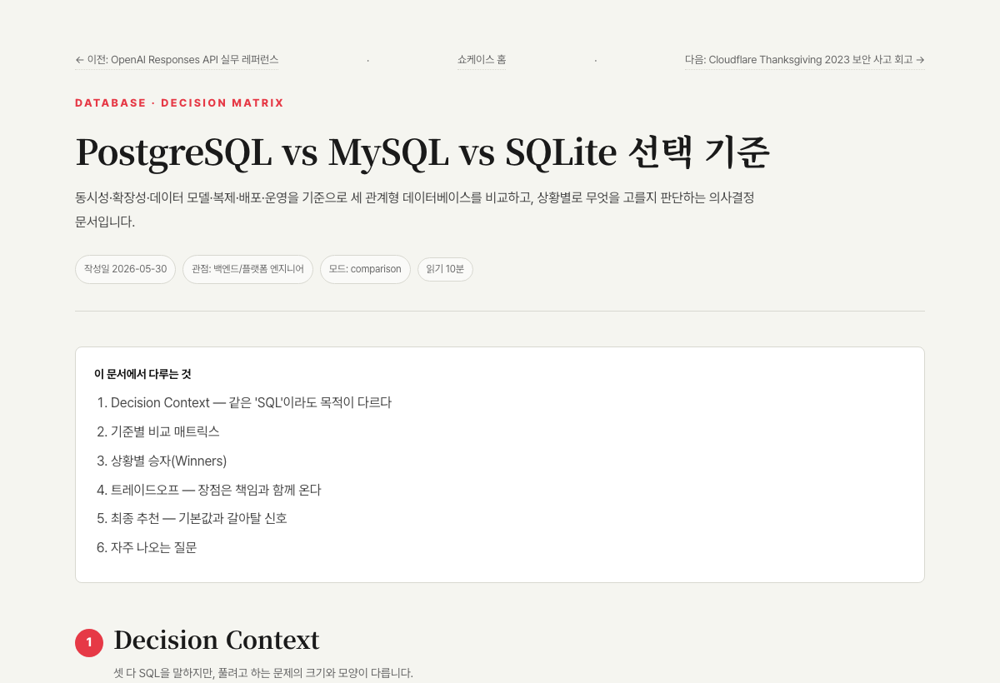</a><br><b>10 · <code>comparison_html</code></b><br>PostgreSQL vs MySQL vs SQLite 선택 기준</td>
</tr>
<tr>
<td width="50%"><a href="output/adaptive-html-final-showcase-v3/pages/11-case-cloudflare-thanksgiving-incident.html">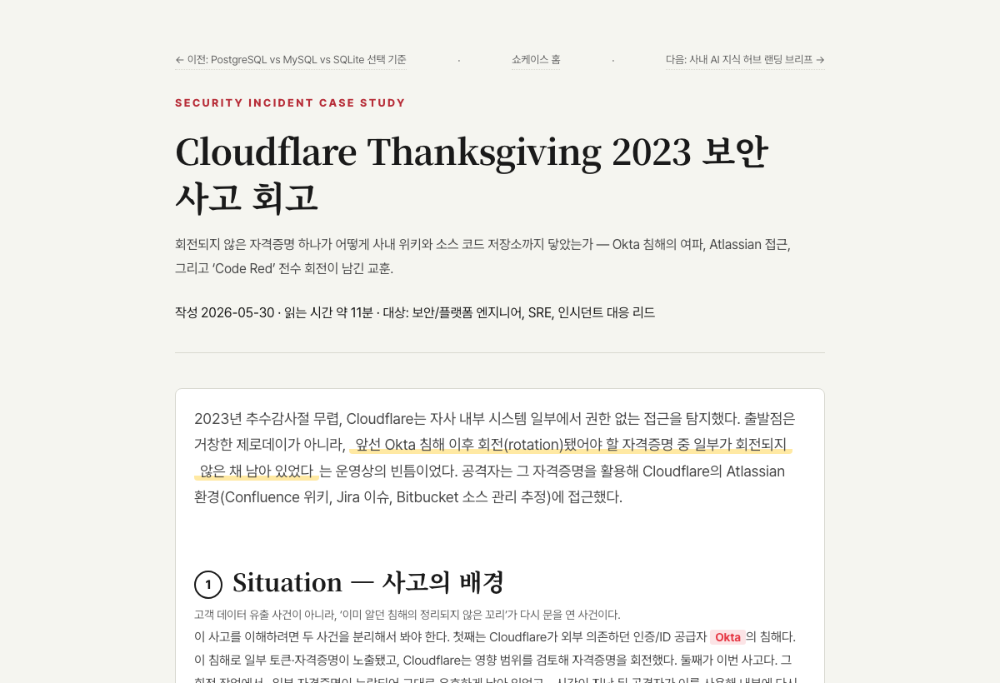</a><br><b>11 · <code>case_study_html</code></b><br>Cloudflare 2023 보안 사고 회고</td>
<td width="50%"><a href="output/adaptive-html-final-showcase-v3/pages/12-landing-ai-knowledge-hub.html">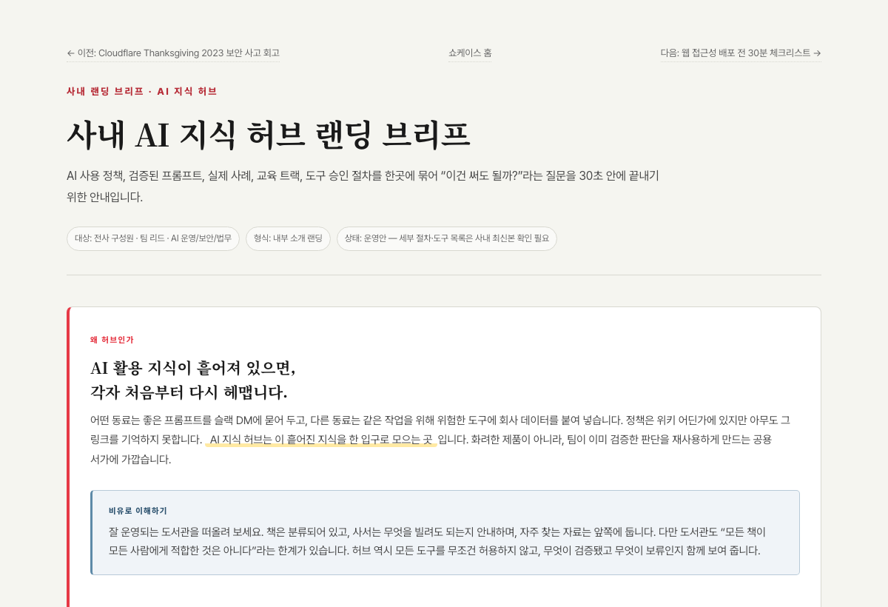</a><br><b>12 · <code>landing_brief_html</code></b><br>사내 AI 지식 허브 랜딩 브리프</td>
</tr>
<tr>
<td width="50%"><a href="output/adaptive-html-final-showcase-v3/pages/13-checklist-web-accessibility-release.html">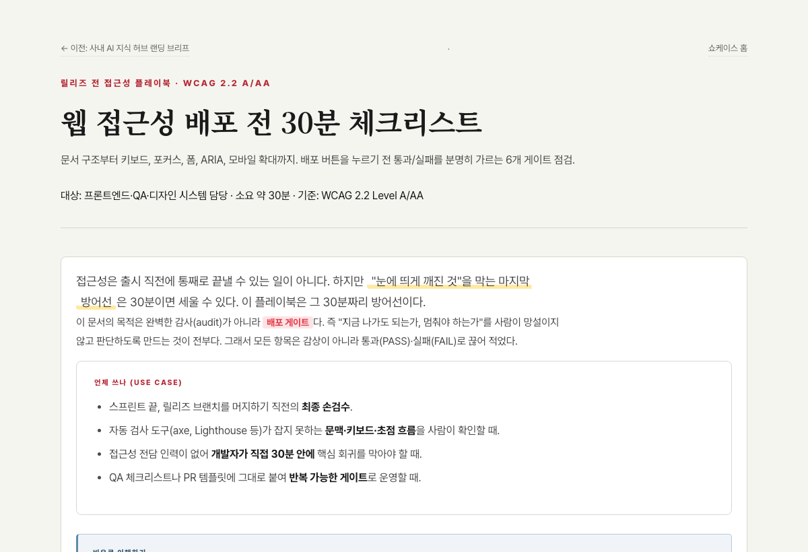</a><br><b>13 · <code>checklist_playbook</code></b><br>웹 접근성 배포 전 30분 체크리스트</td>
<td width="50%" valign="top"><br><b>＋ 추가 데모</b><br>· <a href="output/adaptive-html-final-showcase-v3/pages/14-visual-template-system.html">14 · Visual Template System</a> (8000×6000 SVG 인포그래픽)<br>· <a href="output/adaptive-html-final-showcase-v3/pages/15-svg-template-gallery.html">15 · SVG 템플릿 20종 갤러리</a></td>
</tr>
</table>

> 💡 로컬에서 렌더된 모습으로 직접 보려면: `python3 -m http.server 8778` 실행 후 `http://127.0.0.1:8778/output/adaptive-html-final-showcase-v3/index.html`

---

## 🏗️ 스킬 구조

### 디자인 시스템 (CSS 레이어)

```text
theme.css       색/폰트/폭 토큰(:root) · skip · focus-visible · reduced-motion
components.css   term · analogy · danger · good · hero-analogy · try · tbl · faq · cta-box ...
layouts.css      13개 모드별 그리드/구조 (+ 39개 레이아웃 전용 클래스)
print.css        인쇄 대응(print-color-adjust · break-inside)
visual-components.css   figure.visual-figure (8000×6000 SVG 삽입 셸)  ← v4.2
```

### 비주얼 템플릿 시스템 (v4.2+)

목적형 정보는 외부 사진 검색이 아니라 **8000×6000 SVG 인포그래픽**을 기본값으로 직접 생성합니다.

| 구성 | 내용 |
|---|---|
| `visual-templates/*.svg.tpl` | hero-map · card-grid · decision-tree · quality-gate · timeline · matrix · checklist-flow (7종) |
| `scripts/render_visual_svg.py` | visual brief(JSON) → 8000×6000 SVG 렌더러 (**stdlib only**, 오프라인 동작) |
| `schemas/visual-brief.schema.json` | 시각 템플릿 입력 스키마 |
| 데모 | SVG 템플릿 [20종 갤러리](output/adaptive-html-final-showcase-v3/pages/15-svg-template-gallery.html) (risk-heatmap, sankey, treemap, user-journey 등) |

---

## 📁 프로젝트 구조

```text
skills-html-showcase/
├── skills/adaptive-html-final/        # 통합 스킬 (74 files) + .skill 패키지
│   ├── SKILL.md                       # 라우터 · 워크플로우 · 품질 게이트
│   ├── manifest.json                  # name/version/modes/layouts (v4.3.3)
│   ├── assets/        (6 + 13 layouts) # base.html · CSS 5종 · 13개 레이아웃 골격
│   ├── references/    (11)            # 모드/레이아웃/글쓰기/SEO/플랫폼/감사/비주얼 규칙
│   ├── recipes/       (13)            # 13개 모드별 대표 프롬프트
│   ├── schemas/       (3)             # blog-meta · quality-report · visual-brief
│   ├── tests/         (5)             # 품질/레이아웃/시각회귀/접근성 체크리스트
│   ├── visual-templates/ (7)         # 8000×6000 SVG 템플릿
│   ├── scripts/       (2)             # render_visual_svg.py 등
│   └── examples/      (8)            # 예시 결과물
├── output/
│   ├── adaptive-html-final-showcase{,-v2,-v3}/   # 13모드 쇼케이스 (v3 = 최신)
│   │   ├── pages/     (15)            # 13모드 + 비주얼 데모 + SVG 갤러리
│   │   └── media/svg-template-demos/ (20)  # 8000×6000 SVG 데모
│   └── (playwright/ · qa-screenshots/ 는 .gitignore)
├── docs/screenshots/  (13)           # 본 README용 쇼케이스 썸네일
├── demo/ · orginal_skill/            # 이전 계열 데모 · 원본 스킬
├── ANALYSIS_adaptive-html-final.md   # 7-전문가 정밀 분석 보고서
└── Guide.md                          # 사용 가이드
```

---

## 🔬 스킬 상세 분석

[`ANALYSIS_adaptive-html-final.md`](ANALYSIS_adaptive-html-final.md) — 7개 전문가 에이전트 병렬 분해 + 쟁점 적대적 검증 + 교차 통합 감사로 도출한 정밀 분석 보고서입니다.

### 검증으로 입증된 강점

| 항목 | 결과 |
|---|---|
| skip link ↔ `<main id="main">` | **13 / 13** (접근성 회귀 가드로 고정) |
| 단일 `h1` 원칙 | 13 / 13 |
| 외부 동작 JS | **0건** |
| 미정의 CSS 클래스 | **0개** (레이아웃↔CSS 차집합 0) |
| manifest ↔ 디스크 레이아웃 매핑 | 차집합 0 |
| recipes 커버리지 | 13 / 13 모드 |
| blog-writer 상세 규칙 흡수 | 8 / 8 (제목 4계열·도입부 3유형·본문 밀도·톤 매핑·100점·메타·플랫폼·박스) |

### 버전 진화

| 버전 | 핵심 |
|---|---|
| `v4.0.0` | ultimate(13모드 라우터) + blog-writer(블로그/SEO 규칙) **통합** · skip link 버그 수정 |
| `v4.1.0` | 7-전문가 분석 P0~P2 자동 패치 — 모드 ID 통일, recipes 13/13, 스키마 보강, 디자인 토큰 정리(AA 대비·print·reduced-motion) |
| `v4.2.x` | **Visual Template System** 도입 — 8000×6000 SVG 인포그래픽 7종 + stdlib 렌더러 + quality-gate 레이아웃 보정 |
| `v4.3.3` | 13모드 전수 캡쳐 감사 기반 **반응형 폴리시** — dark CTA 대비, 플랫폼 그리드, 모바일 표 밀도, case timeline 구조 + 정적 게이트 |

> 전체 변경 이력: [`skills/adaptive-html-final/CHANGELOG.md`](skills/adaptive-html-final/CHANGELOG.md)

---

## ✅ 품질 게이트

모든 산출물이 통과해야 하는 최소 조건입니다. (`tests/quality-checklist.md`, `tests/accessibility-checklist.md`)

- [x] 요청 목적과 선택 모드 일치 + 모드별 필수 블록 존재
- [x] `lang="ko"` · viewport · `<title>` · meta description
- [x] `h1` 정확히 1개 · 주요 `h2`에 `.h2-sub`(모드 한정 권장)
- [x] `#main` skip link target · `:focus-visible` · `prefers-reduced-motion`
- [x] 모바일 1컬럼 전환 · 표는 `.tbl` 래퍼(가로 스크롤)
- [x] 외부/동작 JS 0 · 확인되지 않은 최신 정보 단정 금지 · 출처 추측 금지
- [x] 교육용=퀴즈+정답 · 전문가용=리스크+검증 · 블로그/SEO=제목+메타+태그 · 감사=개선본
- [x] 비주얼: 8000×6000 캔버스 · `figure`+`figcaption` · 의미 있는 `alt` · 캔버스 잘림 없음

---

## ⚡ 사용법

### 스킬로 콘텐츠 생성 요청

```text
[입력 자료/URL/파일/주제]를 [목적/독자]용 [모드]로 만들어줘.
출력은 [단일 HTML / Markdown+HTML / 플랫폼별 원고]로 해줘.
반드시 포함: [목차, 용어 풀이, 예시, 리스크, FAQ, CTA 등]
주의: [최신 정보는 확인 필요 표시, 외부 JS 금지, 모바일 안전 표]
```

### 비주얼 인포그래픽 직접 렌더

```bash
# visual brief(JSON) → 8000×6000 SVG (stdlib only, 오프라인 동작)
python3 skills/adaptive-html-final/scripts/render_visual_svg.py brief.json output.svg
```

### 쇼케이스 로컬에서 보기

```bash
# 저장소 루트에서
python3 -m http.server 8778
# → http://127.0.0.1:8778/output/adaptive-html-final-showcase-v3/index.html
```

---

## 📜 License

별도 라이선스가 지정되지 않았습니다. 사용 전 저장소 소유자(`coreline-ai`)에게 확인하세요.

<div align="center">
<sub>생성 도구: <code>adaptive-html-final</code> v4.3.3 · 13-mode editorial HTML/SVG engine</sub>
</div>
