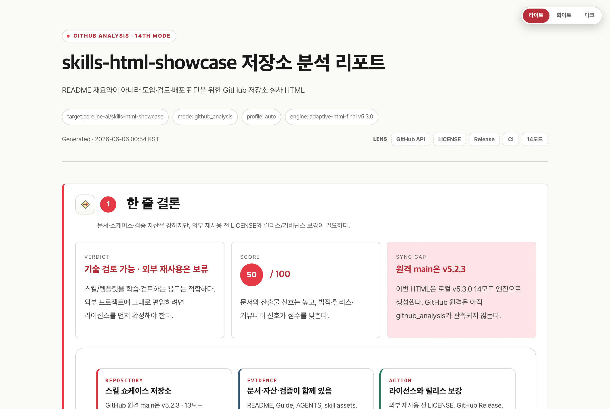
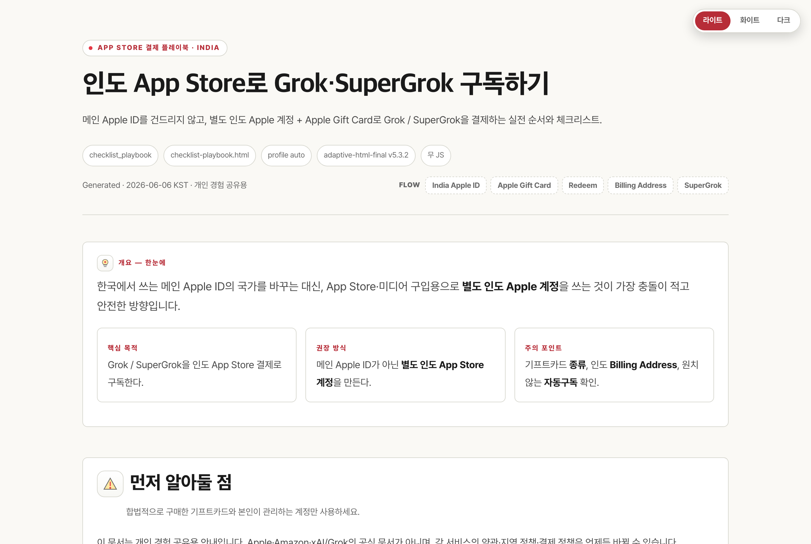
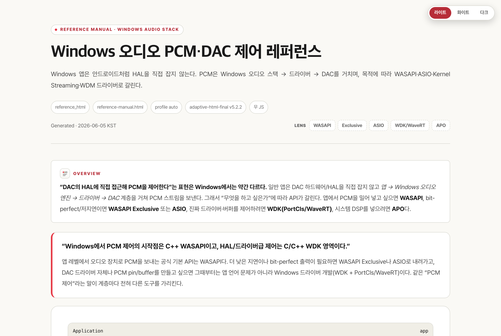
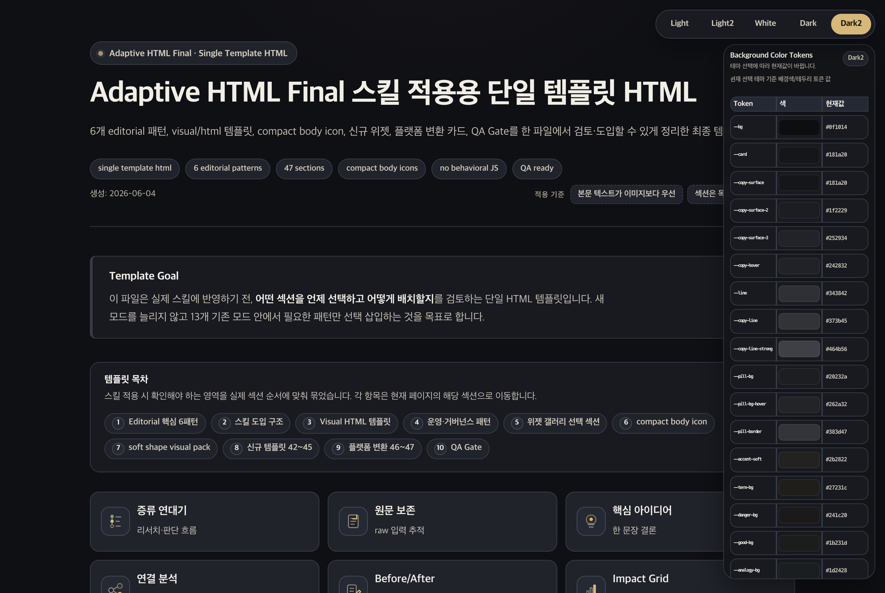
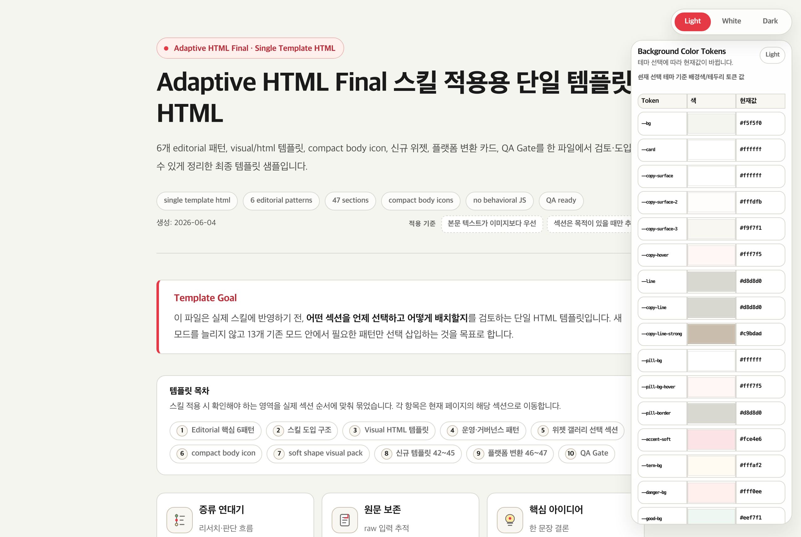

<div align="center">


# 🎨 Adaptive HTML Final

[](skills/adaptive-html-final)
[](skills/adaptive-html-final/CHANGELOG.md)
[](#-17개-모드)
[](#️-비주얼-프로파일)
[](#-8-테마-시스템)
[](#️-비주얼-프로파일) [](#️-비주얼-프로파일)
[](#-품질-게이트--결정론)
[](#)
[](#-품질-게이트--결정론)
[](AGENTS.md)
[](skills/adaptive-html-final/scripts/render_visual_svg.py)

**입력 자료를 17개 모드로 라우팅해 전문가급 한국어 HTML 콘텐츠를 만드는 단일 통합 스킬 — GitHub 저장소 실사·GitHub 기능/도입 가이드·YouTube 영상·매뉴얼 분석, 8-테마, 비주얼 프로파일(위젯형·도식형·자동) 선택**

URL·PDF·텍스트·메모·기술 문서·블로그 초안·`SKILL.md`/`.skill`·GitHub 저장소 URL·YouTube URL/자막·제품 매뉴얼을 받아 학습자료, 전문가 리포트, 저장소/영상/매뉴얼 분석, 아티클, 교육 모듈, 블로그 원고, SEO 대시보드, 플랫폼 변환, 스킬 감사, 레퍼런스, 비교, 케이스 스터디, 랜딩, 체크리스트로 변환합니다.

[Overview](#-overview) · [빠른 시작](#-빠른-시작) · [17개 모드](#-17개-모드) · [비주얼 프로파일](#️-비주얼-프로파일) · [8-테마](#-8-테마-시스템) · [쇼케이스](#️-쇼케이스-갤러리) · [아키텍처](#️-아키텍처--디자인-시스템) · [품질 게이트](#-품질-게이트--결정론) · [사용법](#-사용법)

</div>

> [!NOTE]
> **외부/동작 JS 0** · **결정론적 크로스-에이전트**(Claude Code · Codex · Gemini 동일 출력) · **자기방어 검증 게이트 159/159** · 입력→정보구조 재구성 파이프라인. 단순 변환기가 아니라, 무엇을 어떻게 보여줄지 **모드·레이아웃·프로파일을 결정표로 고정**해 생성합니다.

---

## ✨ 핵심 특징

| | |
|---|---|
| 🧭 **17개 모드 라우터** | 입력·목적을 분석해 `skill_audit`·`github_analysis`·`youtube_analysis`·`manual_analysis` 등 17개 정보 구조 중 하나로 자동 라우팅 |
| 🎚️ **3 비주얼 프로파일** | `widget`(CSS 위젯) · `diagram`(SVG→HTML 도식) · `auto`(둘 다, 기본). 코어는 100% 공유, 프로파일이 라이브러리만 게이트 |
| 🎨 **8-테마 스위처** | `light·light2·white·dark·dark2·blue·skyblue·sepia` — **무 JS** CSS-only 라디오 스위처 |
| 🧩 **시각 라이브러리** | CSS 뷰 위젯 `wg-` 20종 + SVG→HTML 템플릿 `vt-` 21종 + 본문 아이콘 `bi-` 32종 + soft-shape 36종 |
| 🛡️ **무 JS 원칙** | 출력에 외부/동작 JS 0. 상호작용은 전부 CSS-only(`:has()`·라디오·`details`). JSON-LD만 허용 |
| 🤖 **크로스-에이전트 결정론** | `AGENTS.md` 단일 진입점 + `modes/*.json` Registry로 어느 에이전트에서 돌려도 동일 결과 |
| ✅ **자기방어 게이트** | `validate_output.py`(구조·해시·계약) + `quality_contract_check.py`(붕어빵 차단) + 거버넌스 **159/159** |
| 🖨️ **PDF/PNG/WebP export** | `html-exporter`로 빌드타임 변환(테마별 캡처). 출력 HTML엔 JS 미삽입 |

---

## 📖 Overview

`adaptive-html-final`은 `html-for-beginners` → `adaptive-html-blog-writer` → `adaptive-html-learning-ultimate` 계열을 하나로 합친 **최종 통합본**입니다. 단순 HTML 변환기가 아니라, 입력을 분석해 **목적별 정보 구조**로 재구성하는 파이프라인을 실행합니다.

```text
┌──────────┐   ┌───────────────────────┐   ┌──────────────┐   ┌──────────┐   ┌──────────────┐
│ 입력 분석 │ ─▶│ 사실·해석·추론·확인필요 분류 │ ─▶│ 독자 수준 판단 │ ─▶│ 모드 선택 │ ─▶│ 레이아웃·프로파일 │
└──────────┘   └───────────────────────┘   └──────────────┘   └────┬─────┘   └──────┬───────┘
                                                                     │                │
                          ┌──────────────────────────────────────────┘                ▼
                          ▼                                              ┌─────────────────────────┐
              §0.6 결정표(단일 출처)                                       │ vt-/wg- 시각 라이브러리 + 8테마 │
              modes/NN-*.json Registry                                   │ 코어 CSS 인라인 + 해시 마커     │
                          │                                              └────────────┬────────────┘
                          ▼                                                           ▼
              검증 게이트(validate + quality + completion)  ─────────────▶  무 JS 단일 HTML
```

> [!TIP]
> 상세 규칙의 **단일 출처(SoT)** 는 스킬 본체입니다. 충돌 시 우선순위: `AGENTS.md` → `skills/adaptive-html-final/SKILL.md` → `references/*`.

---

## 🚀 빠른 시작

```bash
# 1) 저장소 클론 후 루트에서 로컬 미리보기
python3 -m http.server 8788
#   현행 17모드 참조 예제
#   → http://127.0.0.1:8788/skills/adaptive-html-final/examples/index.html

# 2) 현행 레퍼런스 검증 (마지막 줄 OK 여야 정상)
python3 skills/adaptive-html-final/scripts/validate_output.py \
  skills/adaptive-html-final/examples \
  --skill-dir skills/adaptive-html-final

# 3) 비주얼 인포그래픽 직접 렌더 (stdlib only, 오프라인)
python3 skills/adaptive-html-final/scripts/render_visual_svg.py brief.json output.svg
```

스킬로 콘텐츠를 생성할 때는 에이전트에게 이렇게 요청합니다:

```text
[입력 자료/URL/파일/주제]를 [목적/독자]용 [모드]로 만들어줘.
출력: 단일 HTML  ·  비주얼: profile=widget | diagram | auto  (미지정 시 auto)
반드시 포함: [목차·용어풀이·예시·리스크·FAQ·CTA 등]
주의: 최신 정보는 확인 필요 표시 · 외부 JS 금지 · 모바일 안전 표
```

---

## 📦 17개 모드

트리거가 겹치면 우선순위(`1=skill_audit … 17=checklist_playbook`)를 따릅니다. 결정표 단일 출처는 [`modes/NN-<mode>.json`](skills/adaptive-html-final/modes) Registry이며 `validate_output.py`가 직접 읽습니다.

| # | 모드 | 용도 (트리거 요약) | 레이아웃 | 1순위 vt-템플릿 |
|--:|---|---|---|---|
| 1 | 🔍 `skill_audit` | 스킬 분석·`SKILL.md` 개선·`.skill` 통합 | `.layout-audit` | `quality-gate` |
| 2 | 🪶 `platform_blog` | 티스토리·벨로그·네이버·워드프레스 플랫폼 변환 | `.layout-platform` | `card-grid` |
| 3 | 🔎 `seo_dashboard` | SEO·제목·메타·태그·검색 의도 | `.layout-seo` | `card-grid` |
| 4 | 🎓 `education_html` | 교육·강의·온보딩·실습·퀴즈 | `.layout-education` | `timeline` |
| 5 | 🐙 `github_analysis` | GitHub 저장소 실사(README·Issues·Releases·License) | `.layout-github` | `hero-map` |
| 6 | 🧰 `github_feature_usage` | GitHub 기능·사용법·도입 가이드(화면·스크린샷 중심) | `.layout-github-feature` | `hero-map` |
| 7 | ▶️ `youtube_analysis` | YouTube 영상 요약·자막·댓글·챕터·콘텐츠 갭 | `.layout-youtube` | `timeline` |
| 8 | 📕 `manual_analysis` | 매뉴얼·운영 절차서·트러블슈팅·제품 가이드 | `.layout-manual` | `hero-map` |
| 9 | 🧠 `expert_html` | 전문가 리포트·진단·아키텍처·리스크 | `.layout-expert` | `risk-matrix` |
| 10 | 📰 `article_html` | 공개 글·아티클·기사·GitHub Pages | `.layout-article` | `decision-tree` |
| 11 | ✍️ `blog_writer` | 블로그 글·포스팅·경험담·내 생각 | `.layout-blog` | `timeline` |
| 12 | 🌱 `beginner_html` | 초보자·쉽게·비유로·입문 | `.layout-beginner` | `concept-explainer` |
| 13 | 📚 `reference_html` | 레퍼런스·API 문서·치트시트·옵션표 | `.layout-reference` | `file-tour` |
| 14 | ⚖️ `comparison_html` | 비교·장단점·선택 기준 | `.layout-compare` | `comparison-cards` |
| 15 | 🧾 `case_study_html` | 사례 연구·회고·프로젝트 기록 | `.layout-case` | `incident-summary` |
| 16 | 🚀 `landing_brief_html` | 소개 페이지·랜딩·요약 페이지 | `.layout-landing` | `hero-map` |
| 17 | ✅ `checklist_playbook` | 체크리스트·운영 절차·플레이북 | `.layout-checklist` | `checklist-flow` |

> 전체 트리거·후순위 vt·권장 wg 매핑은 [`AGENTS.md` §3 결정표](AGENTS.md)와 [`SKILL.md` §0.6](skills/adaptive-html-final/SKILL.md) 참조.

---

## 🎚️ 비주얼 프로파일

스킬을 **기동할 때 비주얼 스타일을 고를 수 있습니다.** 코어(17모드 라우터·레이아웃·코어 CSS 5종)는 100% 공유하고, 프로파일이 *어느 라이브러리·삽입 단계·CSS 번들*을 쓸지만 게이트합니다. 세 프로파일 모두 **외부/동작 JS 0**.

<table>
<tr>
<td width="33%" align="center"><b>🧩 <code>widget</code></b></td>
<td width="33%" align="center"><b>📊 <code>diagram</code></b></td>
<td width="33%" align="center"><b>🔀 <code>auto</code> (기본)</b></td>
</tr>
<tr>
<td><a href="https://coreline-ai.github.io/skills-html-showcase/output/2026-06-01/adaptive-html-final-showcase-v5/pages/04-education-postgres-indexing.html"></a></td>
<td><a href="https://coreline-ai.github.io/skills-html-showcase/output/2026-06-01/adaptive-html-final-showcase-diagram/pages/10-message-queue-kafka-rabbitmq-sqs.html"></a></td>
<td><a href="https://coreline-ai.github.io/skills-html-showcase/output/2026-06-01/adaptive-html-final-showcase-v6/pages/02-realtime-inventory-sync-operating-model.html"></a></td>
</tr>
<tr>
<td valign="top">CSS 뷰 위젯 <code>wg-01~20</code> — 탭·플로우·아코디언 등 <b>인터랙티브</b> 컴포넌트(CSS-only). 코어5 + <code>widgets.css</code>.</td>
<td valign="top">SVG→HTML 템플릿 <code>vt-</code> 21종 — 리스크 매트릭스·비교 카드·타임라인·soft workflow map 등 본문 삽입 <b>정적 도식</b>. 코어5 + <code>visual-html.css</code>.</td>
<td valign="top">둘 다(vt- 1순위 + wg- 보강). 현행 기본값이자 <b>회귀-0 기준선</b>. 코어5 + 두 라이브러리.</td>
</tr>
</table>

| 프로파일 | 라이브러리 (markup) | CSS 번들 | 참고 쇼케이스 |
|---|---|---|---|
| `widget` | CSS 뷰 위젯 `wg-` | 코어5 + `widgets.css` | [widget showcase](https://coreline-ai.github.io/skills-html-showcase/output/2026-06-01/adaptive-html-final-showcase-v5) |
| `diagram` | SVG→HTML `vt-` | 코어5 + `visual-html.css` | [diagram showcase](https://coreline-ai.github.io/skills-html-showcase/output/2026-06-01/adaptive-html-final-showcase-diagram) |
| `auto` (기본) | 둘 다 | 코어5 + `widgets.css` + `visual-html.css` | [auto showcase](https://coreline-ai.github.io/skills-html-showcase/output/2026-06-01/adaptive-html-final-showcase-v6) |

```bash
adaptive-html-final  profile=widget     # CSS 위젯만
adaptive-html-final  profile=diagram    # SVG→HTML 도식만
adaptive-html-final  profile=auto       # 둘 다 (기본)
adaptive-html-final                     # 미지정 시 auto

# 검증기는 출력의 sources/profile.json 을 자동 인지(또는 --profile)해
# 교차 누수(diagram에 wg- / widget에 vt-)를 차단한다
python3 skills/adaptive-html-final/scripts/validate_output.py <output_dir> \
  --skill-dir skills/adaptive-html-final --profile diagram
```

> 🤖 **크로스-에이전트 결정론**: 인자가 명시되면 Claude Code·Codex·Gemini가 동일 결과를 낸다(정규화 `profile=` 우선, 무효 토큰은 `invalid_profile` 실패). 비대화형(AGENTS.md 경유)은 미지정 시 무조건 `auto`.

---

## 🎨 8-테마 시스템

상단 라디오 세그먼트 스위처(`name="ahf-theme"`)로 **무 JS** 즉시 전환. CSS-only `:has()` 토큰 오버라이드(`theme-dark.css`)로 동작합니다.

`🌕 light` · `⚪ light2` · `◽ white` · `🌑 dark` · `⬛ dark2` · `🔵 blue` · `🩵 skyblue` · `🟤 sepia`

> [!IMPORTANT]
> 8-테마 스위처는 `name="ahf-theme"` 라디오 8개 계약을 사용하며 legacy `#theme-toggle`은 금지입니다. 부분 테마 출력은 검증기 `theme_switcher_*` 게이트에서 실패합니다.

---

## 🖼️ 쇼케이스 갤러리

### 🆕 최신 실전 산출물 데모 (현행 스킬 v5.10.4 기준, 게이트 OK)

최근 생성한 **대표 실전 산출물 3종**입니다. 썸네일을 클릭하면 GitHub Pages에서 실제 결과물이 바로 열립니다(상단 스위처로 8테마 전환).

<table>
<tr>
<td width="33%" valign="top"><a href="https://coreline-ai.github.io/skills-html-showcase/output/2026-06-06/github-analysis-skills-html-showcase-20260606_005440/index.html"></a><br><b>🔎 <code>github_analysis</code></b><br>저장소 분석 리포트. 사용/채택/감사 의사결정용 GitHub 분석 모드. 결론 직후 <b>chip-nav 목차(toc-map)</b> + references 투어 <b>다단(col-list)</b>.<br><a href="https://coreline-ai.github.io/skills-html-showcase/output/2026-06-06/github-analysis-skills-html-showcase-20260606_005440/index.html">▶ 라이브</a> · <a href="output/2026-06-06/github-analysis-skills-html-showcase-20260606_005440/index.html"><code>로컬</code></a></td>
<td width="33%" valign="top"><a href="https://coreline-ai.github.io/skills-html-showcase/output/2026-06-06/grok-india-appstore-guide-20260606_074130/index.html"></a><br><b>🧾 <code>checklist_playbook</code></b><br>인도 App Store(별도 Apple 계정 + Gift Card)로 Grok·SuperGrok 구독하는 실전 순서·체크리스트. 단계별 카드·표·주의 패턴.<br><a href="https://coreline-ai.github.io/skills-html-showcase/output/2026-06-06/grok-india-appstore-guide-20260606_074130/index.html">▶ 라이브</a> · <a href="output/2026-06-06/grok-india-appstore-guide-20260606_074130/index.html"><code>로컬</code></a></td>
<td width="33%" valign="top"><a href="https://coreline-ai.github.io/skills-html-showcase/output/2026-06-05/adaptive-html-final-windows-audio-pcm-reference-20260605/index.html"></a><br><b>📘 <code>reference_html</code></b><br>Windows 오디오 PCM·DAC 제어 레퍼런스. WASAPI·ASIO·WDK/WaveRT·APO 스택을 정리한 기술 매뉴얼. 표·코드·핵심 callout.<br><a href="https://coreline-ai.github.io/skills-html-showcase/output/2026-06-05/adaptive-html-final-windows-audio-pcm-reference-20260605/index.html">▶ 라이브</a> · <a href="output/2026-06-05/adaptive-html-final-windows-audio-pcm-reference-20260605/index.html"><code>로컬</code></a></td>
</tr>
</table>

> 🌐 라이브(GitHub Pages): **[github_analysis](https://coreline-ai.github.io/skills-html-showcase/output/2026-06-06/github-analysis-skills-html-showcase-20260606_005440/index.html)** · **[grok 가이드](https://coreline-ai.github.io/skills-html-showcase/output/2026-06-06/grok-india-appstore-guide-20260606_074130/index.html)** · **[windows-audio 레퍼런스](https://coreline-ai.github.io/skills-html-showcase/output/2026-06-05/adaptive-html-final-windows-audio-pcm-reference-20260605/index.html)** · 로컬 확인은 `python3 -m http.server 8080` 후 `http://localhost:8080/output/<dir>/index.html`

<details>
<summary><b>🌐 라이브 역사적 갤러리 — 13-topics (v5.2.3, 게이트 OK) · 13모드 펼치기</b></summary>

<br>

v5.2.3 시점의 정적 품질 게이트를 **0 issue로 완전 통과**하고, 13명 전문가 에이전트가 모든 얕은 섹션을 보강한 **역사적 13-topic 기준선**입니다. 현행 v5.10.4 기준 17모드 레퍼런스는 `skills/adaptive-html-final/examples/`입니다.

**▶ 메인 화면:** **[13개 모드 신규 주제 쇼케이스 (index)](https://coreline-ai.github.io/skills-html-showcase/output/2026-06-05/adaptive-html-final-13-topics-20260605_083433/index.html)**

| # | Mode | 주제 | 열기 |
|--:|---|---|---|
| 01 | `beginner_html` | 로컬 RAG 개인 지식 금고 입문 | [▶ 보기](https://coreline-ai.github.io/skills-html-showcase/output/2026-06-05/adaptive-html-final-13-topics-20260605_083433/pages/01-local-rag-personal-knowledge-vault.html) |
| 02 | `expert_html` | AI 코드 리뷰 게이트웨이 운영 모델 | [▶ 보기](https://coreline-ai.github.io/skills-html-showcase/output/2026-06-05/adaptive-html-final-13-topics-20260605_083433/pages/02-ai-code-review-gateway-operating-model.html) |
| 03 | `article_html` | 작은 팀의 운영 문서와 제품 속도 | [▶ 보기](https://coreline-ai.github.io/skills-html-showcase/output/2026-06-05/adaptive-html-final-13-topics-20260605_083433/pages/03-small-team-operating-docs-product-speed.html) |
| 04 | `education_html` | PostgreSQL 쿼리 플랜 읽기 3주 교육 | [▶ 보기](https://coreline-ai.github.io/skills-html-showcase/output/2026-06-05/adaptive-html-final-13-topics-20260605_083433/pages/04-postgres-query-plan-3week-course.html) |
| 05 | `blog_writer` | 두 번째 뇌를 다시 작게 만든 30일 회고 | [▶ 보기](https://coreline-ai.github.io/skills-html-showcase/output/2026-06-05/adaptive-html-final-13-topics-20260605_083433/pages/05-small-second-brain-30days-retro.html) |
| 06 | `seo_dashboard` | AI 회의록 자동화 검색 허브 | [▶ 보기](https://coreline-ai.github.io/skills-html-showcase/output/2026-06-05/adaptive-html-final-13-topics-20260605_083433/pages/06-ai-meeting-notes-automation-seo.html) |
| 07 | `platform_blog` | 컨퍼런스 발표를 플랫폼별 글로 변환 | [▶ 보기](https://coreline-ai.github.io/skills-html-showcase/output/2026-06-05/adaptive-html-final-13-topics-20260605_083433/pages/07-conference-talk-platform-adaptation.html) |
| 08 | `skill_audit` | 배포 체크리스트 생성 스킬 감사 | [▶ 보기](https://coreline-ai.github.io/skills-html-showcase/output/2026-06-05/adaptive-html-final-13-topics-20260605_083433/pages/08-release-checklist-skill-audit.html) |
| 09 | `reference_html` | Webhook 서명 검증 레퍼런스 | [▶ 보기](https://coreline-ai.github.io/skills-html-showcase/output/2026-06-05/adaptive-html-final-13-topics-20260605_083433/pages/09-webhook-signature-verification-reference.html) |
| 10 | `comparison_html` | 벡터 검색 선택 기준 비교 | [▶ 보기](https://coreline-ai.github.io/skills-html-showcase/output/2026-06-05/adaptive-html-final-13-topics-20260605_083433/pages/10-vector-db-pgvector-search-engine-comparison.html) |
| 11 | `case_study_html` | 예약 알림 지연 사고 케이스 스터디 | [▶ 보기](https://coreline-ai.github.io/skills-html-showcase/output/2026-06-05/adaptive-html-final-13-topics-20260605_083433/pages/11-reservation-reminder-delay-case-study.html) |
| 12 | `landing_brief_html` | LocalNote 팀 지식관리 랜딩 브리프 | [▶ 보기](https://coreline-ai.github.io/skills-html-showcase/output/2026-06-05/adaptive-html-final-13-topics-20260605_083433/pages/12-localnote-team-knowledge-landing.html) |
| 13 | `checklist_playbook` | AI 기능 출시 전 안전성 플레이북 | [▶ 보기](https://coreline-ai.github.io/skills-html-showcase/output/2026-06-05/adaptive-html-final-13-topics-20260605_083433/pages/13-ai-feature-release-safety-playbook.html) |

</details>

<details>
<summary><b>🧩 스킬 적용용 단일 템플릿 HTML (final_20260604) · 펼치기</b></summary>

<br>

스킬의 모든 자산·패턴을 한 파일에 담은 **단일 템플릿 HTML** 2종입니다. 원본 템플릿 HTML 정본은 `skills/adaptive-html-final/template-catalog/`에 보관합니다.

<table>
<tr>
<td width="50%" valign="top"><a href="https://coreline-ai.github.io/skills-html-showcase/output/2026-06-04/final_20260604/index.html"></a><br><b>▶ Skill Template HTML (와이드 · 8-테마)</b><br><code>final_20260604/index.html</code><br>프로파일·vt/wg·soft-shape·workflow 도판·body-icon을 한 페이지에 집약한 적용용 마스터 템플릿(스크린샷은 <b>Dark2</b>).<br><a href="https://coreline-ai.github.io/skills-html-showcase/output/2026-06-04/final_20260604/index.html">▶ 라이브</a> · <a href="output/2026-06-04/final_20260604/index.html"><code>로컬</code></a></td>
<td width="50%" valign="top"><a href="https://coreline-ai.github.io/skills-html-showcase/output/2026-06-04/final_20260604/index-beginner-width.html"></a><br><b>▶ Skill Template HTML (beginner-width 변형)</b><br><code>final_20260604/index-beginner-width.html</code><br>본문 가독 폭(beginner-width)으로 조판한 변형본(8-테마, 스크린샷은 라이트).<br><a href="https://coreline-ai.github.io/skills-html-showcase/output/2026-06-04/final_20260604/index-beginner-width.html">▶ 라이브</a> · <a href="output/2026-06-04/final_20260604/index-beginner-width.html"><code>로컬</code></a></td>
</tr>
</table>

</details>

<details>
<summary><b>🎞️ 디자인 썸네일 미리보기 (v4 데모 — 참고용) · 13모드 펼치기</b></summary>

<br>

아래는 디자인 시스템을 한눈에 보는 **v4 스크린샷 데모**입니다(주제는 13-topics와 다름). 현행 검증 기준은 `skills/adaptive-html-final/examples/`입니다.

<table>
<tr>
<td width="50%"><a href="https://coreline-ai.github.io/skills-html-showcase/output/2026-05-31/adaptive-html-final-showcase-v4/pages/01-beginner-passkeys-webauthn.html"></a><br><b>01 · <code>beginner_html</code></b><br>패스키와 WebAuthn, 비밀번호 없는 로그인 입문</td>
<td width="50%"><a href="https://coreline-ai.github.io/skills-html-showcase/output/2026-05-31/adaptive-html-final-showcase-v4/pages/02-expert-eu-ai-act-governance.html"></a><br><b>02 · <code>expert_html</code></b><br>EU AI Act 기반 생성형 AI 거버넌스 리포트</td>
</tr>
<tr>
<td width="50%"><a href="https://coreline-ai.github.io/skills-html-showcase/output/2026-05-31/adaptive-html-final-showcase-v4/pages/03-article-ai-agent-ux-trust.html"></a><br><b>03 · <code>article_html</code></b><br>AI 에이전트 UX의 신뢰 설계 (매거진 아티클)</td>
<td width="50%"><a href="https://coreline-ai.github.io/skills-html-showcase/output/2026-05-31/adaptive-html-final-showcase-v4/pages/04-education-github-actions-security-ci.html"></a><br><b>04 · <code>education_html</code></b><br>GitHub Actions 보안 CI 교육 모듈 (퀴즈 포함)</td>
</tr>
<tr>
<td width="50%"><a href="https://coreline-ai.github.io/skills-html-showcase/output/2026-05-31/adaptive-html-final-showcase-v4/pages/05-blog-local-ai-workstation.html"></a><br><b>05 · <code>blog_writer</code></b><br>로컬 AI 워크스테이션 구축기 (경험담)</td>
<td width="50%"><a href="https://coreline-ai.github.io/skills-html-showcase/output/2026-05-31/adaptive-html-final-showcase-v4/pages/06-seo-rag-vs-finetuning.html"></a><br><b>06 · <code>seo_dashboard</code></b><br>RAG vs Fine-tuning SEO 대시보드</td>
</tr>
<tr>
<td width="50%"><a href="https://coreline-ai.github.io/skills-html-showcase/output/2026-05-31/adaptive-html-final-showcase-v4/pages/07-platform-rag-post-platforms.html"></a><br><b>07 · <code>platform_blog</code></b><br>RAG 글을 4개 플랫폼용으로 변환</td>
<td width="50%"><a href="https://coreline-ai.github.io/skills-html-showcase/output/2026-05-31/adaptive-html-final-showcase-v4/pages/08-skill-audit-adaptive-html-final.html"></a><br><b>08 · <code>skill_audit</code></b><br>adaptive-html-final 스킬 자체 감사 리포트</td>
</tr>
<tr>
<td width="50%"><a href="https://coreline-ai.github.io/skills-html-showcase/output/2026-05-31/adaptive-html-final-showcase-v4/pages/09-reference-openai-responses-api.html"></a><br><b>09 · <code>reference_html</code></b><br>OpenAI Responses API 실무 레퍼런스</td>
<td width="50%"><a href="https://coreline-ai.github.io/skills-html-showcase/output/2026-05-31/adaptive-html-final-showcase-v4/pages/10-comparison-postgresql-mysql-sqlite.html"></a><br><b>10 · <code>comparison_html</code></b><br>PostgreSQL vs MySQL vs SQLite 선택 기준</td>
</tr>
<tr>
<td width="50%"><a href="https://coreline-ai.github.io/skills-html-showcase/output/2026-05-31/adaptive-html-final-showcase-v4/pages/11-case-cloudflare-thanksgiving-incident.html"></a><br><b>11 · <code>case_study_html</code></b><br>Cloudflare 2023 보안 사고 회고</td>
<td width="50%"><a href="https://coreline-ai.github.io/skills-html-showcase/output/2026-05-31/adaptive-html-final-showcase-v4/pages/12-landing-ai-knowledge-hub.html"></a><br><b>12 · <code>landing_brief_html</code></b><br>사내 AI 지식 허브 랜딩 브리프</td>
</tr>
<tr>
<td width="50%"><a href="https://coreline-ai.github.io/skills-html-showcase/output/2026-05-31/adaptive-html-final-showcase-v4/pages/13-checklist-web-accessibility-release.html"></a><br><b>13 · <code>checklist_playbook</code></b><br>웹 접근성 배포 전 30분 체크리스트</td>
<td width="50%" valign="top"><br><b>＋ 추가 데모</b><br>· <a href="https://coreline-ai.github.io/skills-html-showcase/output/2026-05-31/adaptive-html-final-showcase-v4/pages/14-visual-template-system.html">14 · Visual Template System</a> (8000×6000 SVG 인포그래픽)<br>· <a href="https://coreline-ai.github.io/skills-html-showcase/output/2026-05-31/adaptive-html-final-showcase-v4/pages/15-svg-template-gallery.html">15 · SVG 템플릿 20종 갤러리</a></td>
</tr>
</table>

</details>

---

## 🏗️ 아키텍처 & 디자인 시스템

### 🎨 디자인 시스템 (CSS 레이어)

```text
[ 코어 해시 5종 — 합본 SHA-256 마커 ]
theme.css              색/폰트/폭 토큰(:root) · skip · focus-visible · reduced-motion
components.css         term · analogy · danger · good · hero-analogy · try · tbl · faq · cta-box ...
visual-components.css  figure.visual-figure (8000×6000 SVG 삽입 셸)
layouts.css            17개 모드별 그리드/구조 (github 실사·기능가이드·youtube·manual 포함)
print.css              인쇄 대응(print-color-adjust · break-inside · reading-progress 숨김)

[ 조건부 / 후행 인라인 — 해시 비대상 ]
widgets.css            CSS 뷰 위젯 wg-01~20 (탭·플로우·아코디언, 무 JS)   ← widget/auto 프로파일
visual-html.css        SVG→HTML 템플릿 vt- 21종 (본문 삽입 도식)          ← diagram/auto 프로파일
body-icons.css         본문 아이콘 bi- 32종                              ← 프로파일 무관
editorial-patterns.css chronology/source/insight/a11y 등 본문 패턴 8종    ← 프로파일 무관
shape-visuals.css      soft-shape 36종                                  ← 프로파일 무관
workflow-visuals.css   workflow 도판 10종                               ← 프로파일 무관
theme-dark.css         CSS-only 8-테마 토큰 오버라이드 + 라디오 스위처      ← print 뒤 항상 인라인
```

> 코어 해시는 **5종**(theme·components·visual-components·layouts·print)의 합본 SHA-256(`adaptive-html-final-core-css-sha256` 마커)이며, 출력은 이 5종을 **byte-verbatim 인라인**해야 합니다.

### 📊 비주얼 템플릿 시스템 (v4.2+)

목적형 정보는 외부 사진 검색이 아니라 **8000×6000 SVG 인포그래픽**을 기본값으로 직접 생성합니다.

| 구성 | 내용 |
|---|---|
| `visual-templates/*.svg.tpl` | hero-map · card-grid · decision-tree · quality-gate · timeline · matrix · checklist-flow (7종) |
| `scripts/render_visual_svg.py` | visual brief(JSON) → 8000×6000 SVG 렌더러 (**stdlib only**, 오프라인 동작) |
| `schemas/visual-brief.schema.json` | 시각 템플릿 입력 스키마 |
| 데모 | SVG 템플릿 [20종 갤러리](https://coreline-ai.github.io/skills-html-showcase/output/2026-05-31/adaptive-html-final-showcase-v4/pages/15-svg-template-gallery.html) (risk-heatmap, sankey, treemap, user-journey 등) |

---

## 📁 프로젝트 구조

```text
skills-html-showcase/
├── skills/adaptive-html-final/        # 통합 스킬 + .skill 패키지
│   ├── SKILL.md                       # 라우터 · 워크플로우 · 품질 게이트 (단일 출처)
│   ├── manifest.json                  # name/version/modes/layouts/profiles/theme_system (v5.10.4 · 17모드)
│   ├── assets/                        # base.html · CSS 12종 · 위젯/도식/패턴/테마 자산 · 17개 레이아웃 골격
│   ├── modes/         (17)            # 모드 결정표 Registry (validator가 직접 읽는 실행 정본)
│   ├── references/    (19)            # 모드/레이아웃/글쓰기/SEO/감사/GitHub·YouTube·Manual·기능가이드 규칙
│   ├── recipes/       (17)            # 모드별 대표 프롬프트
│   ├── schemas/       (3)             # blog-meta · quality-report · visual-brief
│   ├── scripts/       (7)             # validate_output · quality_contract_check · completion_check ·
│   │                                  #   render_visual_svg · mode_registry · check_mode_registry_sync · body_icon_markup
│   ├── tests/                         # 거버넌스 게이트 (159/159) + 레이아웃/접근성 체크리스트
│   ├── visual-templates/ (7)          # 8000×6000 SVG 템플릿
│   ├── galleries/                     # body-icon / soft-shape 카탈로그
│   ├── examples/                      # v5.10.4 현행 17모드 참조 예제 + index + sources 스냅샷
│   └── template-catalog/             # final_20260604 기반 템플릿 HTML 정본 4종
├── skills/html-exporter/             # 재사용 export 스킬 (Playwright → PDF/PNG/WebP)
├── output/                            # 날짜별 산출물 아카이브 (독립 결과물 — 스킬 입력 아님)
│   └── YYYY-MM-DD/<산출물>/            # output/README.md 의 날짜 인덱스 참조
├── docs/
│   ├── screenshots/                   # 본 README용 쇼케이스 썸네일
│   ├── adaptive-html-final-template-authoring-protocol.md  # v5.10.4 작성 프로토콜
│   └── archive/                       # v4~v5.0 시점 고정 리뷰/분석/계획 기록 (SUPERSEDED)
├── dev-plan/                          # 단계별 구현 계획 + release-approval 기록
├── AGENTS.md                          # 크로스-에이전트 결정론 진입점
├── Guide.md                           # 사용 가이드
└── README.md                          # (루트는 README · AGENTS · Guide 3종 유지)
```

---

## ✅ 품질 게이트 & 결정론

모든 산출물이 통과해야 하는 최소 조건입니다(`validate_output.py` + `quality_contract_check.py` + `completion_check.py`).

- [x] 요청 목적과 선택 모드 일치 + 모드별 필수 블록 존재
- [x] `lang="ko"` · viewport · `<title>` · meta description · 헤더 generated-row/lens-strip
- [x] `h1` 정확히 1개 · 직접 섹션 h2 순서 `body-icon → (num/no) → title`
- [x] `#main` skip link target · `:focus-visible` · `prefers-reduced-motion`
- [x] 모바일 1컬럼 전환 · 표는 `.tbl`/`.table-scroll` 래퍼(가로 스크롤)
- [x] 8-테마 스위처는 `name="ahf-theme"` 라디오 8개 계약, legacy `#theme-toggle` 없음
- [x] **외부/동작 JS 0** · 코어 CSS byte-verbatim 인라인 + 해시 마커 일치
- [x] 모드별 1순위 vt / 권장 wg 사용(`mode_template_contract_gate`) · 붕어빵·얇은 문서 차단
- [x] 비주얼: 8000×6000 캔버스 · `figure`+`figcaption` · 의미 있는 `alt` · 캔버스 잘림 없음

### 검증 현황

| 검증 항목 | 결과 |
|---|---|
| 거버넌스 게이트 | `test_governance_gates.py` **159 / 159 통과** |
| 외부 동작 JS | **0건** |
| 코어 CSS 해시 | 5종 합본 SHA-256 byte-verbatim 인라인 일치 |
| skip link ↔ `#main` · 단일 `h1` | 17 / 17 레이아웃 계약 |
| manifest ↔ 결정표 ↔ Registry | 6자 정합(`check_mode_registry_sync.py`) |

> [!NOTE]
> 🟢 **게이트 현황(v5.10.4)**: 거버넌스 `test_governance_gates.py` **159 / 159 통과**. 검증기 `validate_output.py`는 17모드 계약(시각 정본·모드별 vt/wg·toc-map·무 JS·코어 해시·manifest/결정표/참조문서 자기정합·버전 표면·`.skill` byte-match)을 정적으로 강제합니다. 현행 17모드 레퍼런스는 `skills/adaptive-html-final/examples/`입니다.

```bash
# 현행 17모드 레퍼런스 검증 (저장소 루트에서)
python3 skills/adaptive-html-final/scripts/validate_output.py \
  skills/adaptive-html-final/examples \
  --skill-dir skills/adaptive-html-final          # → 마지막 줄 OK

python3 skills/adaptive-html-final/tests/test_governance_gates.py   # → 159/159 checks passed
python3 skills/adaptive-html-final/scripts/quality_contract_check.py skills/adaptive-html-final/examples
python3 skills/adaptive-html-final/scripts/completion_check.py     skills/adaptive-html-final/examples
```

> 🤖 **크로스-에이전트 결정론**: 모드·레이아웃·템플릿·위젯 선택은 추측하지 않고 [`AGENTS.md`](AGENTS.md) §3 결정표 + `modes/*.json` Registry를 그대로 따릅니다. `check_mode_registry_sync.py`가 결정표·Registry·`MODE_TEMPLATE_CONTRACTS`·`SKILL §0.6`·`widget-system`·`manifest` 6자 정합을 강제합니다.
>
> 참고: `output/`은 날짜별 **독립 테스트 결과물**이며 스킬 입력/정본이 아닙니다. v4~v5.0 시점 산출물은 코어 CSS 진화로 해시가 드리프트하면 현재 게이트에서 `FAILED`가 날 수 있습니다(시점 고정). 최신 기준선은 항상 `skills/adaptive-html-final/examples/`입니다.

---

## ⚡ 사용법

### 1) 스킬로 콘텐츠 생성 요청

```text
[입력 자료/URL/파일/주제]를 [목적/독자]용 [모드]로 만들어줘.
출력은 [단일 HTML / Markdown+HTML / 플랫폼별 원고]로 해줘.
비주얼: profile=widget | diagram | auto  (미지정 시 auto)
반드시 포함: [목차, 용어 풀이, 예시, 리스크, FAQ, CTA 등]
주의: [최신 정보는 확인 필요 표시, 외부 JS 금지, 모바일 안전 표]
```

### 2) 비주얼 인포그래픽 직접 렌더

```bash
# visual brief(JSON) → 8000×6000 SVG (stdlib only, 오프라인 동작)
python3 skills/adaptive-html-final/scripts/render_visual_svg.py brief.json output.svg
```

### 3) 쇼케이스 로컬에서 보기

```bash
python3 -m http.server 8788
# 현행 v5.10.4 17모드 참조 예제
# → http://127.0.0.1:8788/skills/adaptive-html-final/examples/index.html
# canonical v4 쇼케이스
# → http://127.0.0.1:8788/output/2026-05-31/adaptive-html-final-showcase-v4/index.html
# 역사적 v5.2.3 13-topic 산출물(전문가 보강)
# → http://127.0.0.1:8788/output/2026-06-05/adaptive-html-final-13-topics-20260605_083433/index.html
```

### 4) HTML → PDF/PNG/WebP export

완성된 `output/<dir>` HTML은 빌드 타임 도구로 PDF·테마별 PNG·WebP로 변환할 수 있습니다. 출력 HTML에는 JS를 삽입하지 않고, export 전후 HTML SHA와 `validate_output.py --json` 이슈 불변성을 manifest에 기록합니다.

```bash
npm install                                                    # 최초 1회
npm run export:output -- output/2026-06-04/final_20260604 --clean
```

| 항목 | v1 계약 |
|---|---|
| 엔진 | Playwright Chromium (`:has()` 테마·대형 SVG 충실도 유지) |
| WebP | `sharp` optional dependency. 없으면 webp skip, `--require-webp`면 실패 |
| 테마 | DOM radio `name="ahf-theme"`에 존재하는 테마만 캡처(`light,light2,white,dark,dark2,blue,skyblue,sepia`) |
| 산출물 | `<output_dir>/exports/{pdf,png,webp}/` + `exports/export-manifest.json` (`.gitignore`) |

> 재사용 스킬: [`skills/html-exporter`](skills/html-exporter/) — 다른 프로젝트에서도 동일한 export 절차를 적용할 때 사용합니다.

---

## 🗂️ 버전 히스토리

**현행 `v5.10.4`** — 마이크로 레이아웃 정본 계약(M1·M4·M7·M10) + 작성 프로토콜. 실산출물이 검증을 통과하고도 눈검수에서 남은 결함(번호 pill 줄바꿈·카드 간격·인쇄 progress·footer 정렬)을 정본 CSS로, 접착·단조 rail(M2·M3·M6·M9)은 [작성 프로토콜](docs/adaptive-html-final-template-authoring-protocol.md)로 닫음. 거버넌스 **159/159** 불변.

<details>
<summary><b>전체 버전 진화 펼치기 (v4.0 → v5.10.4)</b></summary>

<br>

| 버전 | 핵심 |
|---|---|
| `v4.0.0` | ultimate(13모드 라우터) + blog-writer 통합 · skip link 버그 수정 |
| `v4.1.0` | 7-전문가 분석 P0~P2 자동 패치 — 모드 ID 통일, recipes 13/13, 스키마 보강, 디자인 토큰 정리 |
| `v4.2.x` | **Visual Template System** — 8000×6000 SVG 인포그래픽 7종 + stdlib 렌더러 |
| `v4.3.3` | 13모드 전수 캡쳐 감사 기반 **반응형 폴리시** + 정적 게이트 |
| `v4.4.0` | **뷰 위젯 시스템** 편입 — CSS 뷰 위젯 `wg-01~20`(무 JS) + 위젯 정적 게이트 |
| `v4.5.0` | **SVG→HTML 템플릿** 편입(`vt-`) + 루트 `AGENTS.md` 결정론 진입점 + **비주얼 프로파일** 도입 |
| `v5.0.0` | 코어 프리미티브 업그레이드 + 토큰 전용 다크 테마 |
| `v5.1.0` | proper-black 다크 보정 — vt/wg 표면 색·CTA·회색 리터럴 토큰화 |
| `v5.2.0~5.2.3` | **CSS-only 테마 시스템** + 라디오 스위처 · 13-topics 전문가 보강 · 가독성 승격(조건부 자산, 코어 해시 불변) |
| `v5.3.0` | **GitHub Analysis 14번째 모드** |
| `v5.7.0` | **YouTube / Manual Analysis 15·16번째 모드** + 깊이 계약 |
| `v5.9.0~5.9.2` | 시각 정본 게이트 3종 + 카탈로그 reverse-sync · 외부 세리프 폰트 금지·toc-map 회귀 방지 |
| `v5.10.0` | **GitHub Feature-Usage 17번째 모드** + 스크린샷 갤러리·계약 게이트 |
| `v5.10.1` | 예제 정본화(부록 안티패턴 제거) + 자기정합 게이트 3종 |
| `v5.10.2` | `layout-github-feature` 단락 폭 회귀 수정 + R5 게이트 정밀화 |
| `v5.10.3` | 다크 대비·인쇄 가독·전 모드 page-wide 폭 정본 + 자기방어 게이트 6종 + 버전 표면/.skill byte-match + render-audit 완료 증빙 + 승인 없는 버전 bump 차단 |
| `v5.10.4` | **마이크로 레이아웃 정본 계약(M1·M4·M7·M10)** + 작성 프로토콜(M2·M3·M6·M9 정본 컴포넌트 규칙). 코어 해시 갱신·examples 재인라인·.skill 재패키징. 거버넌스 159/159 |

</details>

> 전체 변경 이력: [`skills/adaptive-html-final/CHANGELOG.md`](skills/adaptive-html-final/CHANGELOG.md)

---

## 📚 문서

| 문서 | 내용 |
|---|---|
| [`AGENTS.md`](AGENTS.md) | 크로스-에이전트 결정론 진입점 — 모드 라우팅 결정표 · 버전 릴리스 정합 체크리스트 |
| [`skills/adaptive-html-final/SKILL.md`](skills/adaptive-html-final/SKILL.md) | 스킬 본체 — §0.6 결정표 · 워크플로우 · 품질 게이트 |
| [`Guide.md`](Guide.md) | 사용 가이드 |
| [`docs/adaptive-html-final-template-authoring-protocol.md`](docs/adaptive-html-final-template-authoring-protocol.md) | 공식 템플릿 기반 작성 프로토콜 (M1~M10 실패→정답) |
| [`references/`](skills/adaptive-html-final/references) | 모드·레이아웃·글쓰기·SEO·감사·GitHub/YouTube/Manual 규칙 19종 |
| [`CHANGELOG.md`](skills/adaptive-html-final/CHANGELOG.md) | 전체 변경 이력 |

---

## 📜 License

별도 라이선스가 지정되지 않았습니다. 사용 전 저장소 소유자(`coreline-ai`)에게 확인하세요.

<div align="center">
<sub>생성 도구: <code>adaptive-html-final</code> v5.10.4 · 17-mode · 8-theme · 3-profile editorial HTML engine · 무 JS · governance 159/159</sub>
</div>
