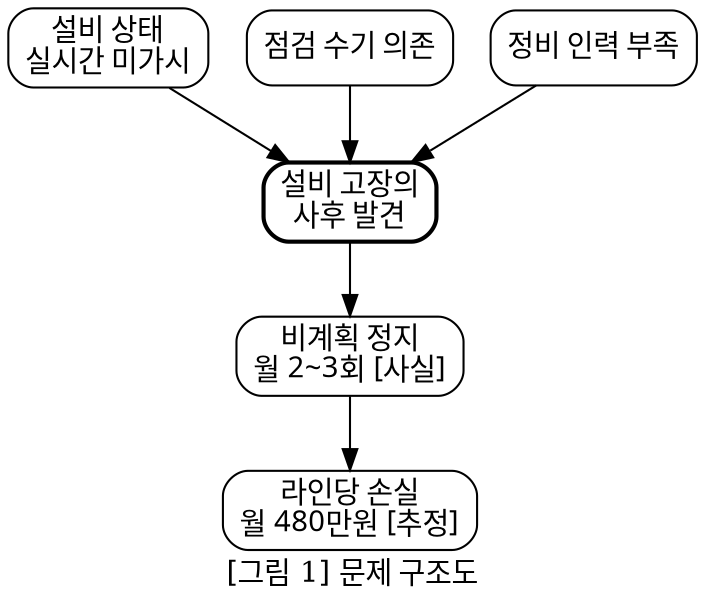
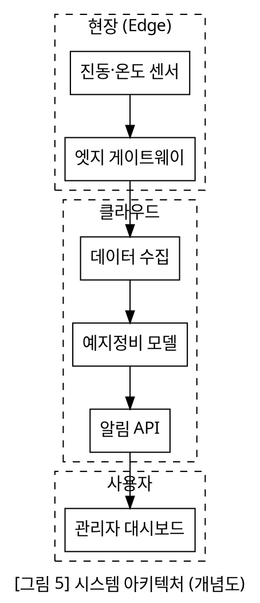
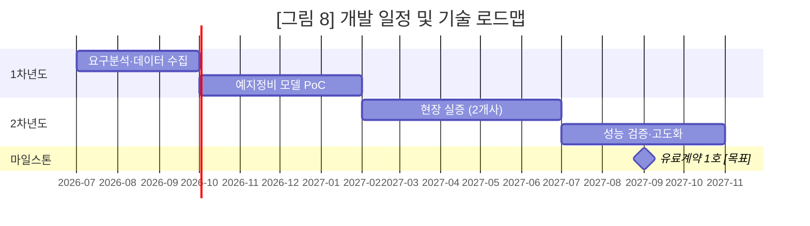
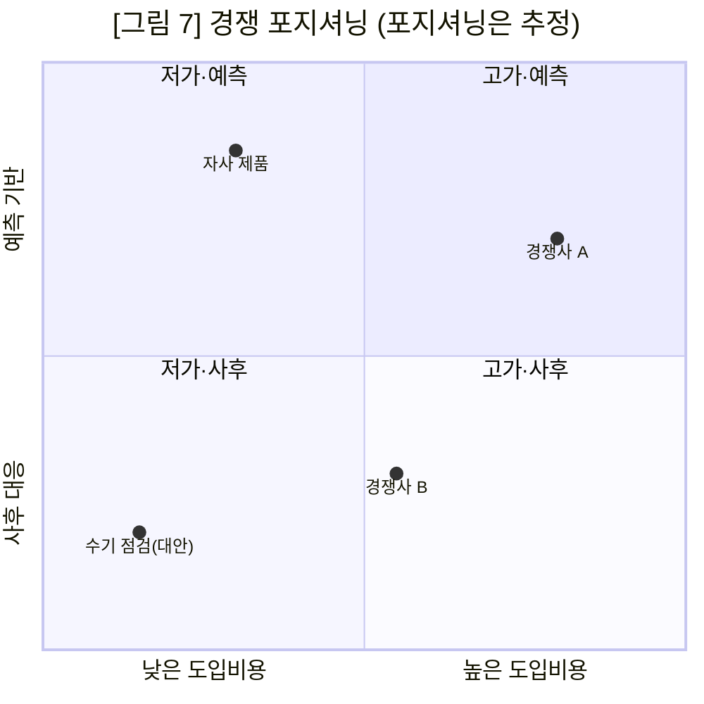

# 09 — 다이어그램 생성 (시각화 프로토콜)

> **이 문서는 15단계 진입 시 Read 한다.** 입력은 `06-template-design/section-visual-map.md` + `business-core.yaml`.
> 출력은 `07-diagrams/diagram-source/`(원본 .mmd/.dot — 보존) → `07-diagrams/images/`(렌더 PNG/SVG).
> 워크플로우: 원본 작성 → `scripts/render_diagram.sh` 렌더 → 초안 삽입.

---

## 0. 절대 규칙 — 다이어그램의 가짜 수치 금지

다이어그램은 글보다 "사실처럼" 보여 위험하다. 절대 규칙 #1·#7이 그대로 적용된다.

- **임의 수치 창작 금지.** 다이어그램에 들어가는 모든 숫자(시장규모·일정·인원·비율)는 `business-core.yaml`/엑셀에 *이미 존재하고 태그가 붙은* 값만 쓴다. 그림 그리려고 숫자를 지어내지 않는다.
- **숫자 일관성(Gate 4).** 간트의 날짜, 동심원의 TAM/SAM/SOM, 예산구조의 금액은 코어·문서와 동일해야 한다.
- **실데이터 vs 개념 구분.** 검증된 데이터 그림에는 출처·기준일을, 개념 설명 그림에는 "개념도(예시)" 라벨을 명시한다. 둘을 섞지 않는다.

---

## 1. 생성 대상 21종 + 권장 포맷

PRD §16. 다이어그램 성격에 맞는 포맷을 고른다.

| 다이어그램 | 권장 포맷 | 이유 |
|---|---|---|
| 문제 구조도 | Graphviz | 원인→결과 관계망 |
| 이해관계자 지도 | Graphviz | 관계·영향 방향 |
| 고객 여정 | Mermaid (journey/flowchart) | 단계 흐름 |
| 현재 업무 흐름 (As-Is) | Mermaid flowchart | 순차·분기 |
| 개선 후 업무 흐름 (To-Be) | Mermaid flowchart | 순차·분기 |
| Before–After 비교 | 표 또는 Mermaid 2열 | 대비 |
| 제품 구성도 | Graphviz | 모듈 구조 |
| 시스템 아키텍처 | Graphviz (cluster) | 계층·경계 |
| 데이터 흐름 | Mermaid flowchart / Graphviz | 데이터 이동 |
| 서비스 이용 흐름 | Mermaid sequence | 행위자 간 상호작용 |
| 비즈니스 모델 | 표 (BMC 9블록) | 정형 캔버스 |
| 가치사슬 | Graphviz (rankdir=LR) | 단계 연쇄 |
| 경쟁 포지셔닝 | 표 또는 2x2 산점 | 축 기반 비교 |
| 시장 세분화 | 표 / 트리(Graphviz) | 분류 |
| 특허 랜드스케이프 | 표 + 산점 | 출원인×기술영역 |
| 기술 로드맵 | Mermaid gantt | 시간축 |
| 개발 일정 | Mermaid gantt | 시간축·마일스톤 |
| 추진 체계 | Graphviz | 기관·역할 관계 |
| 조직도 | Graphviz (tree) | 위계 |
| 예산 구조 | 표 / Graphviz tree | 항목 배분 |
| 파급효과 | Graphviz | 효과 확산 |

원칙: **흐름·시간·시퀀스 = Mermaid**, **구조·관계·위계 = Graphviz**, **비교·포지셔닝·정형캔버스 = 표**.

---

## 2. 다이어그램 규칙 7개 (PRD §16)

매 다이어그램 작성 전 점검.

1. **한 그림 한 메시지** — 한 그림이 두 가지를 말하면 둘로 쪼갠다.
2. **노드 5~9개** — 너무 적으면 그림이 불필요, 많으면 그룹핑하거나 분할.
3. **기술 구조와 사용자 흐름 분리** — 시스템 아키텍처와 고객 여정을 한 그림에 섞지 않는다.
4. **제목·범례·단위 표시** — 모든 그림에 제목, 색/모양이 의미를 가지면 범례, 수치엔 단위.
5. **흑백 식별 가능** — 색에만 의존하지 않는다(인쇄·복사 대비). 모양·패턴·라벨 병행.
6. **원본 보존** — `.mmd`/`.dot` 소스를 `diagram-source/`에 남긴다. 수정·재현·검증 가능(PRD §26 재현성).
7. **실데이터 vs 개념 구분** — 데이터 그림은 출처·기준일, 개념 그림은 "개념도" 라벨.

---

## 3. 워크플로우 — 원본 보존 → 렌더

```text
1) diagram-source/problem-tree.dot  작성   (원본, 버전관리·재현)
2) bash scripts/render_diagram.sh \
     07-diagrams/diagram-source/problem-tree.dot \
     07-diagrams/images/problem-tree.png
3) 초안 section-visual-map 따라 08-draft/*.md 에 images/problem-tree.png 삽입
```

규칙:
- 파일명은 의미 기반 kebab-case: `problem-tree`, `system-architecture`, `tech-roadmap`, `competitive-2x2`.
- 소스 확장자: Mermaid `.mmd`, Graphviz `.dot`.
- 렌더 실패 시 원본은 남으므로 수정 후 재렌더(처음부터 다시 그리지 않음).
- 모든 그림은 흑백 인쇄 미리보기로 식별성 확인 후 삽입.

### 3b. HTML 산출물은 mermaid 자동 렌더 (권장 · 의존성 0 · 2026-06-17)

`mmdc`(mermaid-cli)·`dot`가 없어 PNG 렌더가 안 되는 환경이 흔하다. 이때 **HTML 산출물에는 PNG가 필요 없다**:

- 초안 `08-draft/*.md` 에 다이어그램을 ` ```mermaid ` 코드블록으로 직접 넣는다(원본 .mmd 내용 그대로 붙임).
- `md_to_html.py`가 ` ```mermaid ` 블록을 `<pre class="mermaid">`로 출력하고 mermaid.js(CDN)를 자동 삽입 → **브라우저에서 다이어그램이 그려진다**. (흰 배경·중앙정렬 스타일 자동)
- 따라서 워크플로우: **원본 .mmd 보존(diagram-source/) + 같은 내용을 초안에 ```mermaid 인라인** → HTML은 자동 렌더.
- 검수: HTML을 브라우저로 열어 다이어그램이 깨짐 없이 렌더되는지 확인(§12 픽셀 검수).

### 3c. DOCX/HWPX/PDF 는 mermaid→PNG 사전렌더 필수 (2026-06-18 · 사용자 지적)

> **HTML 외 포맷(DOCX/HWPX/PDF)은 ```mermaid 코드블록을 렌더하지 못해 다이어그램이 텍스트로 깨진다.** 변환 전 반드시 `scripts/prerender_mermaid.py`로 PNG 치환한 "렌더 md"를 만든다.

```bash
# mmdc 1회 설치(로컬): 스킬 루트에서  npm install @mermaid-js/mermaid-cli
python3 scripts/prerender_mermaid.py \
  08-draft/business-plan-draft.md 08-draft/business-plan-draft.render.md \
  --img-dir 07-diagrams/images --src-dir 07-diagrams/diagram-source --prefix fig
# 그 다음 render.md 로 DOCX/HWPX/PDF 변환 (HTML 은 원본 md)
```

- `prerender_mermaid.py`가 ```mermaid 블록을 순서대로 `fig-NN.mmd` 보존 + `fig-NN.png` 렌더(흰배경·고해상) + md 코드블록을 `` 치환.
- 로컬 `node_modules/.bin/mmdc`를 자동 사용(전역 mmdc 불필요). 렌더 실패 블록은 코드블록 유지(비차단).
- 상세: `references/10-drafting.md §11.6`.

---

## 4. 코드 예시

실제 작성에 바로 쓰는 4종 골격. 수치는 모두 `business-core.yaml` 값으로 교체하고 출처/태그를 캡션에 단다.

### 4.1 문제 구조도 (Graphviz)

원인→핵심문제→결과의 인과망. 노드는 코어 `problem`에서 가져온다.


캡션 예: `[그림 1] 문제 구조도. 빈도=CF#04[사실], 손실=src#12[추정]`

### 4.2 시스템 아키텍처 (Graphviz, cluster)

계층·경계를 cluster로. 기술 구조 전용(사용자 흐름과 분리, 규칙 3).


캡션: 개념도이므로 "개념도" 라벨(규칙 7). 구현 단계는 코어 `technology.current_stage`로 별도 표기.

### 4.3 기술 로드맵 / 개발 일정 (Mermaid gantt)

날짜는 코어 `execution.milestones`·financial-model의 집행시점과 **반드시 일치**(Gate 4).


규칙: 마일스톤 라벨에 태그([목표]) 명시. 간트 종료월 = `execution` 코어와 동일.

### 4.4 경쟁 포지셔닝 2x2 (Mermaid quadrant)

축은 고객이 실제 중시하는 기준(코어 `competition.positioning`)으로. 좌표는 [추정]임을 캡션에 명시.


규칙: 자사를 임의로 우상단에 두지 말 것 — 좌표 근거(경쟁 조사 src#)를 evidence-ledger에 기록. 표가 더 정확하면 표로 대체(흑백 식별성).

---

## 5. 다이어그램 검증 체크리스트 (초안 삽입 전)

- [ ] 한 그림 한 메시지, 노드 5~9개
- [ ] 기술 구조 ↔ 사용자 흐름 분리
- [ ] 제목·(필요시)범례·단위 표시
- [ ] 흑백에서 식별 가능 (색 단독 의존 0)
- [ ] `.mmd`/`.dot` 원본을 `diagram-source/`에 보존
- [ ] 모든 수치가 코어/엑셀에 존재 + 태그 부착 (창작 0, Gate 4 일치)
- [ ] 실데이터=출처·기준일 / 개념도=라벨 구분
- [ ] `images/`에 렌더 완료, `section-visual-map.md` 계획과 일치
