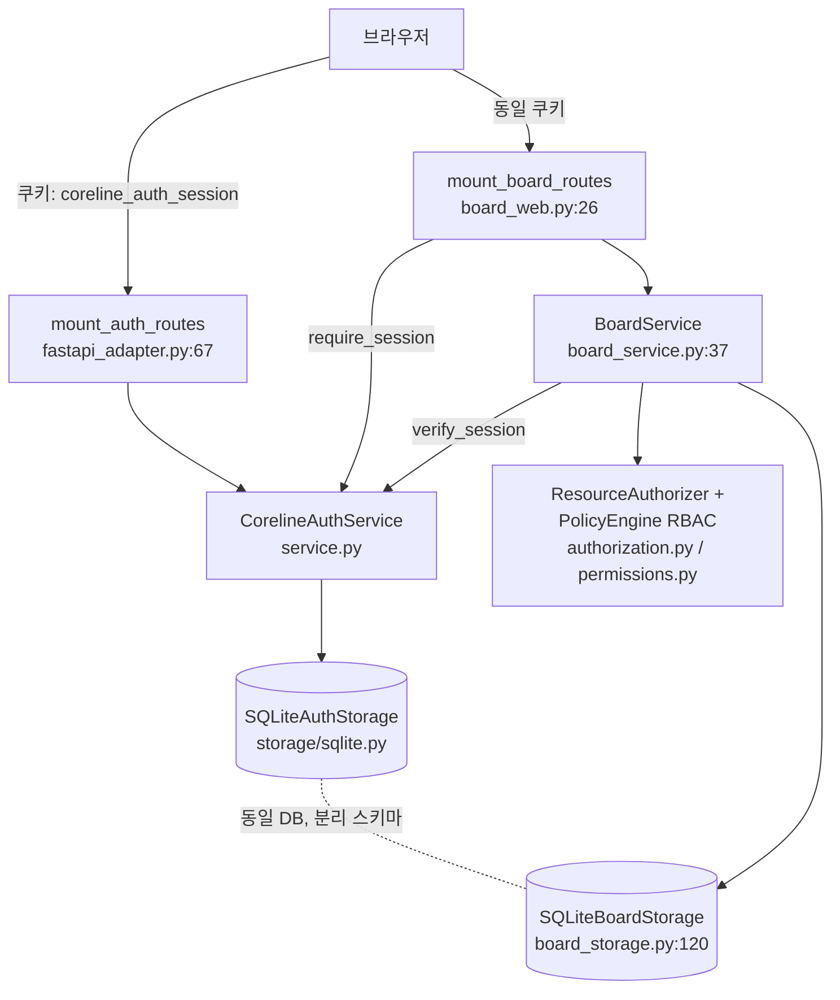
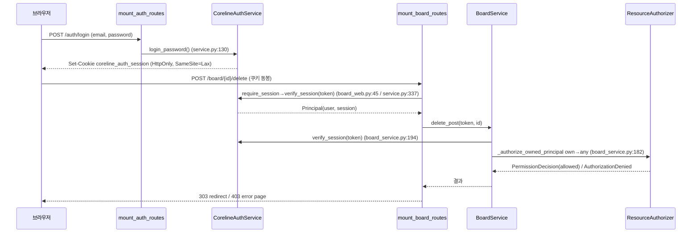

# coreline-auth ↔ 게시판 통합 적용 가능 문서

> **Historical note (2026-06-07)**: 이 문서는 2026-05-29 시점의 pre-split `examples/board_*`/`examples/saas_app.py` 통합 검토 기록이다. 현재 `coreline-auth`의 권한별 board self-test source-of-truth는 checkout-only [`demos/board_rbac/`](../demos/board_rbac/)와 [`dev-plan/implement_20260607_203709.md`](../dev-plan/implement_20260607_203709.md)이다. `src/coreline_auth`에는 board domain/route 코드를 다시 넣지 않는다.

> **대상**: `examples/board_*` (Python/FastAPI in-process 게시판)
> **인증 모듈**: `coreline-auth` v0.5.0rc1 + 보안 패치 5건(AUTHZ-001 / RLIM-02 / REC-01 / VAULT-01 / ASYNC-PARITY)
> **작성일**: 2026-05-29
> **전제(사용자 확정)**: 기준 배포 = 데모(동기 `CorelineAuthService` + `SQLiteAuthStorage`) → 프로덕션(`AsyncCorelineAuthService` + Postgres 비동기) **전환 경로 포함**
> **기존 통합 레퍼런스**: `examples/saas_app.py`
> **루트**: `/Users/hwanchoi/project_202605/CoreMCP/packages/coreline-auth`

---

## 1. 요약 (Executive Summary)

### 적용 가능성 결론

**동기 경로(데모 기준)에서는 게시판 통합이 이미 완결되어 있다.** `examples/saas_app.py:609-616`이 실제 와이어링이며, 새 게시판은 동일한 `BoardService` + `mount_board_routes` 패턴을 그대로 재사용해 in-process로 붙일 수 있다. **비동기/Postgres 프로덕션 전환은 부분적으로만 가능하다** — 인증 핵심(로그인/세션/매직링크) 및 ASYNC-PARITY 패치로 추가된 비밀번호 재설정·이메일 인증은 비동기에서 동작하지만, **게시판(BoardService/스토리지/웹)·admin·MFA·소셜의 비동기판은 미구현**이므로 직접 개발이 필요하다.

### 핵심 통합 포인트 (3~5)

1. **세션 쿠키 공유**: 인증 라우트(`mount_auth_routes`)와 게시판 라우트(`mount_board_routes`)가 동일 쿠키(`coreline_auth_session`)를 공유한다. 게시판은 별도 로그인 로직 없이 쿠키를 읽어 `verify_session()`으로 검증한다(§7).
2. **own/any 권한 위임**: 게시판의 소유권 기반 권한은 전적으로 `BoardService._authorize_owned_principal`(`board_service.py:182-189`) + `ResourceAuthorizer` + `PolicyEngine`에 위임된다. **AUTHZ-001 패치가 이 own/any 정확성에 직결**된다(§8).
3. **자체 RBAC PolicyEngine**: `BoardService`는 host `auth`와 별개로 `PolicyEngine(profile=AuthProfile.RBAC)`를 고정 사용한다(`board_service.py:49`). 게시판 권한은 독립 평가된다(§8).
4. **선택 기능은 auth 계층에서 활성화**: MFA step-up·소셜·이메일·레이트리밋은 게시판 도메인이 아니라 `CorelineAuthService`/인증 라우트에서 켜지고, 게시판은 그 결과(세션/권한/AAL)를 소비한다(§10).
5. **일회성 토큰 원자성은 저장소 계층 책임**: 비밀번호 재설정/이메일 인증/매직링크 토큰의 race 방지는 `consume_login_flow_by_state_hash`의 조건부 `UPDATE ... RETURNING`으로 보장된다(§11).

### 주요 갭 / 리스크

| 우선순위 | 항목 | 근거 |
|---|---|---|
| P0 | 비동기 게시판(`AsyncBoardService`/`AsyncBoardStorage`/async `mount_board_routes`) 미존재 | `board_service.py:37`, `board_web.py:26-33` 동기 전용 |
| P0(프로덕션) | 데모 쿠키 `secure_cookies=False` 평문 HTTP | `saas_app.py:66` |
| P1 | 게시판 POST 폼 CSRF 미내장 — host 책임 | `board_web.py:26-33`(CSRF 인자 없음) |
| P1 | 평문 MFA vault 기본값(`InsecureMfaVaultWarning`) | `service.py:93,393-400` |
| P1 | 비동기 admin/MFA/social 미구현 | `async_service.py`에 해당 메서드 부재 |
| P1 | `seed_demo_board` 프로덕션 호출 시 데이터 오염 | `board_seed.py:49-59`, `saas_app.py:610-611` |

### 권장 단계 (한눈에)

- **Phase 0**: 패치 5건 회귀 테스트 고정
- **Phase 1~3**: 동기 경로로 게시판 통합 완성(마운트 → CSRF/권한 정합성 → 운영 보강)
- **Phase 4~5**: 비동기 기반 구축(게시판 async 신규 개발) → 프로덕션 컷오버(데모 타협 제거)

상세 로드맵은 §13, §14 참조.

---

## 2. 목차

1. 요약 (Executive Summary)
2. 목차
3. 현재 자산 인벤토리
4. 전문가 검토 요약 + 패치 5건
5. 통합 아키텍처
6. (§7) 인증·세션·쿠키·CSRF 통합
7. (§8) 인가 / 권한 매핑
8. (§9) 관리자·사용자 라이프사이클
9. (§10) 선택 기능 (MFA·소셜·이메일·레이트리밋)
10. (§11) 데이터·저장소 통합 & 데모→프로덕션 마이그레이션
11. (§12) 프로덕션 하드닝 (보안·운영·성능)
12. (§13) 갭 분석·리스크 레지스터
13. 단계별 적용 로드맵 & 수용 기준
14. 부록 (권한 매핑표·구성 샘플·코드 스니펫 인덱스·참고 문서)

> 본문 번호: 문서 섹션은 §3~§14로 매긴다. 임무에서 지정한 "본문 7개 섹션"은 §7(인증·세션·CSRF)부터 §13(갭·로드맵)까지에 편입했다.

---

## 3. 현재 자산 인벤토리

### 3.1 coreline-auth 모듈 능력 (동기/비동기 대비)

| 능력 | 동기 `CorelineAuthService` | 비동기 `AsyncCorelineAuthService` | 근거(file:line) |
|---|:---:|:---:|---|
| 세션 발급/검증 | ✅ | ✅ | `service.py:328-363`, `async_service.py:250` |
| 비밀번호 로그인 | ✅ | ✅ | `service.py:130-150`, `async_service.py:105` |
| 매직링크 | ✅ | ✅ | `service.py:152-182` |
| 이메일 인증 | ✅ | ✅ (ASYNC-PARITY) | `service.py:184-223`, `async_service.py:158,178` |
| 비밀번호 재설정 | ✅ | ✅ (ASYNC-PARITY) | `service.py:225-262`, `async_service.py:202,220` |
| RBAC 권한 엔진 | ✅ (공통 모듈) | ✅ (공통 모듈) | `permissions.py`, `authorization.py` |
| MFA (TOTP/복구코드/step-up) | ✅ | ❌ | `service.py:391-483` |
| 관리자(admin) | ✅ | ❌ | `admin.py`, `fastapi_adapter.py:263` |
| 소셜/OAuth | ✅ | ❌ | `service.py:264-326`, `connectors.py` |
| FastAPI 어댑터 | `mount_auth_routes`/`mount_admin_routes` | `mount_async_auth_routes`(6 엔드포인트) | `fastapi_adapter.py:67,263`, `fastapi_async_adapter.py:35` |

### 3.2 게시판(board) 도메인

| 컴포넌트 | 역할 | 근거(file:line) |
|---|---|---|
| `BoardPost` / `BoardComment` / `BoardPostDetail` | 도메인 모델 (id/author_user_id/created_at/updated_at) | `board_models.py:11-34` |
| `MemoryBoardStorage` | 프로세스-로컬 dict 저장소(테스트/데모, 스레드 비안전) | `board_storage.py:17-89` |
| `SQLiteBoardStorage` | WAL + `threading.RLock` 스레드 안전 저장소 | `board_storage.py:120-252` |
| `BoardService` | 세션 검증 + RBAC own/any 권한 오케스트레이션 | `board_service.py:37-224` |
| `mount_board_routes` | FastAPI `/board` 라우터(쿠키 세션, HTML UI) | `board_web.py:26-247` |
| `seed_demo_board` | 6역할 데모 사용자·게시글 idempotent 시드 | `board_seed.py:49-59` |
| 권한 상수 10+종 | `board:read`, `post:*`, `comment:*` | `board_service.py:15-25` |

### 3.3 기존 데모 통합 (`saas_app.py`) 요약

```python
# saas_app.py:609-616 (실제 와이어링)
board_storage = SQLiteBoardStorage(DB_PATH)
if DEMO_MODE:
    seed_demo_board(auth, board_storage)
board_service = BoardService(auth, storage=board_storage)
mount_board_routes(app, auth, board_service=board_service, render_page=page)
...
app.middleware("http")(demo_csrf_middleware(csrf))
```

데모는 `SQLiteAuthStorage`(`saas_app.py:47`) + `InMemoryEmailSender`(`:48`) + `CorelineAuthConfig(profile=AuthProfile.RBAC, require_email_verified=False)`(`:47-56`)로 구성된다.

---

## 4. 전문가 검토 요약 + 패치 5건

`docs/auth-expert-review-20260529.md`의 핵심을 게시판 관점으로 압축하면, 통합 정확성은 **권한 스코프 정합성(own/any)**, **세션/쿠키 보안**, **일회성 토큰 원자성**, **비동기 기능 패리티**에 달려 있다. 방금 적용된 5건 패치는 이 중 앞 셋을 보강한다.

### 4.1 패치 5건과 게시판 통합 영향

| 패치 ID | 코드 위치 | 게시판 관점 영향 |
|---|---|---|
| **AUTHZ-001** 와일드카드 스코프 우회 수정 | `permissions.py:104-128` (핵심 119-128) | own/any 권한 모델의 정확성에 **직결**. scoped grant `post:*:own`이 `post:delete:any`를 더 이상 우회 충족하지 못함 → `_authorize_owned_principal`의 own→any 폴백이 신뢰 가능 |
| **RLIM-02** MFA step-up 레이트리밋 | `service.py:444, 464` | step-up 노출 시 6자리 TOTP 무차별 대입을 `mfa_verify_limit_per_minute`(기본 5/분, `service.py:57`)로 차단 |
| **REC-01** 복구코드 162비트 | `mfa.py:46-52` (`_RECOVERY_CODE_CHARS=27`) | 27 base64url × 6비트 = 162비트, NIST SP 800-63B(≥160비트) 충족 |
| **VAULT-01** 평문 vault 경고 | `service.py:393-400` (`InsecureMfaVaultWarning`) | 기본 `InMemoryMfaSecretVault` 사용 시 경고 → 프로덕션 배포 게이트로 활용 |
| **ASYNC-PARITY** 비동기 4메서드 | `async_service.py:158,178,202,220` | 비동기에서 비밀번호 재설정/이메일 인증 가능. 단 MFA/admin/social/board는 여전히 동기 전용 |

> **중요 정정**: 일부 사전 분석에는 "RLIM-02 미해결"·"ASYNC-PARITY 미구현"으로 표기된 stale 항목이 있었다. **실제 코드 기준으로 RLIM-02는 적용 완료**(`step_up_totp`/`step_up_recovery_code`가 `_check_rate_limit(f"mfa_step_up:{principal.user_id}", limit=self.config.mfa_verify_limit_per_minute)` 호출)이며, **ASYNC-PARITY 4메서드는 모두 구현 완료**다. 이 문서 전체는 정정된 사실을 따른다(§9.1 상세).

### 4.2 AUTHZ-001 매칭 규칙 (실제 코드)

```python
# permissions.py:119-128 — resource/action 와일드카드가 통과해도 grant의 scope는 반드시 존중된다 (AUTHZ-001)
if granted_statement.scope is None or granted_statement.scope == ALL_PERMISSIONS:
    return True
if granted_statement.scope == required_statement.scope:
    return True
if granted_statement.scope == ANY_SCOPE and required_statement.scope in {None, OWN_SCOPE}:
    return True
return False
```

`any` grant는 `own`/무스코프 요구를 상향 커버하지만, `own` grant는 절대 `any`로 승격되지 않는다. 게시판 `author` 역할이 타인 글을 수정/삭제할 수 없음이 정책 엔진 레벨에서 보장된다(§8 상세).

### 4.3 게시판 관점 보안 자세 (요약)

- **알려진 갭(잔존)**: AAL2-01(step-up이 토큰 재발급 없이 assurance level만 상승, `service.py:446`), CSRF 토큰 만료 미검증(세션 바인딩으로 완화, `csrf.py`), SOCIAL-001(직접 `OAuthProviderConfig` 구성 시 SSRF 검토 필요).
- **게시판 미적용 보안**: `mount_board_routes`는 CSRF·감사·레이트리밋·AAL2를 내장하지 않으므로 host가 보강한다(§12).

---

## 5. 통합 아키텍처

### 5.1 컴포넌트 토폴로지



### 5.2 요청 흐름 (인증 → 세션 → 인가 → 게시판 액션)



핵심: 게시판 액션은 **이중으로 세션을 검증**한다 — ① 웹 계층(`require_session`)에서 인증 여부, ② 서비스 계층(`BoardService`)에서 인증+권한.

### 5.3 동기 데모 vs 비동기 프로덕션 토폴로지

| 계층 | 동기 데모 | 비동기 프로덕션 |
|---|---|---|
| 인증 서비스 | `CorelineAuthService` | `AsyncCorelineAuthService` (MFA/admin/social 갭) |
| auth 스토리지 | `SQLiteAuthStorage` | `AsyncPostgresAuthStorage` (`storage/postgres.py:66`) |
| 게시판 서비스 | `BoardService` | **`AsyncBoardService` 신규 개발 필요** |
| 게시판 스토리지 | `SQLiteBoardStorage` | **`AsyncPgBoardStorage` 신규 개발 필요** |
| 게시판 웹 | `mount_board_routes`(동기) | **async `mount_board_routes` 신규 개발 필요** |

---

## 6. (§7) 인증·세션·쿠키·CSRF 통합

게시판(`examples/board_*`)은 자체 로그인 화면이나 세션 발급 로직을 갖지 않는다. 인증 전체를 `coreline-auth`에 위임하고, 게시판은 **세션 쿠키를 읽어 `verify_session()`으로 검증한 뒤 `BoardService`에 권한 판단을 위임**하는 얇은 계층으로만 동작한다.

### 7.1 전체 흐름 한눈에 보기

```
[브라우저]
   │  POST /auth/login (또는 saas_app의 POST /login)
   ▼
mount_auth_routes → auth.login_password(email, password)   # service.py 로그인
   │  Set-Cookie: coreline_auth_session=<token>; HttpOnly; SameSite=Lax; [Secure]
   ▼
[브라우저가 쿠키 보유]
   │  GET/POST /board/*  (쿠키 자동 동봉)
   ▼
mount_board_routes.require_session(request)                # board_web.py:40-49
   │  token = request.cookies.get(SESSION_COOKIE_NAME)
   │  principal = auth.verify_session(token)                # service.py:337-363
   ▼
BoardService.<action>(token, ...) → ResourceAuthorizer.require(...)  # board_service.py
```

핵심은 **인증 라우트와 게시판 라우트가 같은 쿠키 이름(`coreline_auth_session`)을 공유**한다는 점이다. `mount_auth_routes`가 세션 쿠키를 심고(`fastapi_adapter.py:82-83`), `board_web.py`의 `require_session()`이 동일한 `SESSION_COOKIE_NAME`을 읽는다(`board_web.py:18, 41`).

### 7.2 세션 쿠키 — 실제 설정값

`mount_auth_routes`의 내부 `set_session_cookie`가 세션 쿠키를 세팅한다(`fastapi_adapter.py:82-83`):

```python
def set_session_cookie(response: Response, token: str) -> None:
    response.set_cookie(cookie_name, token, httponly=True, secure=secure_cookies, samesite="lax", path="/")
```

| 속성 | 값 | 근거(file:line) | 비고 |
|------|-----|------------------|------|
| 쿠키 이름 | `coreline_auth_session` | `fastapi_adapter.py:20` | `cookie_name` 인자로 변경 가능 |
| `HttpOnly` | 항상 `True` | `fastapi_adapter.py:83` | JS 접근 차단(고정) |
| `Secure` | `secure_cookies` 인자 | `fastapi_adapter.py:73, 83` | **데모 `False`, 프로덕션 `True`** |
| `SameSite` | `lax` | `fastapi_adapter.py:83` | 세션 쿠키는 항상 lax(고정) |
| `Path` | `/` | `fastapi_adapter.py:83` | `/board`와 `/auth` 모두 커버 |
| CSRF 쿠키 이름 | `coreline_auth_csrf` | `fastapi_adapter.py:21` | 세션 쿠키와 분리 |
| CSRF 헤더 이름 | `x-csrf-token` | `fastapi_adapter.py:22` | double-submit 헤더 |
| CSRF 쿠키 `SameSite` | `strict` (기본) | `fastapi_adapter.py:78, 122` | `csrf_cookie_samesite` 인자 |
| CSRF 쿠키 `HttpOnly` | `False` | `fastapi_adapter.py:122` | JS가 헤더에 실어야 하므로 의도적 |

세션 수명은 `CorelineAuthConfig`가 결정한다(`service.py:51-53`):

- `session_ttl_seconds = 60*60*24*7` (절대 만료 7일)
- `session_idle_ttl_seconds = 60*60*12` (유휴 만료 12시간, `None`이면 비활성)
- `session_touch_interval_seconds = 60` (1분마다 유휴 만료 갱신)

`verify_session()`은 절대/유휴 만료를 모두 검사하고, touch 간격이 지났으면 `touch_session()`으로 `idle_expires_at`을 갱신한다(`service.py:342, 349-360`). 게시판을 12시간 이상 방치하면 재로그인이 필요하고, 활동 중이면 유휴 만료가 자동 연장된다 — 게시판 코드가 별도로 처리할 것은 없다.

### 7.3 게시판 액션 보호 — `require_session` + `verify_session`

`board_web.py`는 FastAPI 의존성을 쓰지 않고 라우트 내부에서 직접 세션을 추출한다(`board_web.py:40-49`):

```python
def require_session(request: Request) -> tuple[Principal, str] | RedirectResponse:
    token = request.cookies.get(SESSION_COOKIE_NAME)
    if not token:
        return RedirectResponse("/login", status_code=303)
    try:
        return auth.verify_session(token), token            # service.py:337
    except AuthenticationFailed:
        response = RedirectResponse("/login", status_code=303)
        response.delete_cookie(SESSION_COOKIE_NAME, path="/")  # 만료 쿠키 청소
        return response
```

검증된 `(principal, token)`에서 **`token`을 그대로 `BoardService`에 넘긴다** — `BoardService`가 다시 `verify_session`을 호출하기 때문이다(`board_service.py:191-194`). 따라서 게시판 액션은 **이중으로 세션을 검증**한다(§5.2).

`verify_session(token, *, required_permission=None)` 시그니처(`service.py:337`)는 `required_permission`을 받지만 게시판은 쓰지 않는다. 권한은 `ResourceAuthorizer`가 own/any 스코프까지 판단해야 하므로 `BoardService._authorize_*`가 담당한다(`board_service.py:170-189`, §8). **게시판에서 `verify_session(token, required_permission="post:update:own")`처럼 직접 권한을 거는 것은 own/any 스코프 컨텍스트가 빠지므로 사용하지 말 것.**

세션이 검증되면 `Principal`에서 다음을 사용한다:
- `principal.user_id` — 소유자 비교(`board_web.py:252`, `board_service.py:188`)
- `principal.session.permissions: tuple[str,...]` — UI 버튼 노출 판단(`board_web.py:75`: `"post:create" in principal.session.permissions`)
- `principal.session.role` — 화면 표시(`board_web.py:85, 303`)

### 7.4 CSRF — `CsrfProtector` 적용

게시판 라우트의 POST 폼(글 작성/수정/삭제/댓글)은 `board_web.py`에 **CSRF 검증이 구현되어 있지 않다**. `mount_board_routes`는 `csrf_protector` 인자조차 받지 않는다(`board_web.py:26-33`). CSRF 보호의 실제 메커니즘은 `mount_auth_routes`/`mount_admin_routes`의 `require_csrf`(double-submit)에 있다(`fastapi_adapter.py:95-114`):

```python
def require_csrf(request, *, cookie_auth_required=False):
    authorization = request.headers.get("authorization", "")
    if authorization.lower().startswith("bearer "):
        return                                   # Bearer 요청은 CSRF 면제 (fastapi_adapter.py:97-98)
    if csrf_protector is None:
        if cookie_auth_required and request.cookies.get(cookie_name):
            raise HTTPException(403, "csrf protection is required ...")  # 쿠키 인증 변경 작업은 보호 강제
        return
    header_token = request.headers.get(csrf_header_name)
    cookie_token = request.cookies.get(csrf_cookie_name)
    if not header_token or not cookie_token or not hmac.compare_digest(header_token, cookie_token):
        raise HTTPException(403, "missing or invalid csrf token")
    ...
    csrf_protector.verify_for_context(header_token, context_key=context_key)   # 세션 바인딩 검증
```

`CsrfProtector`는 HMAC-SHA256 서명 토큰을 발급하며(`csrf.py:49-62`), `context_key`는 세션 토큰 해시(`hash_secret(session_token)`)로 **세션별 바인딩**된다(`fastapi_adapter.py:93, 108-110`). 비로그인 컨텍스트는 `"anonymous"`로 전역 바인딩(`csrf.py:43-47`). 생성자는 32자 미만/약한 시크릿을 거부한다(`csrf.py:31-35`); 데모는 `allow_weak_dev_secret=True`로 우회한다(`csrf.py:29`, `saas_app.py:50`).

**게시판 POST에 CSRF를 적용하는 두 가지 옵션:**

**옵션 A — 게시판 폼 POST에 의존성으로 직접 검증 추가(권장).** `require_csrf`와 동일한 double-submit 패턴을 게시판 라우터에 얹는다:

```python
import hmac
from fastapi import Request, HTTPException
from coreline_auth.fastapi_adapter import CSRF_COOKIE_NAME, CSRF_HEADER_NAME, SESSION_COOKIE_NAME
from coreline_auth.security import hash_secret
from coreline_auth.errors import AuthValidationError

def verify_board_csrf(request: Request, *, csrf: CsrfProtector, auth: CorelineAuthService) -> None:
    if request.headers.get("authorization", "").lower().startswith("bearer "):
        return  # Bearer API는 CSRF 면제
    header_token = request.headers.get(CSRF_HEADER_NAME)
    cookie_token = request.cookies.get(CSRF_COOKIE_NAME)
    if not header_token or not cookie_token or not hmac.compare_digest(header_token, cookie_token):
        raise HTTPException(403, "missing or invalid csrf token")
    session_token = request.cookies.get(SESSION_COOKIE_NAME)
    try:
        if session_token:
            auth.verify_session(session_token)
            csrf.verify_for_context(header_token, context_key=hash_secret(session_token))
        else:
            csrf.verify_global(header_token)
    except AuthValidationError as exc:
        raise HTTPException(403, str(exc)) from exc
```

`GET /auth/csrf`가 `{"csrf_token", "header", "cookie", "binding"}`을 반환하고 동시에 CSRF 쿠키를 세팅하므로(`fastapi_adapter.py:116-123`), 페이지 렌더 전에 토큰을 받아 폼 헤더에 넣는다. **HTML 폼 POST는 커스텀 헤더를 못 보내므로, fetch 기반 제출 또는 hidden 필드+서버측 폼값 비교로 전환이 필요**하다. 현재 `board_web.py`의 순수 `<form method='post'>`(`board_web.py:119, 168, 208, 277`)는 헤더 기반 double-submit과 호환되지 않으므로 프로덕션에서는 이 폼들을 fetch+헤더 방식으로 바꿔야 한다.

> 데모 대안: `saas_app.py:616`의 `demo_csrf_middleware(csrf)`는 `</form>` 직전에 CSRF hidden 필드를 string-replace로 주입한다(`saas_demo/layout.py:42-43`). 커스텀 `render_page`를 쓰면 이 주입이 사라져 board POST가 403될 수 있다(§13 R-06).

**옵션 B — SameSite에 의존(데모 한정).** 세션 쿠키가 `SameSite=Lax`이므로 cross-site 폼 POST는 쿠키가 동봉되지 않아 일정 수준 차단되나, CSRF 완전 방어가 아니다(top-level GET 등 우회 가능). 데모 외 사용 금지.

### 7.5 Bearer API 옵션

쿠키 대신 Bearer 토큰으로 게시판을 호출할 수도 있다. 어댑터의 `token_from_request`가 `Authorization: Bearer <token>`을 우선 인식한다(`fastapi_adapter.py:61-64`):

```python
def token_from_request(request, credentials, cookie_name=SESSION_COOKIE_NAME):
    if credentials and credentials.scheme.lower() == "bearer":
        return credentials.credentials
    return request.cookies.get(cookie_name)
```

- **현재 `board_web.py`의 `require_session()`은 쿠키만 읽는다**(`board_web.py:41`). Bearer로 게시판을 쓰려면 `fastapi_adapter.require_session`/`require_permission` 의존성(둘 다 Bearer+쿠키 지원, `fastapi_adapter.py:225-248`)으로 교체하거나, 게시판 라우트를 JSON API로 별도 작성한다.
- **Bearer 요청은 CSRF가 면제된다**(`fastapi_adapter.py:97-98`). 토큰이 브라우저에 자동 동봉되지 않으므로 CSRF 위험이 없는, 의도된 동작이다. 모바일/서버-투-서버 게시판 API는 Bearer를 쓰면 CSRF 설계가 단순해진다.
- 발급 토큰은 `login_password()`가 반환하는 `IssuedSession.token`이며, 쿠키/헤더 어느 쪽으로 보내도 `verify_session`이 동일 검증한다.

### 7.6 데모 vs 프로덕션 (인증·CSRF 관점)

| 항목 | 데모 (`saas_app.py`) | 프로덕션 권장 | 근거 |
|------|----------------------|----------------|------|
| `secure_cookies` | `False` | **`True`(HTTPS)** | `saas_app.py:66` |
| `expose_magic_link_token` | `DEMO_MODE` | **`False`** | `saas_app.py:66`, `fastapi_adapter.py:143-144` |
| CSRF 시크릿 | `allow_weak_dev_secret=...` | 32자+ 고엔트로피, `allow_weak_dev_secret=False` | `saas_app.py:50`, `csrf.py:31-35` |
| CSRF 활성 | `csrf_protector=csrf` | **필수** | `saas_app.py:66-67` |
| 게시판 시드 | `seed_demo_board(...)` (DEMO_MODE) | **호출 금지** | `saas_app.py:610-611` |
| 게시판 CSRF | 없음/미들웨어 주입 | 옵션 A로 직접 추가 | `board_web.py:26-33` |

```python
# 프로덕션 마운트(차이만 반영)
csrf = CsrfProtector(secret_key=os.environ["CSRF_SECRET"])  # 32자+, allow_weak_dev_secret 미사용
mount_auth_routes(app, auth, secure_cookies=True, expose_magic_link_token=False, csrf_protector=csrf)
mount_admin_routes(app, auth, csrf_protector=csrf)
board_service = BoardService(auth, storage=SQLiteBoardStorage(DB_PATH))
# seed_demo_board 호출하지 않음
mount_board_routes(app, auth, board_service=board_service, render_page=page)
# 게시판 POST 폼에 옵션 A의 verify_board_csrf 적용
```

### 7.7 비동기 전환 시의 정직한 현실

- `mount_board_routes`/`board_web.py`/`BoardService`는 모두 동기 `CorelineAuthService`만 받는다 — `auth.verify_session(token)`을 `await` 없이 호출하므로(`board_web.py:45`, `board_service.py:194`) `AsyncCorelineAuthService`를 넘기면 동작하지 않는다. **`AsyncBoardService`/async `mount_board_routes`는 미구현이며 자체 개발 필요**(§11.4).
- 비동기 인증 어댑터 `mount_async_auth_routes`가 실제 마운트하는 엔드포인트는 `/csrf`, `/login`, `/magic-link/request`, `/magic-link/consume`, `/logout`, `/me` **6개뿐**(`fastapi_async_adapter.py:84, 93, 103, 115, 125, 134`). 즉 **이메일 인증/비밀번호 재설정 HTTP 엔드포인트가 없다.**
- 단, ASYNC-PARITY로 **서비스 레벨**에는 4메서드가 구현되어 있다(`async_service.py:158, 178, 202, 220`). 비동기 비밀번호 재설정/이메일 인증을 쓰려면 **이 서비스 메서드를 호출하는 async 라우트를 직접 작성**한다.
- 쿠키/CSRF 메커니즘 자체는 동기·비동기 어댑터가 동일하다(`fastapi_async_adapter.py:51`도 동일 `set_cookie` + double-submit `CsrfProtector`). §7.2~§7.4 규칙이 비동기에도 그대로 적용된다.

### 7.8 통합 체크리스트 (인증·세션·CSRF)

데모:
- [ ] `mount_auth_routes(app, auth, secure_cookies=False, expose_magic_link_token=DEMO_MODE, csrf_protector=csrf)`
- [ ] `mount_board_routes(app, auth, board_service=..., render_page=...)`
- [ ] 로그인 화면(`/login`)이 `set_cookie(SESSION_COOKIE_NAME, issued.token, httponly=True, samesite="lax", path="/")` 수행(`saas_app.py:1037`)
- [ ] `DEMO_MODE`일 때만 `seed_demo_board` 호출

프로덕션:
- [ ] HTTPS 종단 + `secure_cookies=True`
- [ ] `expose_magic_link_token=False`
- [ ] `CsrfProtector` 32자+ 고엔트로피, `allow_weak_dev_secret=False`, auth/admin 라우트에 전달
- [ ] **게시판 POST 폼에 CSRF 검증 직접 추가**(옵션 A)
- [ ] 순수 `<form>` POST를 fetch+`x-csrf-token` 헤더 방식으로 전환
- [ ] `seed_demo_board` **미호출**
- [ ] 비동기로 갈 경우: §11.4의 async 게시판 + 이메일/비번 async 라우트 직접 작성
- [ ] 세션 만료 정책(절대 7일/유휴 12시간 기본) 조정

---

## 7. (§8) 인가 / 권한 매핑

게시판 인가는 **세 계층 위임**으로 구성된다: (1) `verify_session()`이 세션에서 `Principal`과 권한 튜플을 복원, (2) `BoardService`가 도메인 권한 상수(own/any)와 소유자 ID를 결정, (3) `ResourceAuthorizer` + `PolicyEngine._permission_matches()`가 실제 매칭. 웹 계층(`board_web.py`)은 권한 규칙을 직접 작성하지 않고 전부 `BoardService`에 위임한다.

### 8.1 게시판 권한 카탈로그

권한 상수는 `board_service.py:15-25`에 정의된다. 문법은 `resource:action[:scope]` 3-튜플이며 `PermissionStatement.parse()`(`permissions.py:55-65`)가 파싱한다. scope 값은 `OWN_SCOPE="own"`, `ANY_SCOPE="any"`(`permissions.py:10-11`).

| 권한 상수 | 권한 문자열 | scope | 의미 |
|---|---|---|---|
| `BOARD_READ` | `board:read` | 없음 | 게시판 목록/상세/댓글 조회 |
| `BOARD_POST_CREATE` | `post:create` | 없음 | 글 작성 |
| `BOARD_POST_UPDATE_OWN` | `post:update:own` | own | 본인 글 수정 |
| `BOARD_POST_UPDATE_ANY` | `post:update:any` | any | 타인 글 포함 전체 수정 |
| `BOARD_POST_DELETE_OWN` | `post:delete:own` | own | 본인 글 삭제 |
| `BOARD_POST_DELETE_ANY` | `post:delete:any` | any | 전체 글 삭제 |
| `BOARD_COMMENT_CREATE` | `comment:create` | 없음 | 댓글 작성 |
| `BOARD_COMMENT_UPDATE_OWN` | `comment:update:own` | own | 본인 댓글 수정 |
| `BOARD_COMMENT_UPDATE_ANY` | `comment:update:any` | any | 전체 댓글 수정 |
| `BOARD_COMMENT_DELETE_OWN` | `comment:delete:own` | own | 본인 댓글 삭제 |
| `BOARD_COMMENT_DELETE_ANY` | `comment:delete:any` | any | 전체 댓글 삭제 |

> **주의**: `comment:update:any` 상수는 정의되어 있으나, 아래 RBAC 기본 역할 매핑에서 **어떤 역할도 `comment:update:any`를 부여받지 않는다**(OWNER/ADMIN의 `*` 제외). 즉 모더레이터조차 타인 댓글을 *수정*할 수 없고 *삭제*만 가능하다. 이 권한을 쓰려면 역할 매핑을 직접 확장해야 한다(§8.5).

### 8.2 RBAC 역할 ↔ 권한 매핑표 (실제 코드)

역할별 권한은 `permissions.py:12-46`의 정적 튜플이다. `BoardService`는 `PolicyEngine(profile=AuthProfile.RBAC)`(`board_service.py:49`)를 쓰므로 `RBAC_ROLE_PERMISSIONS`(`permissions.py:39-46`)가 적용된다.

| 권한 \ 역할 | VIEWER | USER | AUTHOR | MODERATOR | ADMIN | OWNER |
|---|:---:|:---:|:---:|:---:|:---:|:---:|
| `board:read` | O | O | O | O | `*` | `*` |
| `post:create` | - | O | O | **-** | `*` | `*` |
| `post:update:own` | - | - | O | (any로 커버) | `*` | `*` |
| `post:update:any` | - | - | - | O | `*` | `*` |
| `post:delete:own` | - | - | O | (any로 커버) | `*` | `*` |
| `post:delete:any` | - | - | - | O | `*` | `*` |
| `comment:create` | - | O | O | O | `*` | `*` |
| `comment:update:own` | - | - | **-** | - | `*` | `*` |
| `comment:update:any` | - | - | - | **-** | `*` | `*` |
| `comment:delete:own` | - | - | O | (any로 커버) | `*` | `*` |
| `comment:delete:any` | - | - | - | O | `*` | `*` |
| `users:read` | - | - | - | O | `*` | `*` |

근거(`permissions.py`):
- `RBAC_READ_ONLY_PERMISSIONS = READ_ONLY_PERMISSIONS + ("board:read",)` (line 22) — VIEWER 권한(line 44).
- `USER_PERMISSIONS = RBAC_READ_ONLY_PERMISSIONS + ("post:create", "comment:create")` (line 23-26).
- `AUTHOR_PERMISSIONS = USER_PERMISSIONS + ("post:update:own", "post:delete:own", "comment:delete:own")` (line 27-31) — **author는 `comment:update:own`이 없다**(댓글 삭제만 가능, 수정 불가).
- `MODERATOR_PERMISSIONS = RBAC_READ_ONLY_PERMISSIONS + ("users:read", "post:update:any", "post:delete:any", "comment:create", "comment:delete:any")` (line 32-38) — **모더레이터는 `post:create`가 없다**(글 작성 불가, 관리만). `comment:update:any`도 없다.
- `Role.OWNER`/`Role.ADMIN` → `(ALL_PERMISSIONS,)` 즉 `("*",)` (line 40-41).

`*`가 모든 권한을 충족하는 근거는 `_permission_matches()` 첫 줄(`permissions.py:105`). `(any로 커버)`의 의미: 모더레이터는 own 권한이 없지만 `any` grant가 own 요청도 충족하므로(AUTHZ-001 규칙, §8.4) 자기 글 수정 시에도 `post:update:any`로 통과한다.

### 8.3 소유권 모델: AuthorizationContext + ResourceAuthorizer

own/any 판정의 핵심은 "행위자가 리소스 소유자인가"이며 `AuthorizationContext.owns_resource`(`authorization.py:62-63`)로 동적 계산된다:

```python
@property
def owns_resource(self) -> bool:
    return (self.actor_user_id is not None and self.resource_owner_id is not None
            and self.actor_user_id == self.resource_owner_id)
```

`BoardService._build_context()`(`board_service.py:196-203`)가 `Principal`로부터 컨텍스트를 만든다(`actor_user_id`, `actor_role`, `actor_status`, `resource_owner_id`, `metadata`). metadata의 `resource_type`/`resource_id`는 현재 `ResourceAuthorizer.can()`에서 사용되지 않는 확장 포인트다.

소유 리소스의 이중 권한 검사 진입점 `_authorize_owned_principal()`(`board_service.py:182-189`):

```python
def _authorize_owned_principal(self, principal, *, own_permission, any_permission, owner_user_id, resource_id) -> None:
    context = self._build_context(principal, resource_id=resource_id, owner_user_id=owner_user_id)
    if self.authorizer.can(principal.session.permissions, own_permission, context=context).allowed:
        return
    if self.authorizer.can(principal.session.permissions, any_permission, context=context).allowed:
        return
    expected = own_permission if principal.user_id == owner_user_id else any_permission
    raise AuthorizationDenied(f"missing permission: {expected}")
```

흐름: **own 먼저 → any 폴백 → 둘 다 실패 시 거부.** 거부 메시지는 행위자가 소유자면 own 권한명, 아니면 any 권한명을 노출한다. `update_post`(75-90)·`delete_post`(92-102)·`update_comment`(131-141)·`delete_comment`(143-153)가 이 메서드를 호출하고, `create_post`(65-73)·`create_comment`(120-129)·읽기 계열은 단일 권한 검사 `_authorize()`(170-173)를 쓴다.

### 8.4 AUTHZ-001 수정이 own/any 정확성에 왜 필수인가

`_authorize_owned_principal()`은 "own 시도 → any 폴백" 구조라, 권한 매칭 엔진이 scope 경계를 정확히 지켜야 own/any 분리가 의미를 갖는다. AUTHZ-001 핵심 규칙(`permissions.py:122-127`, §4.2 코드 참조):

- **scope 없는 grant 또는 `:*` scope** → 모든 scope 충족(유연).
- **동일 scope** → 충족(`own↔own`, `any↔any`).
- **`any` grant** → `own`/unscoped 요청 충족(상향 호환). → §8.2의 "any로 커버".
- **그 외(`own` grant가 `any` 요청)** → 거부.

**취약점 시나리오**: 패치 전이라면 `post:*:own`이 action 와일드카드 매칭만 거쳐 `post:delete:any`까지 우회 충족 → author가 **타인 글까지 삭제**하는 권한 상승. AUTHZ-001로 `own` grant는 `any` 요청을 절대 충족하지 못하므로 own/any 경계가 강제된다.

**검증 체크리스트:**
- [ ] AUTHOR로 **타인** 글 `POST /board/{id}/delete` → 403
- [ ] AUTHOR로 **본인** 글 삭제 → 200/303
- [ ] MODERATOR로 타인 글 삭제 → 200/303 (`post:delete:any`)
- [ ] USER로 본인 글 수정 → 403 (own 권한 없음)

### 8.5 다중 게시판/카테고리별 권한 확장 설계

현재 `RBAC_ROLE_PERMISSIONS`는 **정적 dict**(`permissions.py:39-46`)로 모든 게시판이 동일 권한을 공유한다. 확장 옵션(난이도순):

**옵션 A — 리소스 prefix 분리(권장, 변경 최소).** 권한 문자열의 resource 토큰을 네임스페이스화: `notice.post:update:any`, `qna.post:delete:own`. 3-튜플 문법 유지로 `PermissionStatement.parse()`와 호환되고 AUTHZ-001 scope 로직이 그대로 적용된다.

```python
# 커스텀 역할 매핑(host app 소유) — permissions.py 수정 없이 새 dict 생성
from coreline_auth.models import Role
from coreline_auth.permissions import RBAC_ROLE_PERMISSIONS

notice_perms = {
    role: (perms + ("notice.post:update:any",)) if role == Role.MODERATOR else perms
    for role, perms in RBAC_ROLE_PERMISSIONS.items()
}
# 주의: RBAC_ROLE_PERMISSIONS 자체를 mutate 하지 말 것(전역 공유). 새 dict 생성.
```

단, `PolicyEngine`이 `RBAC_ROLE_PERMISSIONS`를 직접 참조하므로(`permissions.py:97`), 커스텀 dict를 쓰려면 `PolicyEngine` 서브클래싱 또는 `issue_session()`의 권한 결정 경로를 커스터마이즈한다. 권한은 `issue_session()`(`service.py:331`)에서 `policy.permissions_for(role=...)`로 토큰에 **고정 저장**되므로 역할 매핑 변경은 신규 세션부터 반영(기존 세션은 재발급 필요).

**옵션 B — 컨텍스트 metadata 활용.** `AuthorizationContext.metadata`에 `resource_type`/`resource_id`가 들어가지만(`board_service.py:202`) 현재 미사용. 카테고리별 동적 정책이 필요하면 `ResourceAuthorizer`를 서브클래싱해 `_candidate_requirements()` 후 metadata 기반 추가 검사를 넣는다(in-house 책임).

**옵션 C — 게시판별 BoardService 인스턴스.** `BoardService(auth, storage=..., authorizer=...)`는 `authorizer`/`storage`를 주입받으므로(`board_service.py:45-50`), 게시판마다 별도 `ResourceAuthorizer`(다른 `PolicyEngine`)·저장소로 격리한다.

### 8.6 데모 vs 프로덕션 (인가 관점)

| 항목 | 데모 | 프로덕션 권장 |
|---|---|---|
| 서비스 | 동기 `BoardService` | 동일(비동기 `AsyncBoardService` **미구현** — §11.4) |
| 권한 프로필 | `AuthProfile.RBAC`(board_service.py:49) | 동일 |
| 역할 시드 | `seed_demo_board()`(board_seed.py:49-59) | **비활성화 필수**(idempotent upsert로 실제 글 덮어쓸 위험) |
| 권한 매칭 | AUTHZ-001 적용 `_permission_matches()` | 동일 |
| 권한 캐싱 | 없음(`can_update_post`/`can_delete_post` 매 호출, board_web.py:255,274) | 목록 N건 시 캐싱/배치 검토(§12.7) |
| CSRF | form POST 미적용 | 직접 보강(§7.4) |

비동기 측 정직한 갭: `AsyncCorelineAuthService`에는 코어만 있고 admin/MFA/social/board 비동기판이 없다. 인가 로직 자체(`permissions.py`, `authorization.py`)는 동기/비동기 공통 모듈이므로 권한 매핑 설계는 비동기 전환에도 재사용된다.

### 8.7 적용 체크리스트 (인가)

- [ ] `BoardService`가 `PolicyEngine(profile=AuthProfile.RBAC)`로 초기화되는지 확인. 다른 프로필에서는 board 권한 미부여.
- [ ] 신규 사용자에게 올바른 `Role` 부여. 역할은 `issue_session()` 시점 권한 튜플로 고정 → 변경 후 세션 재발급/폐지 필요.
- [ ] own/any 변경 작업은 `_authorize_owned_principal()` 경유(직접 `verify_session(required_permission=...)`로 own 검사 우회 금지).
- [ ] AUTHZ-001 회귀 테스트(§8.4).
- [ ] 커스텀 역할 확장 시 `RBAC_ROLE_PERMISSIONS` 전역 dict in-place mutate 금지.
- [ ] 멀티 게시판은 옵션 A(네임스페이스) 우선, 동적 정책은 옵션 B/C.
- [ ] 프로덕션 배포 전 `seed_demo_board()` 제거.
- [ ] `mount_board_routes`의 form POST에 CSRF 검증 직접 추가.

---

## 8. (§9) 관리자·사용자 라이프사이클

이 섹션은 관리자 기능(역할/세션/감사/밴) 연결, 게시판 모더레이션(`any` 스코프) ↔ admin/moderator 역할 매핑, 가입/이메일검증/비밀번호재설정 흐름, 비동기 admin 부재 갭과 대응을 다룬다.

### 9.1 핵심 사실 정정 (재확인)

§4.1에서 다룬 정정을 라이프사이클 관점에서 재확인한다.

| 항목 | stale 주장 | 실제 코드 |
|---|---|---|
| RLIM-02 | "미해결" | **적용됨.** `step_up_totp`(service.py:444), `step_up_recovery_code`(service.py:464)가 `_check_rate_limit(f"mfa_step_up:{principal.user_id}", limit=mfa_verify_limit_per_minute)` 호출 |
| ASYNC-PARITY | "미구현" | **4메서드 구현됨.** `async_service.py:158,178,202,220` |
| 비동기 서비스 vs HTTP 어댑터 | 혼용 | **분리.** 서비스에는 email verify/password reset 존재, 어댑터(`mount_async_auth_routes`)에는 해당 라우트 없음(§9.4 표) |

### 9.2 관리자 API 표면: `CorelineAdminService` + `mount_admin_routes`

#### 9.2.1 코어 서비스 메서드 (`admin.py`)

모든 메서드는 `actor_session_token`을 받아 `verify_session(token, required_permission=...)`으로 행위자 권한을 검증한다.

| 메서드 | file:line | 요구 권한 | 부수효과 |
|---|---|---|---|
| `list_users(*, actor_session_token, query, status, role)` | `admin.py:21-25` | `users:read` | - |
| `update_user_role(*, actor_session_token, user_id, role)` | `admin.py:27-36` | `users:write` | **즉시 `revoke_sessions_for_user(user.id)`** |
| `ban_user(*, actor_session_token, user_id, reason)` | `admin.py:38-48` | `users:ban` | 자기 밴 불가, 마지막 owner/admin 밴 불가 |
| `unban_user(...)` | `admin.py:50-56` | `users:ban` | status→ACTIVE |
| `disable_user(...)` | `admin.py:58-69` | `users:write` | status→DISABLED + 세션 폐지 |
| `enable_user(...)` | `admin.py:71-77` | `users:write` | status→ACTIVE |
| `set_user_password(*, actor_session_token, user_id, password)` | `admin.py:79-86` | `users:write` | `revoke_sessions_on_password_change=True`면 세션 폐지 |
| `list_sessions_for_user(...)` | `admin.py:88-91` | `users:read` | - |
| `revoke_session(*, actor_session_token, session_id)` | `admin.py:93-95` | `sessions:revoke` | 단일 세션 폐지 |

**안전장치 2개:**
- `_require_another_active_privileged_user`(`admin.py:101-105`): owner/admin 강등·밴·비활성화 시 다른 활성 owner/admin이 없으면 `AuthorizationDenied("at least one active owner/admin account is required")` → **잠금아웃 방지**.
- `update_user_role`/`set_user_password`가 세션을 즉시 폐지 → 권한 회수가 토큰 만료를 기다리지 않고 즉시 발효.

#### 9.2.2 HTTP 라우트 (`fastapi_adapter.py:263-448`)

```python
def mount_admin_routes(app, auth, *, prefix="/auth/admin", cookie_name=SESSION_COOKIE_NAME,
                       csrf_protector=None, csrf_cookie_name=CSRF_COOKIE_NAME,
                       csrf_header_name=CSRF_HEADER_NAME, csrf_cookie_samesite="strict") -> APIRouter:
```

| 메서드/경로 | line | 요구 권한 | CSRF |
|---|---|---|---|
| `GET /auth/admin/users` | 319 | `users:read` | 불필요(GET) |
| `GET /auth/admin/audit` | 341 | `audit:read` | 불필요 |
| `POST /auth/admin/users/{id}/role` | 374 | `users:write` | **필수** |
| `POST /auth/admin/users/{id}/ban` | 384 | `users:ban` | 필수 |
| `POST /auth/admin/users/{id}/unban` | 394 | `users:ban` | 필수 |
| `POST /auth/admin/users/{id}/password` | 404 | `users:write` | 필수 |
| `GET /auth/admin/users/{id}/sessions` | 414 | `users:read` | 불필요 |
| `POST /auth/admin/sessions/{id}/revoke` | 437 | `sessions:revoke` | 필수 |

> `disable_user`/`enable_user`는 HTTP로 노출되지 않는다(코어 서비스에만 존재). 게시판에서 "사용자 비활성화" UI가 필요하면 코어 서비스를 직접 호출하거나 별도 라우트를 추가한다.

### 9.3 게시판 모더레이션 ↔ admin/moderator 역할 연결

모더레이션의 핵심은 **`post:*:any` / `comment:*:any` 스코프 권한**이며, §8.2 매트릭스가 정책의 전부다. 실무 사실 재강조:
- **MODERATOR는 `post:create`가 없다** — 남의 글 수정/삭제는 되어도 새 글 작성 불가.
- **MODERATOR는 `comment:update:any`가 없다** — 댓글 삭제만, 내용 수정 불가.
- **AUTHOR는 `comment:update:own`이 없다** — 자기 댓글 삭제만, 수정 불가. UI에서 author에게 댓글 "수정" 버튼을 노출하면 403.

**모더레이션 = "역할 부여" 행위.** 누군가를 모더레이터로 승격하는 것은 `admin.update_user_role` 한 번이다:

```python
from coreline_auth.admin import CorelineAdminService
from coreline_auth.models import Role

admin = CorelineAdminService(auth)
admin.update_user_role(actor_session_token=admin_session_token, user_id="usr_xxx", role=Role.MODERATOR)
```

승격 직후 대상의 기존 세션이 폐지되므로(`admin.py:34`), **재로그인 시 새 세션에 `post:delete:any` 등이 토큰에 박혀 나온다**(권한은 `issue_session`에서 `policy.permissions_for(role)`로 세션에 스냅샷, `service.py:328-335`). 폐지 없이는 즉시 반영되지 않는다.

AUTHZ-001 패치 덕분에 별도 소유권 우회 방지 로직이 불필요하다(§8.4): MODERATOR의 `post:delete:any`는 own/any 검사 둘 다 통과하고, AUTHOR의 `post:delete:own`은 타인 글 삭제 요청에서 절대 매칭되지 않는다.

### 9.4 가입 / 이메일검증 / 비밀번호재설정 흐름

#### 9.4.1 가입

게시판 전용 가입 API는 없다. 데모(`saas_app.py:884-892`)는 **`create_user` + 즉시 `login_password`** 패턴이다.

```python
# saas_app.py:884-892
user = auth.create_user(email=email, role=Role.AUTHOR, password=password,
                        email_verified=True, display_name=display_name or None)
issued = auth.login_password(email=user.primary_email, password=password, context=request_context(request))
response.set_cookie(SESSION_COOKIE_NAME, issued.token, httponly=True, samesite="lax", path="/")
```

`create_user` 시그니처(`service.py:108`):
```python
def create_user(self, *, email, role=Role.USER, password=None, email_verified=False, display_name=None) -> AuthUser
```

| 항목 | 데모 | 프로덕션 |
|---|---|---|
| 기본 역할 | `Role.AUTHOR` | `Role.USER` 권장, 승격은 admin 경유 |
| `email_verified` | `True` 즉시 | **`False`** + 검증 흐름 강제(`require_email_verified=True` 기본) |
| 가입 후 로그인 | 즉시 자동 | `require_email_verified=True`면 검증 전 `login_password`가 `AuthenticationFailed("email is not verified")` |

> 프로덕션: `require_email_verified=True`에서 가입 직후 자동 로그인을 하려면 `email_verified=False`로 만들 수 없다. "가입 → 검증 메일 발송 → 검증 후 첫 로그인" 순서로 설계한다.

#### 9.4.2 이메일검증 (동기)

| 단계 | 메서드 | file:line |
|---|---|---|
| 요청 | `request_email_verification(user_id=None, email=None)` → `MagicLinkChallenge` | `service.py:184-202` |
| 소비 | `consume_email_verification(token)` → `AuthUser` | `service.py:204-223` |

- `user_id` 또는 `email` 중 **정확히 하나만** 전달(`service.py:185-186`).
- 토큰은 storage 조건부 UPDATE로 **원자적 1회성**.
- HTTP(`fastapi_adapter.py:157-180`): `POST /auth/email-verification/request`(열거 방지로 실패 시에도 `{"ok": True}`, `:162-165`), `.../consume`.

#### 9.4.3 비밀번호재설정 (동기)

| 단계 | 메서드 | file:line |
|---|---|---|
| 요청 | `request_password_reset(email)` → `MagicLinkChallenge` | `service.py:225-242` |
| 소비 | `consume_password_reset(token, new_password)` → `AuthUser` | `service.py:244-262` |

- **열거 방지**: 미존재/비활성 사용자도 flow를 만들어 반환하되 저장/메일발송 생략, `verify_dummy_password(token)`로 타이밍 평탄화(`service.py:237-240`).
- **세션 폐지**: `revoke_sessions_on_password_change=True`(기본)면 소비 시 모든 세션 폐지(`service.py:258-260`) → 진행 중 게시판 세션도 즉시 무효.
- HTTP(`fastapi_adapter.py:182-199`): `POST /auth/password-reset/{request,consume}`.

#### 9.4.4 동기 vs 비동기 라이프사이클 라우트 가용성 (정밀 비교)

비동기 적용의 **가장 큰 함정**: 서비스 레벨과 HTTP 어댑터 레벨의 가용성이 다르다.

| 기능 | 동기 서비스 | 동기 HTTP | 비동기 서비스 | 비동기 HTTP(`mount_async_auth_routes`) |
|---|:---:|:---:|:---:|:---:|
| 로그인/매직링크/로그아웃/me | ✅ | ✅ | ✅ | ✅ (`fastapi_async_adapter.py:84-140`) |
| 이메일검증 (request/consume) | ✅ | ✅ | ✅ (`async_service.py:158,178`) | ❌ **라우트 없음** |
| 비밀번호재설정 (request/consume) | ✅ | ✅ | ✅ (`async_service.py:202,220`) | ❌ **라우트 없음** |
| admin (users/role/ban/audit) | ✅ | ✅ | ❌ **메서드 0개** | ❌ |
| MFA (TOTP/recovery/step-up) | ✅ | (별도) | ❌ | ❌ |
| 소셜 로그인 | ✅ | (saas_app) | ❌ | ❌ |
| 게시판(`BoardService`/`mount_board_routes`) | ✅ | ✅ | ❌ | ❌ |

비동기 HTTP 라우트 전부(검증: `fastapi_async_adapter.py`): `/csrf`(84), `/login`(93), `/magic-link/request`(103), `/magic-link/consume`(115), `/logout`(125), `/me`(134).

### 9.5 비동기 측 admin 부재 갭과 대응

#### 9.5.1 갭

1. `AsyncCorelineAuthService`에 admin 메서드 0개.
2. `mount_async_auth_routes`에 admin 라우트 없음.
3. `CorelineAdminService`는 동기 `CorelineAuthService`에 강결합(`admin.py:18` `def __init__(self, auth: CorelineAuthService)`) → 그대로는 비동기 storage에 못 붙음.
4. 게시판 모더레이션 자체가 동기(`board_service.py:194`).

#### 9.5.2 대응 전략

**대응 A — 하이브리드(권장).** 데이터 평면(로그인/세션검증/게시판 읽기)만 비동기 Postgres로 가고, admin/모더레이션 제어 평면은 동기 `CorelineAdminService` + 동기 storage 세션을 별도 유지. 동일 Postgres를 공유하되 동기 측은 별도 동기 드라이버 사용. admin 쓰기 후 `revoke_sessions_for_user`가 비동기 측 `verify_session`에 즉시 반영(같은 `auth_sessions` 테이블). FastAPI는 동기/비동기 라우트 혼용 가능(동기 핸들러는 스레드풀 실행).

**대응 B — 비동기 admin 직접 구현.** `CorelineAdminService`를 참조해 `AsyncCorelineAdminService` 신규 작성. 각 메서드를 `async def`로, `await self.auth.verify_session/storage.update_user/storage.revoke_sessions_for_user`로 치환. 권한 상수/감사 액션 문자열은 동기판과 1:1 유지.

**대응 C — 비동기 게시판 모더레이션.** `AsyncBoardService` + `AsyncBoardStorage` 신규 구현(§11.4). 권한 검사 로직은 순수 동기 연산이라 그대로 재사용 — `await`가 필요한 부분은 `verify_session`과 storage 호출뿐.

#### 9.5.3 비동기 전환 라이프사이클 체크리스트

- [ ] 비번재설정/이메일검증 비동기 HTTP가 필요하면 `mount_async_auth_routes`에 `/password-reset/*`, `/email-verification/*` 라우트 추가(서비스 메서드 존재).
- [ ] admin 필요 시 대응 A 또는 B 결정.
- [ ] 모더레이션 필요 시 `AsyncBoardService` 작성(권한 로직 재사용, I/O만 await).
- [ ] 역할 변경 후 세션 폐지가 비동기 storage에 적용되는지 통합 테스트.
- [ ] `require_email_verified=True`에서 가입→검증→로그인 순서가 비동기 경로에서 강제되는지 확인.
- [ ] MFA step-up 비동기 미구현 인지 — AAL2 필요 작업은 동기 경로 또는 자체 구현.

### 9.6 데모 → 프로덕션 라이프사이클 설정 차이

| 항목 | 데모 (`saas_app.py`) | 프로덕션 |
|---|---|---|
| 서비스/스토리지 | 동기 + SQLite | 비동기 + Postgres(admin/모더레이션은 §9.5 대응) |
| owner 부트스트랩 | `create_user(role=Role.ADMIN, ...)`(`saas_app.py:59`) | `bootstrap_owner`/`create_user`로 최초 owner 후 승격 |
| 가입 기본 역할 | `Role.AUTHOR`(`saas_app.py:886`) | `Role.USER` 권장 |
| `email_verified` | `True` 즉시 | `False` + 검증 강제 |
| 쿠키 | `secure_cookies=False` | `secure_cookies=True` + HTTPS |
| 매직링크 토큰 | `expose_magic_link_token=DEMO_MODE` | `False` |
| CSRF | 약한 dev secret 허용 | 강한 secret, admin POST 전부 CSRF 필수 |
| 게시판 시드 | `seed_demo_board(...)`(`saas_app.py:611`) | **반드시 비활성화** |
| MFA vault | `InMemoryMfaSecretVault`(평문) | `SQLite/RedisMfaSecretVault` 주입 |

---

## 9. (§10) 선택 기능 (MFA·소셜·이메일·레이트리밋)

핵심 세션/RBAC 통합 위에 얹는 선택 기능을 다룬다. 각 기능은 게시판 도메인이 아니라 `CorelineAuthService`(또는 인증 라우트) 층에서 활성화되고, 게시판은 그 결과로 발급된 세션/권한/AAL을 소비한다.

### 10.0 한눈에 보는 적용 매트릭스

| 선택 기능 | 활성화 지점 | 게시판에서 거는 방식 | 동기(데모) | 비동기(프로덕션) |
|---|---|---|:---:|:---:|
| MFA TOTP step-up | `step_up_totp`(`service.py:442-450`) | 민감 작업 라우트에서 AAL2 게이트 | ✅ | ❌ **미구현** |
| 복구코드 step-up | `step_up_recovery_code`(`service.py:462-477`) | 동상 | ✅ | ❌ |
| 소셜/OIDC 로그인 | `begin_social_login`/`login_social`(`service.py:264-326`) | 발급 쿠키 세션을 `mount_board_routes`가 소비 | ✅ | ❌ |
| 이메일 검증 | `request/consume_email_verification`(`service.py:184-223`) | 로그인 게이트(`require_email_verified`)로 간접 | ✅ | ✅ (ASYNC-PARITY, 라우트 직접 작성) |
| 비밀번호 재설정 | `request/consume_password_reset`(`service.py:225-262`) | 인증 라우트에서 처리 | ✅ | ✅ (ASYNC-PARITY, 라우트 직접 작성) |
| 레이트리밋 | `_check_rate_limit` + `CorelineAuthConfig`(`service.py:55-57`) | 서비스 자동 적용, 멀티워커는 Redis 한정자 | ✅ | ✅ |

> ASYNC-PARITY로 비동기에 추가된 것은 이메일 검증/비밀번호 재설정뿐이다(`async_service.py:158-239`). **비동기에는 MFA·소셜·admin·board가 여전히 없다.**

### 10.1 MFA step-up: 모더레이터/관리자 민감 작업 보호

#### 10.1.1 동작 원리와 패치 사실

세션은 발급 시 항상 AAL1이다(`issue_session`이 `assurance_level=AAL1` 고정, `service.py:333`). step-up 성공 시 같은 세션이 AAL2로 승격된다.
- `step_up_totp(session_token, *, code) -> Principal`(`service.py:442-450`): `verify_session` → **`_check_rate_limit(f"mfa_step_up:{user_id}", ...)`**(444) → `verify_totp` → `set_session_assurance_level(...AAL2...)`.
- `step_up_recovery_code(...)`(`service.py:462-477`): 464에서 레이트리밋.
- **RLIM-02**: 두 경로 모두 `mfa_step_up:{user_id}` 키로 분당 `mfa_verify_limit_per_minute`(기본 5, `service.py:57`)회 제한.
- `require_aal2(session_token) -> Principal`(`service.py:479-483`): `assurance_level != AAL2`면 `AuthorizationDenied("aal2 required")`. **게시판 민감 작업에 거는 게이트.**

`verify_totp`(`service.py:425-440`)는 `last_used_counter` 이하를 거부하고 `mark_mfa_factor_counter_used`로 원자 마킹해 리플레이를 막는다.

#### 10.1.2 게시판에 거는 위치

AAL2를 강제할 후보는 **타인 리소스에 영향 주는 모더레이터/관리자 작업**(`post:delete:any`/`comment:delete:any`)이다. `own` 작업은 AAL1로 두는 것이 합리적이다. `BoardService`는 MFA를 노출하지 않으므로(§13 GAP-MFA-BOARD) 게이트는 웹/서비스 래퍼에 surgical하게 추가한다:

```python
from coreline_auth import AuthorizationDenied, AuthAssuranceLevel

def delete_post_with_stepup(auth, board, session_token: str, post_id: str) -> None:
    principal = auth.verify_session(session_token)             # service.py:337
    post = board.get_post(session_token, post_id)              # board_service.py:56
    if principal.user_id != post.author_user_id:               # 타인 글 = any 경로
        if principal.session.assurance_level != AuthAssuranceLevel.AAL2:
            raise AuthorizationDenied("aal2 required for moderation")
    board.delete_post(session_token, post_id)                  # board_service.py:92
```

step-up 유도:
```python
principal = auth.step_up_totp(session_token, code="123456")    # service.py:442
assert principal.session.assurance_level == AuthAssuranceLevel.AAL2
principal = auth.step_up_recovery_code(session_token, code="<27-char-recovery>")  # service.py:462
```

> **한계(AAL2-01)**: step-up은 assurance level만 올리고 토큰을 재발급하지 않는다(`service.py:446`). 토큰 탈취 시 탈취자도 AAL2에 접근 가능. 고위험 운영에서는 step-up 직후 토큰 회전 정책을 추가한다.

#### 10.1.3 등록과 복구코드 (REC-01/VAULT-01)

- 등록: `begin_totp_enrollment(user_id, *, name="Authenticator") -> (AuthMfaFactor, str)`(`service.py:391-413`) → `verify_totp_enrollment(*, user_id, factor_id, code)`(`service.py:415-423`).
- 복구코드: `generate_recovery_codes(user_id, *, count=10) -> list[str]`(`service.py:452-460`). 코드 1개는 **27 base64url 문자 = 162비트**(`mfa.py:48,51-52`, REC-01).
- **VAULT-01**: `mfa_secret_vault` 미주입 시 기본 `InMemoryMfaSecretVault`(평문)가 쓰이고 `begin_totp_enrollment`가 `InsecureMfaVaultWarning` 발생(`service.py:393-400`).

```python
# 프로덕션: 암호화 vault 주입 (VAULT-01 경고 제거)
from coreline_auth import SecretEnvelopeProtector, SQLiteMfaSecretVault, CorelineAuthService
protector = SecretEnvelopeProtector(master_key_b64=os.environ["CORELINE_MFA_MASTER_KEY"])
vault = SQLiteMfaSecretVault("var/mfa.sqlite3", protector=protector)
auth = CorelineAuthService(storage=..., config=..., mfa_secret_vault=vault)  # service.py:82
# Redis 대안: RedisMfaSecretVault(redis_client, protector=protector)
```

### 10.2 소셜/OIDC 로그인

#### 10.2.1 서비스 흐름 (동기 전용)

1. `begin_social_login(*, provider, return_to="/", nonce=None) -> str`(`service.py:264-280`): `FlowType.OAUTH` 플로우 + state 반환. `return_to`는 `SafeReturnToPolicy` 검증, nonce는 해시 저장.
2. `consume_social_login_state(*, provider, state, nonce=None) -> LoginFlow`(`service.py:282-293`): 원자적 소비.
3. `login_social(*, profile: SocialProfile, state=None, nonce=None, context=None) -> IssuedSession`(`service.py:295-326`): identity 매칭 → 없으면 이메일 링크 또는 신규 생성 → 세션 발급.

> **이메일 링킹 보안**: `social_email_linking_requires_verified=True`(기본, `service.py:58`)면 미검증 소셜 이메일을 기존 계정에 링크 시 `auth.social.link_rejected` 감사 후 거부(`service.py:305-307`).

#### 10.2.2 커넥터

- `GoogleOAuthConnector.from_credentials(*, client_id, client_secret, redirect_uri)`(`connectors.py:293-306`)
- `GenericOIDCConnector.from_issuer(*, provider, issuer, client_id, client_secret, redirect_uri, scope="openid email profile", ...)`(`connectors.py:249-271`)
- `FacebookOAuthConnector.from_credentials(...)`(`connectors.py:311-323`)
- `DevSocialConnector(provider).fake_profile(*, email=None, display_name=None) -> SocialProfile`(`connectors.py:353-367`) — 게시판 데모용, `email_verified=True` 고정.

OIDC 경로는 `exchange_code(...)`(`connectors.py:87-164`)가 audience/issuer/nonce/azp/max_age를 검증한다(125-145). 데모 `saas_app.py:990-1002`가 이 PKCE+nonce+JWKS 경로.

#### 10.2.3 게시판에 거는 방식 — "추가 통합이 사실상 없다"

**소셜 로그인은 게시판과 직접 연결되지 않는다.** `login_social`이 발급하는 것은 일반 `IssuedSession`이며, 세션 쿠키만 설정하면 `require_session`(`board_web.py:40-49`)이 다른 방식과 동일 소비한다 — **게시판 코드 변경 0**.

```python
# saas_app.py:984-1011 패턴
issued = auth.login_social(profile=profile, context=request_context(request))  # service.py:295
response = RedirectResponse("/", status_code=303)
response.set_cookie(SESSION_COOKIE_NAME, issued.token, httponly=True, samesite="lax", path="/")
```

신규 소셜 사용자는 기본 `Role.USER`(`service.py:309`) → `post:create`/`comment:create`만 보유(`permissions.py:23-26`). AUTHZ-001 덕분에 own/any 경계가 와일드카드로 우회되지 않는다.

> **SSRF 주의(SOCIAL-001)**: 직접 `OAuthProviderConfig` 구성 시 `auth_url`/`token_url` HTTPS·호스트 검증은 호출자 책임. `GenericOIDCConnector.from_issuer`/`from_endpoints`는 `_normalize_provider_url`을 거치므로 더 안전(`connectors.py:200-205,249-271`).

### 10.3 이메일 검증 / 비밀번호 재설정

§9.4.2~9.4.3에서 흐름과 시그니처를 다뤘다. 게시판 관점의 **간접 효과**만 정리한다.

1. **이메일 검증 = 로그인 게이트**: `require_email_verified=True`(기본)면 미검증 사용자는 `login_password`/`consume_magic_link`/`login_social`의 `_enforce_profile_login`에서 `AuthenticationFailed("email is not verified")`로 막힌다 → 게시판에 세션이 발급되지 않음. 게시판 추가 처리 불필요.
2. **비밀번호 재설정 = 세션 폐기 전파**: 진행 중 게시판 세션이 폐기되어 다음 `verify_session`에서 `AuthenticationFailed` → `require_session`이 `/login`으로 302.

FastAPI 엔드포인트는 이미 마운트되어 있다(`fastapi_adapter.py:157-199`). 게시판과 같은 앱에 `mount_auth_routes`만 호출하면 된다. 비동기는 서비스 메서드(`async_service.py:158-239`)는 있으나 `mount_async_auth_routes`에 라우트가 없어 직접 작성한다.

| 항목 | 데모 | 프로덕션 |
|---|---|---|
| EmailSender | `InMemoryEmailSender`(`email.py:84-99`) | `SmtpEmailSender(host=..., base_url="https://...")` 또는 SES/SendGrid |
| 토큰 노출 | `expose_magic_link_token=True`면 `debug_token` | **False 필수** |
| 흐름 TTL | `login_flow_ttl_seconds=600`(`service.py:54`) | 동일/단축 |

### 10.4 레이트리밋

#### 10.4.1 설정값과 키 구조

`_check_rate_limit(key, limit)`을 서비스가 자동 호출하며, 초과 시 `AuthenticationFailed("rate limited")`(윈도우 60초 고정).

| 흐름 | 키 패턴 | 설정 필드(기본) | 호출 위치 |
|---|---|---|---|
| 비밀번호 로그인 | `login:{hash(email)}` | `login_limit_per_minute`(10) | `service.py:132` |
| 매직링크 요청 | `magic:{hash(email)}` | `magic_link_limit_per_minute`(5) | `service.py:157` |
| 이메일 검증 요청 | `email_verify:{hash(email)}` | `magic_link_limit_per_minute`(5) | `service.py:194` |
| 비밀번호 재설정 요청 | `password_reset:{hash(email)}` | `magic_link_limit_per_minute`(5) | `service.py:227` |
| MFA step-up | `mfa_step_up:{user_id}` | `mfa_verify_limit_per_minute`(5) | `service.py:444,464` (RLIM-02) |

게시판은 별도로 다루지 않는다 — 모든 진입이 위 인증 메서드를 통과하므로 자동 보호된다.

#### 10.4.2 데모(프로세스 로컬) vs 프로덕션(공유)

기본 한정자는 `FixedWindowRateLimiter`로 **프로세스 로컬**(`rate_limit.py:26-52`). 멀티워커에서는 워커별 카운터 분리로 실효 한도가 N배 느슨해진다. 프로덕션은 동일 `check(key, *, limit, window_seconds)` 계약의 공유 한정자를 주입한다.

```python
import redis
from coreline_auth import CorelineAuthService, RedisFixedWindowRateLimiter
limiter = RedisFixedWindowRateLimiter(redis.Redis.from_url(os.environ["REDIS_URL"]))
auth = CorelineAuthService(
    storage=...,
    config=CorelineAuthConfig(profile=AuthProfile.RBAC, login_limit_per_minute=10,
                              magic_link_limit_per_minute=5, mfa_verify_limit_per_minute=5),
    rate_limiter=limiter, mfa_secret_vault=vault,
)
```

### 10.5 적용 체크리스트 (선택 기능)

**데모:**
- [ ] `mount_auth_routes` + `mount_board_routes` 동일 앱, 같은 `auth` 공유.
- [ ] 소셜은 `DevSocialConnector` 폴백 동작 확인, 성공 시 쿠키 설정만으로 게시판 진입.
- [ ] MFA AAL2 게이트는 `post:delete:any`/`comment:delete:any`에만 surgical 적용.
- [ ] `InsecureMfaVaultWarning`을 로그로 가시화.
- [ ] 레이트리밋 기본값(10/5/5), 단일 워커.

**프로덕션:**
- [ ] **MFA·소셜·admin은 비동기 미구현** — 동기 분리 또는 자체 구현, 전환 계획에 명시.
- [ ] 이메일/비번 재설정은 비동기 4메서드 사용, 라우트 직접 작성.
- [ ] `mfa_secret_vault`에 암호화 vault 주입(VAULT-01).
- [ ] `rate_limiter`에 `RedisFixedWindowRateLimiter` 주입.
- [ ] `EmailSender` 교체, `expose_magic_link_token=False`, `secure_cookies=True`.
- [ ] OIDC는 `from_issuer`로 구성(JWKS/nonce/PKCE), 직접 `OAuthProviderConfig`는 SSRF 검토 후.
- [ ] AAL2-01 인지: step-up 후 토큰 회전 검토.

---

## 10. (§11) 데이터·저장소 통합 & 데모→프로덕션 마이그레이션

### 11.1 두 도메인, 하나의 데이터베이스: 테이블 공존

통합은 **인증 도메인(`auth_*`)** 과 **게시판 도메인(`board_*`)** 두 테이블 묶음을 가진다. 데모(`saas_app.py:47, 609`)는 둘 다 같은 SQLite 파일을 공유하지만 스키마는 분리된다.

**인증 도메인 테이블**(`storage/sqlalchemy_schema.py`): `auth_users`(:13), `auth_identities`(:31), `auth_credentials`(:45), `auth_login_flows`(:58), `auth_sessions`(:75), `auth_audit_events`(:98), `auth_mfa_factors`(:111), `auth_recovery_codes`(:129).

**게시판 도메인 테이블**(DDL: `board_storage.py:99-117`):

```sql
CREATE TABLE IF NOT EXISTS board_posts (
  id TEXT PRIMARY KEY, author_user_id TEXT NOT NULL, title TEXT NOT NULL,
  body TEXT NOT NULL, created_at TEXT NOT NULL, updated_at TEXT NOT NULL
);
CREATE TABLE IF NOT EXISTS board_comments (
  id TEXT PRIMARY KEY, post_id TEXT NOT NULL, author_user_id TEXT NOT NULL,
  body TEXT NOT NULL, created_at TEXT NOT NULL, updated_at TEXT NOT NULL
);
CREATE INDEX IF NOT EXISTS ix_board_comments_post_created ON board_comments(post_id, created_at, id);
```

**핵심 설계: `board_posts.author_user_id`는 `auth_users.id`를 논리적으로 참조하지만 FK 제약이 없다.** `board_storage.py:130`이 `PRAGMA foreign_keys=ON`을 켜도 `REFERENCES auth_users(id)` 선언이 없다(의도적 — auth가 별도 마이그레이션/스키마/DB로 관리될 수 있음). 의미:
- 사용자 삭제 시 게시판 글이 cascade되지 않음 → 호스트가 "탈퇴 사용자 글 처리" 정책 책임.
- `board_web._author_email()`은 `auth.storage.get_user(user_id)`로 애플리케이션 레벨 조인(`None`이면 user_id 표시).

> 권장: 단일 Postgres에서 auth/board를 **별도 스키마**(`auth.*` vs `board.*`)로 분리. 같은 스키마라도 프리픽스(`auth_`/`board_`)가 충돌을 막는다.

#### 11.1.1 마이그레이션 적용 순서 (alembic)

auth 도메인은 alembic을 제공한다(`migrations/versions/0001_initial.py`):
```python
def upgrade() -> None:
    metadata.create_all(op.get_bind())   # sqlalchemy_schema.metadata 전체
```
alembic 환경(`migrations/env.py:13, 22`)은 `coreline_auth.storage.sqlalchemy_schema.metadata`를 `target_metadata`로 쓰고, DSN은 `CORELINE_AUTH_POSTGRES_DSN` → `alembic.ini`의 `sqlalchemy.url` 순.

**게시판 테이블은 현재 alembic 관리 대상이 아니다.** `0001_initial`은 auth만 생성하고, board는 `SQLiteBoardStorage.bootstrap()`이 런타임 `executescript(BOARD_SCHEMA_SQL)`로 생성한다(`board_storage.py:141-144`). 프로덕션 Postgres 전환 시 이 갭을 메워야 한다.

**프로덕션 적용 순서:**
1. `CORELINE_AUTH_POSTGRES_DSN` 설정.
2. auth 스키마: `uv run --extra postgres alembic -c alembic.ini upgrade head`.
3. board 스키마: (권장) board용 신규 alembic revision 작성 / (과도기) 신규 async board 저장소의 `bootstrap()`를 기동 시 1회 실행.

> SQLite `TEXT` created_at/updated_at은 Postgres에서 `TIMESTAMPTZ`로 매핑 권장(auth 테이블 규약).

### 11.2 데모 기준 vs 프로덕션 기준 (저장소·전환)

| 항목 | 데모 | 프로덕션 |
|---|---|---|
| Auth 서비스 | `CorelineAuthService`(동기) | `AsyncCorelineAuthService`(`async_service.py:43`) |
| Auth 저장소 | `SQLiteAuthStorage`(`saas_app.py:47`) | `AsyncPostgresAuthStorage`(`postgres.py:66`) |
| Board 저장소 | `SQLiteBoardStorage`(`saas_app.py:609`) | **미구현** → `AsyncPgBoardStorage` 신규(§11.4) |
| Board 서비스 | `BoardService`(`board_service.py:37`) | **미구현** → `AsyncBoardService` 신규 |
| Board 웹 | `mount_board_routes`(`saas_app.py:613`) | **미구현** → async mount 신규 |
| 이메일 | `InMemoryEmailSender`(`saas_app.py:48`) | 실제 SMTP |
| 쿠키 | `secure_cookies=False`(`saas_app.py:66`) | `True` + HTTPS |
| `require_email_verified` | `False`(`saas_app.py:53`) | `True` |
| 데모 시드 | `seed_demo_board`(`saas_app.py:610-611`) | **비활성화** |
| 레이트리밋 | `FixedWindowRateLimiter`(프로세스 로컬) | Redis 등 공유 |

**가장 중요한 갭**: 데모 동기 스택은 완비이나, **프로덕션 비동기 스택은 board 측이 통째로 빠져 있다.** `AsyncCorelineAuthService`에 board 메서드가 없고, 비동기 저장소 프로토콜(`storage/async_protocols.py`)에도 board 스토어가 없다(`AsyncUserStore`~`AsyncHealthCheckStore` 9개만). 또한 비동기 auth 서비스 자체도 MFA/admin/social이 부재하다(§9.4.4).

### 11.3 일회성 토큰 원자성 (저장소 계층에서 처리)

비밀번호 재설정/이메일 인증/매직링크 토큰의 race 방지는 **조건부 `UPDATE...RETURNING`**으로 보장된다.

**동기 SQLite**(`storage/sqlite.py:323-344`):
```python
def consume_login_flow_by_state_hash(self, state_hash, *, flow_type, provider=None, now):
    clauses = ["state_hash = ?", "flow_type = ?", "consumed_at IS NULL", "expires_at > ?"]
    sql = f"UPDATE auth_login_flows SET consumed_at = ? WHERE {' AND '.join(clauses)} RETURNING *"
    with self._lock:
        row = self.db.execute(sql, tuple(query_values)).fetchone()
        self.db.commit()
    return self._flow_from_row(row) if row else None
```
`consumed_at IS NULL` 가드 + `RETURNING *`로 동시 요청 중 정확히 하나만 매칭. SQLite는 WAL(`sqlite.py:169`) + `busy_timeout=5000`(`sqlite.py:167`)로 단일 프로세스 동시성을 막는다.

**비동기 Postgres**(`storage/postgres.py:188-204`):
```python
async def consume_login_flow_by_state_hash(self, state_hash, *, flow_type, provider=None, now):
    stmt = (update(auth_login_flows)
        .where(auth_login_flows.c.state_hash == state_hash,
               auth_login_flows.c.flow_type == flow_type.value,
               auth_login_flows.c.consumed_at.is_(None),
               auth_login_flows.c.expires_at > now)
        .values(consumed_at=now).returning(auth_login_flows))
    if provider is not None:
        stmt = stmt.where(auth_login_flows.c.provider == provider)
    async with self.sessionmaker.begin() as session:
        row = (await session.execute(stmt)).mappings().first()
    return self._flow_from_row(row) if row else None
```
비동기 서비스 주석(`async_service.py:180-182`)이 이를 명시한다("Single-use is guaranteed atomically by the storage layer's conditional consume ... racing consumers are safe without bumping the transaction isolation level").

> 게시판은 자체 토큰을 만들지 말고 비밀번호 재설정/이메일 인증을 auth `consume_*`에 전적으로 위임하라. board 도메인은 일회성 토큰 모델이 없으므로 이 패턴을 복제할 필요가 없다.

### 11.4 비동기 board 저장소/서비스 작성 (설계 + 스켈레톤)

동기 구현이 정확한 청사진이므로 **시그니처를 동기판과 1:1로 맞추고 `await`만 추가**한다.

#### 11.4.1 비동기 board 저장소 프로토콜

동기는 `BoardStorage = MemoryBoardStorage` 별칭(`board_storage.py:91`)만 노출한다. 비동기판은 동기 `MemoryBoardStorage`/`SQLiteBoardStorage`(`board_storage.py:29-88`)와 동일 메서드 집합을 `async`로 정의:

```python
from typing import Protocol
from coreline_auth.examples.board_models import BoardComment, BoardPost

class AsyncBoardStorage(Protocol):
    async def create_post(self, post: BoardPost) -> BoardPost: ...
    async def get_post(self, post_id: str) -> BoardPost | None: ...
    async def list_posts(self) -> list[BoardPost]: ...
    async def update_post(self, post: BoardPost) -> BoardPost: ...
    async def delete_post(self, post_id: str) -> None: ...
    async def create_comment(self, comment: BoardComment) -> BoardComment: ...
    async def get_comment(self, comment_id: str) -> BoardComment | None: ...
    async def list_comments(self, post_id: str) -> list[BoardComment]: ...
    async def update_comment(self, comment: BoardComment) -> BoardComment: ...
    async def delete_comment(self, comment_id: str) -> None: ...
```

#### 11.4.2 Postgres 비동기 board 저장소 스켈레톤

`AsyncPostgresAuthStorage`(`postgres.py:66-90`) 패턴(SQLAlchemy Core + `async_sessionmaker(begin=...)` + `IntegrityError` → `AuthValidationError`)을 차용. 동기판 의미를 보존: `create_post` PK 충돌 시 `"board post already exists"`(`board_storage.py:154-155`), `update/delete_post` `rowcount==0` 시 `"board post not found"`(`board_storage.py:176-178, 183-185`), `delete_post`는 댓글 함께 삭제(`board_storage.py:186`).

```python
from sqlalchemy import Column, MetaData, String, Table, delete, insert, update
from sqlalchemy.exc import IntegrityError
from sqlalchemy.ext.asyncio import async_sessionmaker, create_async_engine
from coreline_auth.errors import AuthValidationError
from coreline_auth.models import now_utc
from coreline_auth.examples.board_models import BoardPost

board_metadata = MetaData()
board_posts = Table("board_posts", board_metadata,
    Column("id", String, primary_key=True), Column("author_user_id", String, nullable=False),
    Column("title", String, nullable=False), Column("body", String, nullable=False),
    Column("created_at", String, nullable=False), Column("updated_at", String, nullable=False))
board_comments = Table("board_comments", board_metadata,
    Column("id", String, primary_key=True), Column("post_id", String, nullable=False),
    Column("author_user_id", String, nullable=False), Column("body", String, nullable=False),
    Column("created_at", String, nullable=False), Column("updated_at", String, nullable=False))

class AsyncPgBoardStorage:
    def __init__(self, database_url, *, echo=False):
        self.engine = create_async_engine(database_url, echo=echo, pool_pre_ping=True)
        self.sessionmaker = async_sessionmaker(self.engine, expire_on_commit=False)

    async def bootstrap(self):
        async with self.engine.begin() as conn:
            await conn.run_sync(board_metadata.create_all)

    async def create_post(self, post: BoardPost) -> BoardPost:
        async with self.sessionmaker.begin() as s:
            try:
                await s.execute(insert(board_posts).values(**self._post_values(post)))
            except IntegrityError as exc:
                raise AuthValidationError("board post already exists") from exc
        return post

    async def delete_post(self, post_id: str) -> None:
        async with self.sessionmaker.begin() as s:
            result = await s.execute(delete(board_posts).where(board_posts.c.id == post_id))
            if result.rowcount == 0:
                raise AuthValidationError("board post not found")
            await s.execute(delete(board_comments).where(board_comments.c.post_id == post_id))
    # get_post/list_posts/update_post/create_comment/... 도 board_storage.py:158-232 의미 그대로 이식
```

> 동기 `MemoryBoardStorage.delete_post`(`board_storage.py:49-54`)·`delete_comment`(`:84-88`)는 인덱스 dict를 비원자적으로 갱신해 멀티스레드 비안전이다(§13 R-10). Postgres 비동기판은 `sessionmaker.begin()` 트랜잭션 + FK/cascade로 해소 가능 — 가능하면 `board_comments.post_id REFERENCES board_posts(id) ON DELETE CASCADE` 추가.

#### 11.4.3 비동기 board 서비스 스켈레톤

동기 `BoardService`(`board_service.py:37-224`)의 RBAC 권한 로직은 **순수 동기 CPU 연산**이다. `ResourceAuthorizer.can/require`·`PolicyEngine.allows`는 I/O가 없으므로 비동기판에서 그대로 호출한다. `await`가 필요한 건 (1) `auth.verify_session`, (2) board 저장소 호출뿐.

```python
from dataclasses import replace
from uuid import uuid4
from coreline_auth import (AuthenticationFailed, AuthorizationContext, AuthorizationDenied,
                           Principal, PolicyEngine, ResourceAuthorizer)
from coreline_auth.models import AuthProfile
from coreline_auth.examples.board_models import BoardPost
from coreline_auth.examples.board_service import (
    BOARD_POST_CREATE, BOARD_POST_UPDATE_OWN, BOARD_POST_UPDATE_ANY)

class AsyncBoardService:
    def __init__(self, auth, *, storage, authorizer=None):
        self.auth = auth                                  # AsyncCorelineAuthService
        self.storage = storage                            # AsyncBoardStorage
        self.policy = PolicyEngine(profile=AuthProfile.RBAC)
        self.authorizer = authorizer or ResourceAuthorizer(policy=self.policy)

    async def create_post(self, session_token, *, title, body) -> BoardPost:
        principal = await self._authorize(session_token, BOARD_POST_CREATE)
        post = BoardPost(id=f"post_{uuid4().hex}", author_user_id=principal.user_id,
                         title=title, body=body)  # 길이검증은 board_service._clean_required 이식
        return await self.storage.create_post(post)

    async def update_post(self, session_token, post_id, *, title=None, body=None) -> BoardPost:
        principal = await self._verify_session(session_token)
        post = await self.storage.get_post(post_id)
        if post is None:
            raise AuthValidationError("board post not found")
        self._authorize_owned_principal(                  # 동기 — await 불필요
            principal, own_permission=BOARD_POST_UPDATE_OWN, any_permission=BOARD_POST_UPDATE_ANY,
            owner_user_id=post.author_user_id, resource_id=post.id)
        updated = replace(post, title=title or post.title, body=body or post.body)
        return await self.storage.update_post(updated)

    # 아래 권한 헬퍼는 board_service.py:170-203 과 byte-for-byte 동일 (AUTHZ-001 보증 유지)
    def _authorize_owned_principal(self, principal, *, own_permission, any_permission, owner_user_id, resource_id) -> None:
        context = self._build_context(principal, resource_id=resource_id, owner_user_id=owner_user_id)
        if self.authorizer.can(principal.session.permissions, own_permission, context=context).allowed: return
        if self.authorizer.can(principal.session.permissions, any_permission, context=context).allowed: return
        expected = own_permission if principal.user_id == owner_user_id else any_permission
        raise AuthorizationDenied(f"missing permission: {expected}")

    async def _authorize(self, session_token, permission, *, resource_id=None, owner_user_id=None) -> Principal:
        principal = await self._verify_session(session_token)
        self.authorizer.require(principal.session.permissions, permission,
                                context=self._build_context(principal, resource_id=resource_id, owner_user_id=owner_user_id))
        return principal

    async def _verify_session(self, session_token) -> Principal:
        if not session_token: raise AuthenticationFailed("invalid session")
        return await self.auth.verify_session(session_token)   # async_service.py:250

    def _build_context(self, principal, *, resource_id, owner_user_id) -> AuthorizationContext:
        return AuthorizationContext(actor_user_id=principal.user_id, actor_role=principal.session.role,
            actor_status=principal.user.status, resource_owner_id=owner_user_id,
            metadata={"resource_type": "board", "resource_id": resource_id})
```

**AUTHZ-001 정합성**: 위 `_authorize_owned_principal`은 동기판(`board_service.py:182-189`)과 동일하다. 정확성은 `_permission_matches`(`permissions.py:104-128`)에 의존하므로 **권한 헬퍼는 재작성하지 말고 그대로 복사**하라(재작성 시 AUTHZ-001 보증이 깨질 위험).

#### 11.4.4 비동기 웹 라우터

동기 `mount_board_routes`(`board_web.py:26`)의 `require_session`은 `auth.verify_session(token)`을 동기 호출한다. 비동기판은 핸들러를 `async def`로 바꾸고 모든 service/verify에 `await` 추가. CSRF는 board 라우터에 미내장이므로(§7.4), `demo_csrf_middleware`(`saas_app.py:616`) 또는 동등 미들웨어를 board POST에도 적용해야 한다.

### 11.5 데모→프로덕션 단계적 전환 체크리스트 (저장소)

**Phase 0 — 동기 데모 검증**: SQLite auth/board + 동기 `BoardService` 6역할 RBAC 동작 + AUTHZ-001 회귀.

**Phase 1 — auth 비동기 전환**: `postgres` extra 설치, DSN 설정, `alembic upgrade head`, `SQLiteAuthStorage→AsyncPostgresAuthStorage`, `CorelineAuthService→AsyncCorelineAuthService`, `secure_cookies=True`/`expose_magic_link_token=False`/`require_email_verified=True`/`allow_weak_dev_secret=False`. **MFA/admin/social 비동기 갭 결정**. 이메일 sender 교체.

**Phase 2 — board 비동기 전환(신규)**: `AsyncBoardStorage`+`AsyncPgBoardStorage`(§11.4.1-2), board alembic revision/bootstrap, FK cascade 추가, `AsyncBoardService`(권한 헬퍼 그대로 복사), async `mount_board_routes` + board POST CSRF.

**Phase 3 — 운영 안전장치**: `seed_demo_board` 비활성화(`board_seed.py:118-131`의 upsert가 실제 글 덮어쓸 위험), 레이트리밋 공유 백엔드, MFA vault 영속화, 탈퇴 사용자 글 정책 결정.

### 11.6 데이터 모델 매핑 요약

| 동기 데모 | 프로덕션 비동기 | 상태 |
|---|---|---|
| `SQLiteAuthStorage` | `AsyncPostgresAuthStorage`(postgres.py:66) | 제공됨 |
| `CorelineAuthService` | `AsyncCorelineAuthService`(async_service.py:43) | 제공됨(MFA/admin/social 갭) |
| `consume_login_flow_by_state_hash`(sqlite.py:323) | postgres.py:188 | 원자성 보증(양쪽 RETURNING) |
| `SQLiteBoardStorage`(board_storage.py:120) | `AsyncPgBoardStorage` | **신규 작성**(§11.4.2) |
| `BoardService`(board_service.py:37) | `AsyncBoardService` | **신규 작성**(§11.4.3) |
| `mount_board_routes`(board_web.py:26) | async mount | **신규 작성**(§11.4.4) |
| `RBAC_ROLE_PERMISSIONS`(permissions.py:39) | 동일(재사용) | 변경 불필요 |
| `_permission_matches`(permissions.py:104, AUTHZ-001) | 동일(재사용) | 변경 불필요 |

---

## 11. (§12) 프로덕션 하드닝 (보안·운영·성능)

### 12.1 패치 5건이 게시판 통합에서 갖는 의미

§4.1 표를 참조한다. 요약: AUTHZ-001은 own/any 정확성에 직결(`permissions.py:104-128`), RLIM-02는 step-up 무차별 대입 차단(`service.py:444,464`), REC-01은 복구코드 162비트(`mfa.py:46-52`), VAULT-01은 평문 vault 경고(`service.py:393-400`, 배포 게이트), ASYNC-PARITY는 비동기 이메일/비번재설정 4메서드(`async_service.py:158-239`).

### 12.2 데모 전용 위험 설정 제거 목록

| 설정 | 데모 값 | 프로덕션 필수 | 위험 |
|---|---|---|---|
| `secure_cookies` | `False`(`saas_app.py:66`) | `True` + HTTPS | 평문 세션 쿠키 도청 |
| `expose_magic_link_token` | `DEMO_MODE`(`saas_app.py:66`) | `False` | 토큰 응답 노출(`fastapi_adapter.py:143-144`) |
| CSRF `allow_weak_dev_secret` | `DEMO_MODE and ...`(`saas_app.py:50`) | `False` + 32바이트+ 시크릿 | CSRF 서명 위조 |
| MFA vault | `InMemoryMfaSecretVault`(`service.py:393`) | 영속 암호화 vault | TOTP 평문 보관 |
| 시드 | `seed_demo_board(...)`(`saas_app.py:610-611`) | 호출 금지 | upsert 덮어쓰기 |
| 저장소 | `SQLiteAuthStorage`(`saas_app.py:47`) | Postgres/board 별도(§11) | 동시성·내구성 한계 |
| 이메일 | `InMemoryEmailSender`(`saas_app.py:48`) | SMTP/SES | 메일 미발송 |

```python
# 프로덕션 인증 라우트 마운트 권장 기준
csrf = CsrfProtector(secret_key=os.environ["CORELINE_CSRF_SECRET"])  # allow_weak_dev_secret=False(기본)
mount_auth_routes(app, auth, secure_cookies=True, expose_magic_link_token=False, csrf_protector=csrf)
mount_admin_routes(app, auth, csrf_protector=csrf)  # 동기 전용
mount_board_routes(app, auth, board_service=board_service, render_page=page)
```

> **CSRF 게이트 주의**: `mount_auth_routes`에 `csrf_protector`를 안 넘기면 `require_csrf`는 쿠키 인증 변경 요청만 403하고 나머지 POST는 통과(`fastapi_adapter.py:99-102`). 프로덕션은 항상 주입. **`mount_board_routes`는 `csrf_protector` 인자 자체가 없으니** POST 폼 CSRF는 §7.4 옵션 A로 직접 추가.

### 12.3 게시판 라우트 CSRF 보강

§7.4에서 상세를 다뤘다. 요약: 동기 어댑터의 `CsrfProtector`(`csrf.py:27`)를 재사용해 폼에 토큰을 심고(`issue_for_context(context_key=hash_secret(session_token))`), POST 핸들러에서 `verify_for_context`로 검증. `CsrfProtector`는 시간 기반 만료가 없어 세션 TTL에 의존한다(CSRF-01).

### 12.4 보안 헤더 / 감사 / 관측성

**보안 헤더**: 모듈은 쿠키 플래그만 설정(`fastapi_adapter.py:83`). HSTS/CSP/X-Frame-Options는 host 미들웨어에서 추가. 게시판이 HTML을 렌더링하므로 CSP 중요:

```python
@app.middleware("http")
async def security_headers(request, call_next):
    resp = await call_next(request)
    resp.headers["Strict-Transport-Security"] = "max-age=63072000; includeSubDomains"
    resp.headers["X-Content-Type-Options"] = "nosniff"
    resp.headers["X-Frame-Options"] = "DENY"
    resp.headers["Content-Security-Policy"] = "default-src 'self'; frame-ancestors 'none'"
    resp.headers["Referrer-Policy"] = "strict-origin-when-cross-origin"
    return resp
```

**감사**: `_audit(action, *, actor_user_id, target_user_id, metadata)`(`service.py:528`). 인증 이벤트는 자동 기록, 조회는 `list_audit_events(...)`(`service.py:388-389`). **게시판 갭(§13 R-09)**: `BoardService`/`mount_board_routes`는 `_audit`를 호출하지 않는다. 게시글 생성/수정/삭제·권한 거부 감사가 필요하면 host가 `auth._audit("board.post.delete", ...)` 직접 호출. 비동기 시 `audit_sink`는 동기 콜러블이므로 블로킹 sink는 큐잉 후 백그라운드 flush 권장.

**관측성**: `MetricSink` 훅(`service.py:433,437`)으로 로그인 실패율·replay 차단·step-up 빈도 계측. 권한 거부 사유는 `PermissionDecision(allowed, reason, matched_permission)`(`authorization.py:70-99`)로 로깅. 단 `can_update_post`/`can_delete_post`(`board_service.py:155-168`)는 예외를 삼키고 `False`만 반환하므로 거부 사유 로깅은 별도 경로.

### 12.5 레이트리밋 / 세션 정책

레이트리밋 표는 §10.4.1. **프로덕션 치명 주의**: `FixedWindowRateLimiter`는 프로세스 로컬(`rate_limit.py:26`)이라 멀티워커에서 실효 한도가 워커 수만큼 곱해진다 → Redis 기반 limiter 주입 또는 edge/WAF IP 제한 병행. 게시판 자체에는 레이트리밋이 없으므로 `/board` POST 쓰기 폭주 제한도 host에서 추가 권장.

**세션 정책**: 절대 7일/유휴 12시간/터치 60초(`service.py:51-53`). 게시판은 `verify_session` 시 idle 자동 갱신(`board_web.py:45`). 비밀번호 변경 시 세션 폐지(`revoke_sessions_on_password_change=True`, `service.py:59`). 역할 변경 즉시 무효화는 `CorelineAdminService.update_user_role`의 `revoke_sessions_for_user`(`admin.py`). AAL2는 host가 `auth.require_aal2(token)`(`service.py:479-483`)를 게시판 핸들러 앞단에서 호출(§10.1.2).

### 12.6 데모 → 프로덕션 전환 게이트 (보안·운영)

**보안 게이트:**
- [ ] `secure_cookies=True` + HTTPS
- [ ] `expose_magic_link_token=False`
- [ ] `CsrfProtector(secret_key=<강한 시크릿>)`, `allow_weak_dev_secret=False`, auth/admin에 주입
- [ ] 게시판 POST CSRF 보강(§7.4)
- [ ] 보안 헤더 미들웨어(§12.4)
- [ ] MFA 사용 시 암호화 vault 주입(`InsecureMfaVaultWarning` 미발생)
- [ ] 분산 시 Redis `RateLimiter` 또는 edge 제한

**운영 게이트:**
- [ ] `seed_demo_board` 비활성화(`DEMO_MODE` 가드 확인)
- [ ] `audit_sink`/`metric_sink` 영속 백엔드 연결, 게시판 도메인 감사 추가
- [ ] 실제 `EmailSender` 주입

**저장소/비동기 게이트(정직한 갭):**
- [ ] auth Postgres 전환(서비스 클래스 교체 동반)
- [ ] **비동기 미구현 영역 확인**: admin/MFA/social 부재
- [ ] **게시판 비동기 미구현**: 저장소·서비스·웹 직접 개발(§11.4)
- [ ] DB 공존 마이그레이션 순서 관리(board는 별도 revision 필요)

> **현실적 권장 배포**: 비동기 전면 전환은 admin/MFA/social/board 부재로 비용이 크다. **단기 권장안은 "동기 `CorelineAuthService` + `SQLiteBoardStorage`(WAL) + uvicorn 단일 워커 또는 스티키 라우팅"** 이며 레이트리밋 분산 문제를 edge에서 보완. 완전 비동기/Postgres는 갭을 메운 뒤 단계 전환.

### 12.7 성능 메모

- **권한 검사 캐싱 부재**: `can_update_post`/`can_delete_post`(`board_service.py:155-168`)는 매 호출 `verify_session` + post 조회 + 권한 평가 재실행. 목록 페이지에서 게시글당 호출(`board_web.py:62-72`)되어 **N 비례 권한 재평가 + N+1 댓글 조회**. 세션 검증 1회로 모으고 권한/댓글 카운트 배치 조회 권장.
- **세션 터치 디바운스**: `session_touch_interval_seconds=60`(`service.py:53`)으로 idle 쓰기를 묶어 고트래픽 완화.
- **SQLite WAL**: `SQLiteBoardStorage`는 WAL + `busy_timeout=5000` + `RLock`(`board_storage.py:120-252`)로 스레드 안전하나 단일 노드 한정 → Postgres 전환 판단 기준.
- **`MemoryBoardStorage`**: 락 없는 dict 기반(`board_storage.py:17-89`) → 멀티스레드/워커 프로덕션 부적합(테스트/데모 전용).

---

## 12. (§13) 갭 분석·리스크 레지스터

### 13.1 미구현 갭 목록

| ID | 갭 | 근거(file:line) | 통합 영향 |
|---|---|---|---|
| GAP-ASYNC-BOARD | `AsyncBoardService`/`AsyncBoardStorage` 없음 | `board_service.py:37`, `board_storage.py:17/120` | async 컷오버 시 게시판 계층 신규 개발 필수 |
| GAP-ASYNC-WEB | `mount_board_routes`가 동기 `CorelineAuthService`만 받음 | `board_web.py:26-33,45` | async 앱에서 `await` 불가 → 재작성 |
| GAP-ASYNC-ADMIN | 비동기 admin 라우트 없음 | `fastapi_async_adapter.py`(부재), 동기 `fastapi_adapter.py:263` | 역할변경/밴/감사 async 불가 |
| GAP-ASYNC-MFA | 비동기 MFA/step-up 없음 | `async_service.py`(부재) | 게시판 AAL2 강제 async 불가 |
| GAP-ASYNC-SOCIAL | 비동기 소셜/OAuth 없음 | `async_service.py`(부재) | 소셜 기반 게시판 접근 async 불가 |
| GAP-ASYNC-BOARD-STORAGE | board용 Postgres 비동기 저장소 없음 | `board_storage.py`(메모리/SQLite만) | auth는 있으나 board 없음 |
| GAP-MFA-BOARD | `BoardService`에 step-up 진입점 없음 | `board_service.py`(verify_session만, :194) | 민감 작업 AAL2 미적용(현재 AAL1) |
| GAP-CSRF-RENDER | board form CSRF가 host `render_page`에 의존 | `board_web.py:119,168,208,277`; 데모는 `layout.py:43` 주입 | 커스텀 렌더러 시 CSRF 누락 → 403 |
| GAP-COMMENT-UPDATE | 댓글 수정 권한·서비스는 있으나 웹 라우트 미노출 | `board_service.py:22-23,131`; `board_web.py`(라우트 없음) | 댓글 수정/삭제 UI 미완성 |
| GAP-AUDIT-BOARD | board 작업이 `_audit`/`audit_sink`에 미기록 | `board_web.py`/`board_service.py`(audit 호출 없음) | 게시판 감사 추적 부재 |
| GAP-MULTI-BOARD | 단일 전역 게시판, board별 권한 분리 없음 | `board_service.py:15-25` | 다중 게시판/카테고리 미지원 |
| GAP-ATTACH | 첨부파일/업로드 도메인 부재 | `board_models.py`(첨부 필드 없음) | 파일 권한·검증·스토리지 신규 설계 |
| GAP-PAGINATION | `list_posts` 전량 반환 | `board_storage.py:39-40` | 대량 시 성능·메모리 이슈 |

비동기에서 **이미 구현 완료**: `request/consume_email_verification`(`async_service.py:158,178`), `request/consume_password_reset`(`:202,220`), `verify_session`(`:250`). 즉 비번재설정/이메일인증은 async 가능, **MFA·admin·social·board는 동기 전용**.

### 13.2 리스크 레지스터

심각도: P0(컷오버 차단) / P1(프로덕션 전 필수) / P2(권장).

| ID | 리스크 | 심각도 | 근거 | 완화책 |
|---|---|---|---|---|
| R-01 | 비동기 board 미존재 상태로 async 전환 시 게시판 전면 중단 | P0 | `board_service.py:37`, `board_web.py:26-33` | board 비동기판 완성 후에만 컷오버(Phase 4) |
| R-02 | 평문 MFA vault → TOTP 시크릿 노출 | P1 | `service.py:93,393-398` | 영속 암호화 vault 명시 주입, VAULT-01 경고를 CI error로 |
| R-03 | 데모 쿠키 평문 HTTP 전송 | P0(프로덕션) | `saas_app.py:66` | `secure_cookies=True` + HTTPS |
| R-04 | 매직링크 토큰 UI 노출 | P1 | `saas_app.py:66` | `expose_magic_link_token=False` |
| R-05 | 약한 CSRF dev secret | P1 | `saas_app.py:50` | 강한 시크릿, `allow_weak_dev_secret=False` |
| R-06 | 커스텀 `render_page` 시 board form CSRF 누락 → 403 | P1 | `board_web.py:119,168,208,277`, `layout.py:42-43` | 커스텀 렌더러도 CSRF hidden 필드 주입, 회귀 테스트 |
| R-07 | `seed_demo_board` 프로덕션 호출 시 데이터 오염 | P1 | `board_seed.py:49-59`, `saas_app.py:610` | `DEMO_MODE` 가드, 프로덕션 import 차단 |
| R-08 | 민감 작업(삭제) MFA 미강제 | P2 | `board_service.py:93-102`, `service.py:479-483` | `require_aal2` 게이트(동기, GAP-ASYNC-MFA로 async 보류) |
| R-09 | board 행위 감사 부재 | P2 | `board_service.py`/`board_web.py`(audit 없음) | `auth._audit("board.post.delete", ...)` 또는 별도 sink |
| R-10 | `MemoryBoardStorage` 스레드 비안전 | P1(메모리 모드) | `board_storage.py:17-88` | `SQLiteBoardStorage`/Postgres 사용 |
| R-11 | 권한 변경 후 기존 세션 권한 stale | P1 | 권한 발급 시점 박제(`async_service.py:244-246`); admin은 `revoke_sessions_for_user` | admin 경로(`admin.py`) 의존, board 추가 조치 불필요 |
| R-12 | `can_*`가 매 호출 권한 재계산 | P2 | `board_web.py:253,255,274-280` | 목록 렌더 시 post별 권한 1회 계산 캐시 |
| R-13 | board/auth 동일 DB 마이그레이션 순서/충돌 | P1 | `board_storage.py:99-117` vs `migrations/` | 별도 스키마/prefix, 순서 문서화. board는 auth_users FK 직접 참조 안 함 |
| R-14 | `list_posts` 전량 반환 성능 저하 | P2 | `board_storage.py:39-40` | 페이징 추가(GAP-PAGINATION) |

### 13.3 통합 시 반드시 지킬 불변식

1. own/any 권한은 직접 매칭하지 말고 `_authorize_owned_principal`(`board_service.py:182-189`) 재사용. AUTHZ-001로 scoped 와일드카드 우회는 이미 차단(`permissions.py:122-128`).
2. 게시판은 자체 `PolicyEngine(profile=AuthProfile.RBAC)`(`board_service.py:49`)를 쓰므로 host `auth` 프로필이 `SINGLE_OWNER`여도 독립 평가. 단 세션 권한은 발급 시점 `permissions_for(role)`로 박제되므로 권한 문자열이 발급 정책과 일치해야 함.
3. 커스텀 `render_page` 시 CSRF hidden 필드 주입은 호출자 책임(데모는 `layout.py:43`). 누락 시 전역 CSRF 미들웨어가 board POST를 403.
4. 비동기 컷오버는 board 비동기판(GAP-ASYNC-BOARD/WEB/STORAGE) 완성 전 불가. 그전까지 게시판은 동기 경로로만 안전.

---

## 13. 단계별 적용 로드맵 & 수용 기준

각 Phase는 **수용 기준(체크리스트)** 으로 완료를 판정한다. Phase 0~3은 동기 경로로 통합을 완성, Phase 4~5에서 프로덕션 비동기 컷오버.

### Phase 0 — 베이스라인 확정 & 패치 검증

작업: AUTHZ-001/REC-01/RLIM-02/VAULT-01/ASYNC-PARITY 영향을 회귀 테스트로 고정.

수용 기준:
- [ ] AUTHOR로 타인 글 수정/삭제 403, 본인 글 200 (§8.4)
- [ ] MODERATOR로 타인 글 수정/삭제 200
- [ ] `len(generate_recovery_code()) == 27` (`mfa.py:48,51-52`)
- [ ] vault 미주입 시 `InsecureMfaVaultWarning` 캡처 (`service.py:393-398`)
- [ ] `step_up_totp`/`step_up_recovery_code`가 `_check_rate_limit` 호출 (`service.py:444,464`)
- [ ] async 4메서드 존재 (`async_service.py:158,178,202,220`)
- [ ] 기존 `tests/` 전체 그린

### Phase 1 — 동기 게시판 in-process 통합

```python
auth = CorelineAuthService(storage=SQLiteAuthStorage(DB_PATH),
                           config=CorelineAuthConfig(profile=AuthProfile.RBAC, owner_email=None))
mount_auth_routes(app, auth, secure_cookies=False, csrf_protector=csrf)
board = BoardService(auth, storage=SQLiteBoardStorage(DB_PATH))
mount_board_routes(app, auth, board_service=board, render_page=my_render_page)
```

수용 기준:
- [ ] `/board` 목록·상세·생성·수정·삭제·댓글 라우트 응답 (`board_web.py:51-244`)
- [ ] 미로그인 접근 시 `/login` 303 (`board_web.py:42-43`)
- [ ] `BoardService`가 host `auth` 공유하되 자체 `PolicyEngine(RBAC)` 사용 (`board_service.py:49-50`)

### Phase 2 — CSRF·권한·소유권 정합성 보강

수용 기준:
- [ ] board POST CSRF 토큰 누락 시 403, 정상 토큰 통과 (§7.4, `csrf.py:42-45`)
- [ ] AUTHOR/MODERATOR/USER/VIEWER 권한 매트릭스 테스트 통과 (`permissions.py:23-46`)
- [ ] `can_update_post`/`can_delete_post`가 예외 삼키고 bool 반환 (`board_service.py:155-168`)

### Phase 3 — 운영 보강(감사·MFA 게이트·성능)

수용 기준:
- [ ] 생성/수정/삭제가 감사 이벤트로 기록, `list_audit_events`로 조회 (`service.py:378-389`)
- [ ] AAL2 미충족 세션 삭제 시 `AuthorizationDenied("aal2 required")` (`service.py:482`)
- [ ] 목록 렌더 시 post N개 권한 검사 O(N) 수렴 (R-12)

### Phase 4 — 비동기 기반 구축 (컷오버 준비, 최대 작업량)

작업: `AsyncPostgresAuthStorage` 전환 + alembic, **board 비동기 저장소/서비스/웹 신규 구현**(§11.4). 권한 헬퍼는 동기 코드 그대로 복사(AUTHZ-001 보증 유지). MFA/admin/social async 필요 시 별도 구현 또는 동기 하이브리드(§9.5).

수용 기준:
- [ ] `await async_auth.verify_session(token)`이 게시판 라우트에서 Principal 반환
- [ ] 비동기 board 스토리지가 동기판과 동일 권한 매트릭스 테스트(Phase 2) async 통과
- [ ] Postgres 일회성 토큰 원자성 확인 (`postgres.py:188-204`)
- [ ] async 미구현 영역(MFA/admin/social) 사용 여부 명시 결정·문서화

### Phase 5 — 프로덕션 컷오버

작업(§12.2 차이표를 체크리스트로): `secure_cookies=True`, `expose_magic_link_token=False`, `allow_weak_dev_secret=False`, 암호화 vault 주입, `seed_demo_board` 제거, `require_email_verified=True`, 레이트리밋 공유 백엔드, 실 `EmailSender`.

컷오버 수용 기준(게이트):
- [ ] 모든 인증 쿠키 `Secure` ON, 평문 HTTP 거부
- [ ] 부팅 시 `InsecureMfaVaultWarning` 미발생 (`service.py:393-398`)
- [ ] 프로덕션 부팅 경로에서 `seed_demo_board`/`DEMO_BOARD_USERS` import 0건
- [ ] `expose_magic_link_token`·`allow_weak_dev_secret` 모두 False 설정 단언
- [ ] board POST CSRF 회귀 테스트(Phase 2) 그린
- [ ] 권한 매트릭스 테스트가 프로덕션 스토리지에서 그린
- [ ] admin 역할 변경이 `revoke_sessions_for_user`로 stale 권한 미발생 (R-11)
- [ ] (async 채택 시) 게시판 의존 메서드 중 async 미구현 항목 없음을 import 단계 검증

---

## 14. 부록

### A. 권한 매핑표 (요약 재게재)

§8.2 매트릭스가 정본이다. 핵심 요약:

| Role | board:read | post:create | post:update | post:delete | comment:create | comment:update | comment:delete |
|---|:---:|:---:|:---:|:---:|:---:|:---:|:---:|
| OWNER/ADMIN | ✅ | ✅ | any | any | ✅ | any | any |
| MODERATOR | ✅ | ❌ | any | any | ✅ | ❌ | any |
| AUTHOR | ✅ | ✅ | own | own | ✅ | ❌ | own |
| USER | ✅ | ✅ | ❌ | ❌ | ✅ | ❌ | ❌ |
| VIEWER | ✅ | ❌ | ❌ | ❌ | ❌ | ❌ | ❌ |

근거: `permissions.py:22-46`. (OWNER/ADMIN = `("*",)`.)

### B. 구성 샘플

**데모(`saas_app.py` 기준):**
```python
auth = CorelineAuthService(storage=SQLiteAuthStorage(DB_PATH), config=CorelineAuthConfig(
    profile=AuthProfile.RBAC, owner_email=None, require_email_verified=False),
    audit_sink=audit_events.append, email_sender=InMemoryEmailSender())
csrf = CsrfProtector(secret_key=settings.csrf_secret, allow_weak_dev_secret=DEMO_MODE and ...)
mount_auth_routes(app, auth, expose_magic_link_token=DEMO_MODE, secure_cookies=False, csrf_protector=csrf)
mount_admin_routes(app, auth, csrf_protector=csrf)
board_storage = SQLiteBoardStorage(DB_PATH)
if DEMO_MODE: seed_demo_board(auth, board_storage)
mount_board_routes(app, auth, board_service=BoardService(auth, storage=board_storage), render_page=page)
```

**프로덕션(동기 권장안):**
```python
auth = CorelineAuthService(storage=SQLiteAuthStorage(DB_PATH),  # 또는 동기 Postgres 어댑터
    config=CorelineAuthConfig(profile=AuthProfile.RBAC, require_email_verified=True),
    email_sender=SmtpEmailSender(host=..., base_url="https://..."),
    rate_limiter=RedisFixedWindowRateLimiter(redis.Redis.from_url(os.environ["REDIS_URL"])),
    mfa_secret_vault=SQLiteMfaSecretVault("var/mfa.sqlite3",
        protector=SecretEnvelopeProtector(master_key_b64=os.environ["CORELINE_MFA_MASTER_KEY"])))
csrf = CsrfProtector(secret_key=os.environ["CORELINE_CSRF_SECRET"])
mount_auth_routes(app, auth, secure_cookies=True, expose_magic_link_token=False, csrf_protector=csrf)
mount_admin_routes(app, auth, csrf_protector=csrf)
mount_board_routes(app, auth, board_service=BoardService(auth, storage=SQLiteBoardStorage(DB_PATH)), render_page=page)
# 게시판 POST 폼에 verify_board_csrf 적용(§7.4), 보안 헤더 미들웨어 추가(§12.4)
```

### C. 핵심 코드 스니펫 인덱스

| 주제 | 위치 |
|---|---|
| AUTHZ-001 매칭 | `permissions.py:104-128` (핵심 119-128) |
| RBAC 역할 권한 | `permissions.py:12-46` |
| own/any 이중 검사 | `board_service.py:182-189` |
| 권한 컨텍스트 빌드 | `board_service.py:196-203` |
| 세션 검증 | `service.py:337-363` |
| 쿠키/CSRF 마운트 | `fastapi_adapter.py:67-123` |
| Bearer 토큰 추출 | `fastapi_adapter.py:61-64` |
| 게시판 라우터/세션 | `board_web.py:26-49` |
| MFA step-up + RLIM-02 | `service.py:442-483` |
| 복구코드 162비트(REC-01) | `mfa.py:46-52` |
| VAULT-01 경고 | `service.py:393-400` |
| ASYNC-PARITY 4메서드 | `async_service.py:158-239` |
| 일회성 토큰 원자성 | `sqlite.py:323-344`, `postgres.py:188-204` |
| 게시판 DDL | `board_storage.py:99-117` |
| auth alembic | `migrations/versions/0001_initial.py`, `migrations/env.py` |
| 데모 와이어링 | `saas_app.py:47-67, 609-616` |

### D. 참고 문서

- `docs/auth-expert-review-20260529.md` (전문가 검토)
- `docs/migration-checklist.md`, `docs/ops-readiness.md`, `docs/production-roadblocks-roadmap.md`
- `docs/security-checklist.md`, `docs/performance-checklist.md`, `docs/reference-comparison.md`
- `security_best_practices_report.md`, `CHANGELOG.md`

### E. 핵심 소스 파일 (절대경로)

- `/Users/hwanchoi/project_202605/CoreMCP/packages/coreline-auth/src/coreline_auth/permissions.py`
- `/Users/hwanchoi/project_202605/CoreMCP/packages/coreline-auth/src/coreline_auth/authorization.py`
- `/Users/hwanchoi/project_202605/CoreMCP/packages/coreline-auth/src/coreline_auth/service.py`
- `/Users/hwanchoi/project_202605/CoreMCP/packages/coreline-auth/src/coreline_auth/async_service.py`
- `/Users/hwanchoi/project_202605/CoreMCP/packages/coreline-auth/src/coreline_auth/admin.py`
- `/Users/hwanchoi/project_202605/CoreMCP/packages/coreline-auth/src/coreline_auth/mfa.py`
- `/Users/hwanchoi/project_202605/CoreMCP/packages/coreline-auth/src/coreline_auth/fastapi_adapter.py`
- `/Users/hwanchoi/project_202605/CoreMCP/packages/coreline-auth/src/coreline_auth/fastapi_async_adapter.py`
- `/Users/hwanchoi/project_202605/CoreMCP/packages/coreline-auth/src/coreline_auth/csrf.py`
- `/Users/hwanchoi/project_202605/CoreMCP/packages/coreline-auth/src/coreline_auth/social/connectors.py`
- `/Users/hwanchoi/project_202605/CoreMCP/packages/coreline-auth/src/coreline_auth/storage/sqlite.py`
- `/Users/hwanchoi/project_202605/CoreMCP/packages/coreline-auth/src/coreline_auth/storage/postgres.py`
- `/Users/hwanchoi/project_202605/CoreMCP/packages/coreline-auth/src/coreline_auth/storage/async_protocols.py`
- `/Users/hwanchoi/project_202605/CoreMCP/packages/coreline-auth/src/coreline_auth/examples/board_models.py`
- `/Users/hwanchoi/project_202605/CoreMCP/packages/coreline-auth/src/coreline_auth/examples/board_storage.py`
- `/Users/hwanchoi/project_202605/CoreMCP/packages/coreline-auth/src/coreline_auth/examples/board_service.py`
- `/Users/hwanchoi/project_202605/CoreMCP/packages/coreline-auth/src/coreline_auth/examples/board_web.py`
- `/Users/hwanchoi/project_202605/CoreMCP/packages/coreline-auth/src/coreline_auth/examples/board_seed.py`
- `/Users/hwanchoi/project_202605/CoreMCP/packages/coreline-auth/src/coreline_auth/examples/saas_app.py`
- `/Users/hwanchoi/project_202605/CoreMCP/packages/coreline-auth/migrations/versions/0001_initial.py`
