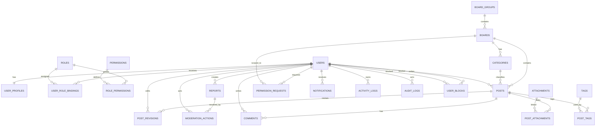
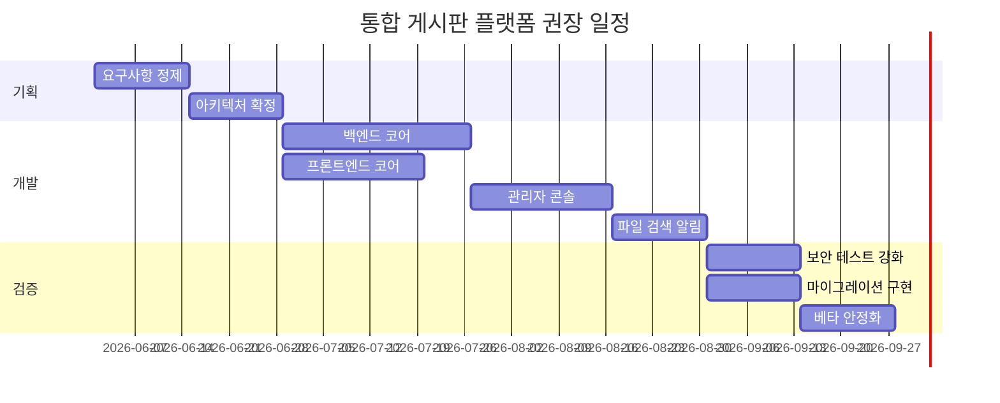

# 통합 게시판 플랫폼 전체 개발 보고서

## 요약

이 보고서는 **통합 게시판 + 멀티 게시판 + 기본 게시판 기능 + 관리자 풀 기능 + 유저 풀 관리 기능**을 하나의 배포 가능한 제품으로 설계하기 위한 실무형 명세서 초안이다. 요구사항은 국내 레거시/실전형 자료인 그누보드의 게시판 그룹·권한 모델, Rhymix의 모듈형 CMS 방향, 그리고 Discourse·NodeBB·Invision 같은 글로벌 커뮤니티 플랫폼의 그룹 기반 권한·모더레이션 모델을 참고해 재구성했다. 기술적으로는 **Next.js 또는 React 프론트엔드, Node.js 백엔드, PostgreSQL, Redis, S3 또는 MinIO, OpenSearch, RabbitMQ**를 기본 권장안으로 제시하며, 운영 환경이 미지정이므로 **Docker Compose 단일 배포**와 **Kubernetes 확장형 배포**를 모두 지원하는 방향이 가장 안전하다. 보안은 OWASP 권고, JWT/OAuth 관련 IETF 표준, NIST 인증 가이드를 기준으로 **세션 쿠키 중심 웹 인증 + 선택적 OAuth/OIDC 연동 + 짧은 수명의 토큰** 조합을 권장하고, 마이그레이션은 **기존 데이터 보존, baseline migration, pg_dump + WAL 아카이빙 + 객체 스토리지 버저닝**을 전제로 설계해야 한다. citeturn23view0turn23view1turn23view2turn23view4turn24view5turn24view6turn24view3turn24view4turn23view11turn35view5turn35view6turn35view7turn35view2turn30view0turn30view1turn32view0turn30view4turn35view0turn30view9turn30view6turn34view11turn34view14turn34view2turn34view3turn33view10turn30view15turn30view16

**목차**

- [범위와 가정](#범위와-가정)
- [요구사항과 권한 모델](#요구사항과-권한-모델)
- [아키텍처와 인터페이스 설계](#아키텍처와-인터페이스-설계)
- [보안과 인증 체계](#보안과-인증-체계)
- [배포 운영과 테스트 전략](#배포-운영과-테스트-전략)
- [마이그레이션과 업그레이드 전략](#마이그레이션과-업그레이드-전략)
- [일정 인력과 참고 사례](#일정-인력과-참고-사례)

## 범위와 가정

본 문서의 대상은 **단일 제품으로 배포 가능한 게시판 플랫폼**이다. 즉, 여러 게시판을 한 인스턴스에서 운영하면서도, 전체 통합 피드와 전역 검색을 제공하고, 게시판별 독립 권한과 운영 정책을 병행할 수 있어야 한다. 이러한 방향은 그누보드의 게시판 그룹 관리, Discourse의 그룹 기반 카테고리 권한, NodeBB의 카테고리별 세분 권한, Rhymix/XE 계열의 모듈·테마 확장 개념을 실전 참고 모델로 삼은 것이다. citeturn23view1turn23view2turn24view5turn24view4turn23view4turn19search13

| 항목 | 값 | 비고 |
|---|---|---|
| 타깃 인프라 | **미지정** | 제약 없음으로 가정 |
| 배포 방식 | **미지정** | 온프렘, 단일 VM, 클라우드, 쿠버네티스 모두 가능 |
| 예상 사용자 수 | **미지정** | 소규모~대규모까지 확장 가능해야 함 |
| SSO 제공자 | **미지정** | OAuth/OIDC 연동 옵션만 정의 |
| 모바일 앱 여부 | **미지정** | 웹 우선, API 우선 설계 |
| 다국어 범위 | **미지정** | ko-KR 기본, i18n 확장 가능 구조 권장 |
| 법적 보존 정책 | **미지정** | 개인정보/삭제/보관 기한은 정책 결정 필요 |
| 첨부파일 정책 | **미지정** | 용량, 형식, 보존 주기 별도 정책화 필요 |

| 권장 산출물 | 설명 |
|---|---|
| 제품 요구사항 명세 | 이 문서 수준의 기능·권한·운영 정책 정의 |
| API 명세 | OpenAPI 기반 REST 명세 |
| DB 스키마 및 마이그레이션 | PostgreSQL 기준 DDL + migration history |
| 프론트엔드 앱 | 사용자 포털 + 관리자 콘솔 |
| 배포 산출물 | Dockerfile, Compose, Helm Chart, env 샘플 |
| 운영 문서 | 백업/복구/알림/장애 대응/배포 체크리스트 |
| 마이그레이션 도구 | legacy import CLI, 검증 리포트, URL redirect 매핑 |
| 테스트 자산 | 단위/통합/E2E/부하 테스트 스크립트 |

이 문서는 **새로 개발하는 제품 사양서**이므로 아래 표의 기능 정의는 특정 솔루션의 기능 복제가 아니라, 여러 공식 문서에 나타나는 검증된 운영 패턴을 재구성한 권장안이다. 그누보드의 그룹/권한 개념, NodeBB의 세분 권한, Discourse의 그룹 기반 카테고리 권한, Invision의 멤버/모더레이터 권한 구조는 본 설계의 참고 기준으로 사용했다. citeturn23view1turn23view2turn24view4turn24view5turn23view11turn24view11

## 요구사항과 권한 모델

### 게시판 핵심 요구사항

| 기능 영역 | 세부 동작 | 주요 엣지케이스 | 기본 권한 모델 |
|---|---|---|---|
| 통합 게시판 | 전체 게시판의 글을 통합 피드, 전역 검색, 인기글, 최신 댓글 흐름으로 제공 | 비공개 게시판 글이 통합 피드/검색에 노출되지 않아야 함 | `post.read`가 허용된 게시판만 합산 |
| 멀티 게시판 | `게시판 그룹 > 게시판 > 카테고리` 3단 구조 지원, 게시판별 스킨/정책/권한 분리 | 게시판 이동 시 URL 리다이렉트, 카테고리 삭제 시 글 재분류 필요 | 게시판 단위 스코프 권한 |
| 글 CRUD | 작성, 임시저장, 수정, 소프트삭제, 복구, 영구삭제, 예약게시, 버전이력 | 동시 수정 충돌, 삭제 후 첨부 참조, 예약 시각 타임존 처리 | 작성자 본인 + 관리자/모더레이터 확장 |
| 댓글/대댓글 | 트리 또는 2단 스레드 선택형, 수정/삭제/복구, 신고 연계 | 원글 삭제 후 댓글 보존 정책, 차단 사용자 댓글 숨김 | 게시판 댓글 권한 + 소유권 검사 |
| 첨부파일 | 다중 첨부, 이미지 미리보기, 다운로드 카운트, 서명 URL, 썸네일 | 본문 삭제 후 고아 파일 정리, 업로드 중단/재시도, 백신 실패 | 업로드/다운로드 분리 권한 |
| 검색 | 제목/본문/태그/작성자/카테고리/기간/정렬 필터, 자동완성, 하이라이트 | 색인 지연, 비공개 글 검색 누락, 삭제 후 색인 정리 | 검색 결과도 원문 권한 검증 필요 |
| 태그 | 전역 태그, 게시판별 허용 태그, 태그 병합/이름변경/비활성화 | 태그 rename 후 기존 링크 유지, 금칙 태그 처리 | 태그 관리 권한 별도 |
| 카테고리 | 계층형 또는 단일형 선택, 게시판별 카테고리 정책 | 카테고리 삭제/병합 시 글의 재매핑 필요 | 게시판 관리자 이상 |
| 공지 | 전역 공지, 게시판 공지, 상단고정, 만료일시, 대상 그룹 지정 | 만료 후 자동 해제, 특정 게시판에서만 고정 노출 | 게시판 관리자 이상 |
| 권한 | 비회원/회원/인증회원/게시판 관리자/모더레이터/운영자/최고관리자 권한 레벨 | 글 읽기 가능하지만 첨부 비허용, 목록 허용/본문 비허용 정책 필요 | deny-by-default |
| 승인 후 게시 | 신규 회원/특정 게시판/특정 태그/첨부 포함 시 승인 대기 가능 | 승인 전 검색 배제, 승인 반려 시 사유 기록/재제출 | 승인 큐 담당자 필요 |
| 신고/블라인드 | 사용자 신고, 임계치 자동 블라인드, 운영자 검토 큐 | 악의적 집단 신고, 이미 삭제된 콘텐츠 신고, 중복 신고 | `report.create`, `moderate.review` 분리 |
| 알림/구독 | 게시판/카테고리/태그/글 단위 구독, 인앱/이메일/푸시 | 차단 관계에서는 알림 억제, 과도한 메일 폭주 방지 | 사용자 개인 설정 + 시스템 제한 |

### 관리자 풀 기능 요구사항

| 기능 영역 | 세부 동작 | 주요 엣지케이스 | 기본 권한 모델 |
|---|---|---|---|
| 관리자 대시보드 | 가입, 차단, 게시글/댓글 추이, 신고 처리량, 인기 게시판, 검색어, 첨부 사용량 | 캐시 지연으로 수치 오차 발생 가능 | `admin.dashboard.read` |
| 사용자 관리 | 조회, 검색, 상태변경, 휴면/탈퇴/차단, 일괄 권한 변경, 계정 병합, 강제 로그아웃 | 삭제 사용자 콘텐츠 보존/익명화 선택 필요 | `user.manage` |
| 역할/권한 관리 | 역할 생성, 권한 묶음, 게시판 스코프, 임시 위임, 만료일이 있는 권한 | 다중 역할 충돌 시 우선순위 규칙 필요 | `role.manage`, `permission.manage` |
| 게시판/카테고리 관리 | 생성/복제/비활성화, 읽기/쓰기 권한, 게시판별 스킨/정책 설정 | 게시판 삭제 시 데이터 이동 또는 아카이브 필요 | `board.manage` |
| 모더레이션 | 신고 큐, 승인 큐, 금칙어, 블라인드, 정지, 경고, 삭제/복구, 사유 기록 | 신고 원본 삭제 후 이력 유지 필요 | `moderate.review` |
| 통계/리포트 | CSV/엑셀 내보내기, 기간 비교, 게시판·유저별 KPI | 개인정보 최소화, 내보내기 접근 통제 | `analytics.read`, `export.data` |
| 배포 설정 | SMTP, OAuth/OIDC, 스토리지, CDN, 검색엔진, 캐시, 큐, feature flag | 설정 변경 시 무중단 reload와 검증 필요 | `system.config.manage` |
| 검색/색인 관리 | 재색인, 부분 색인, 색인 상태 확인 | 대용량 재색인 시 서비스 영향 완화 필요 | `search.manage` |
| 감사 로그 | 관리자 행위, 권한변경, 설정변경, 민감 조회 기록 | 로그 위변조 방지와 보존 주기 필요 | `audit.read` |
| 백업/복구 | 수동/예약 백업, 복구 리허설, 환경 복제 | 부분 복구와 전체 복구 시나리오 분리 필수 | `backup.manage` |

### 유저 풀 관리 기능 요구사항

| 기능 영역 | 세부 동작 | 주요 엣지케이스 | 기본 권한 모델 |
|---|---|---|---|
| 프로필 | 공개 프로필, 소개, 아바타, 배지, 소셜 링크, 공개 범위 설정 | 차단된 사용자에 대한 프로필 노출 정책 필요 | 본인 수정, 관리자 대행 가능 |
| 권한 신청/변경 | 실명 인증, 특정 게시판 접근 권한 신청, 운영자 승인/반려, 변경 이력 | 승인 중복 요청, 사유 미입력, 만료형 권한 필요 | `permission.request.create` |
| 활동 로그 | 내가 쓴 글/댓글, 신고 내역, 로그인 기록, 보안 이벤트 | 개인정보 포함 내역 마스킹 필요 | 본인만 조회 |
| 알림 | 게시판/태그/글/멘션/승인/반려/신고 결과 알림 | 메일 수신거부, 중복 알림, digest 주기 | 개인 설정 |
| 차단/뮤트 | 사용자 차단, 댓글 숨김, DM 차단, 알림 차단 | 상호 차단 시 멘션/답글 처리 규칙 | 본인 설정 |
| 신고 | 글/댓글/프로필/메시지 신고, 처리 상태 추적 | 같은 대상 반복 신고 제한 필요 | 회원 이상 |
| 저장 기능 | 북마크, 나중에 읽기, 구독 스레드, 스크랩 | 삭제된 원문에 대한 북마크 정리 필요 | 회원 이상 |
| 계정 보안 | 비밀번호 변경, 2차 인증, 세션 관리, 디바이스 로그아웃, 계정 삭제/내보내기 | 계정 삭제와 콘텐츠 보존 여부 분리 필요 | 본인 + 관리자 제한 지원 |

위 요구사항은 그누보드의 게시판 그룹/레벨형 권한, NodeBB의 카테고리 세분 권한, Discourse의 그룹 기반 카테고리 접근, Invision의 멤버/모더레이터 권한, Flarum의 그룹 권한 개념을 참고하여 **새 제품에 맞게 정규화**한 것이다. 특히 그룹/역할 기반 권한, 검토 큐, 관리자 대시보드, 게시판 단위 스코프 권한은 이미 여러 성숙한 커뮤니티 플랫폼에서 반복 검증된 패턴이다. citeturn23view1turn23view2turn24view4turn24view5turn24view6turn24view7turn23view11turn24view11turn24view1

### 권한 모델 표

권장 권한 모델은 **RBAC + 게시판 스코프 + 객체 소유권 검사 + 예외 정책**의 조합이다. OWASP는 권한 설계에서 **least privilege**와 **deny by default**를 강조하며, PostgreSQL은 필요 시 테이블별 **Row Security Policy**로 추가 강제 계층을 제공한다. citeturn43search0turn43search3turn43search12turn30view2

기호 설명: `✓ 허용`, `△ 조건부 허용`, `— 비허용`

| 동작 | 비회원 | 일반회원 | 인증회원 | 게시판 관리자 | 모더레이터 | 운영자 | 최고관리자 |
|---|---|---:|---:|---:|---:|---:|---:|
| 공개 게시판 목록 보기 | ✓ | ✓ | ✓ | ✓ | ✓ | ✓ | ✓ |
| 제한 게시판 보기 | — | △ | ✓ | ✓ | ✓ | ✓ | ✓ |
| 글 작성 | — | △ | ✓ | ✓ | ✓ | ✓ | ✓ |
| 본인 글 수정/삭제 | — | ✓ | ✓ | ✓ | ✓ | ✓ | ✓ |
| 타인 글 수정/삭제 | — | — | — | △ | ✓ | ✓ | ✓ |
| 댓글 작성/삭제 | — | △ | ✓ | ✓ | ✓ | ✓ | ✓ |
| 공지 등록 | — | — | — | ✓ | △ | ✓ | ✓ |
| 신고 처리/블라인드 | — | — | — | △ | ✓ | ✓ | ✓ |
| 게시판 설정 변경 | — | — | — | ✓ | — | ✓ | ✓ |
| 사용자 상태 변경 | — | — | — | — | △ | ✓ | ✓ |
| 역할/권한 변경 | — | — | — | — | — | ✓ | ✓ |
| 시스템 설정 변경 | — | — | — | — | — | △ | ✓ |
| 감사 로그 조회 | — | — | — | — | △ | ✓ | ✓ |
| 백업/복구 실행 | — | — | — | — | — | △ | ✓ |

권한 우선순위는 다음과 같이 단순화하는 것이 안전하다. **명시적 금지 > 게시판 스코프 제한 > 역할 허용 > 소유권 허용**. 예를 들어 운영자가 전체 권한을 가져도 특정 민감 게시판은 별도 스코프가 없으면 접근하지 못하도록 설계하는 편이 감사·컴플라이언스에 유리하다. citeturn43search0turn43search3turn24view5turn24view4turn23view11

## 아키텍처와 인터페이스 설계

기본 권장 아키텍처는 **웹 프론트엔드와 API/백오피스를 분리한 3계층 구조**다. 프론트엔드는 Next.js App Router가 제공하는 서버/클라이언트 컴포넌트 분리와 파일시스템 라우팅을 활용하고, 백엔드는 Express를 기본 예시로 들되 팀 규모가 커지면 NestJS의 모듈 구조를 적용하는 것이 유지보수에 유리하다. 데이터 계층은 PostgreSQL을 중심으로 두고, 캐시/레이트리밋은 Redis, 파일은 S3 또는 MinIO, 검색은 PostgreSQL FTS에서 시작해서 필요 시 OpenSearch로 확장하며, 비동기 작업은 RabbitMQ를 기본으로 하고 대규모 분석 이벤트 스트림이 있으면 Kafka를 추가하는 구성이 가장 현실적이다. citeturn35view5turn35view6turn35view7turn34view14turn35view1turn35view2turn30view0turn30view1turn32view0turn30view4turn35view0turn30view9turn30view6turn31search0turn31search2

### 권장 기술 스택 비교

| 계층 | 기본 권장 | 대안 | 장점 | 주의점 | 근거 |
|---|---|---|---|---|---|
| 프론트엔드 | Next.js App Router + React | React + Vite SPA | 서버/클라이언트 컴포넌트 분리, 파일 기반 라우팅, 데이터 fetching과 UI 조합이 자연스러움 | SSR/캐시/재검증 개념을 팀이 이해해야 함 | citeturn35view5turn35view6turn35view7turn13search5 |
| 비동기 상태 관리 | TanStack Query | SWR, Redux Toolkit Query | 서버 상태 fetch/cache/update에 특화 | 캐시 정책을 명확히 정하지 않으면 stale 이슈 발생 | citeturn35view8 |
| 단순 SPA 빌드 | Vite | CRA 계열 | 매우 빠른 개발 서버와 번들링 경험 | SSR이 필요한 경우 별도 프레임워크 필요 | citeturn35view9 |
| 백엔드 | Node.js + Express | NestJS, Spring Boot, Django | Express는 얇고 유연하며 REST API 설계 예시가 단순함 | 큰 팀에서는 구조 표준화가 약할 수 있음 | citeturn34view14turn29search0 |
| 구조화 Node 백엔드 | NestJS | Express 순수 구성 | 모듈 구조와 TypeScript 친화성, Express/Fastify 선택 가능 | 학습곡선이 있음 | citeturn35view1turn35view2 |
| 엔터프라이즈 대안 | Spring Boot | Django | 프로덕션 기능, 메트릭/헬스체크, stand-alone 실행 | Java 생태계 운영비용/개발속도 고려 필요 | citeturn35view3 |
| 배터리 포함 대안 | Django | FastAPI 등 | admin/auth/messages/sessions 등 내장 기능 풍부 | Python 팀이 없으면 전환 비용 큼 | citeturn36view0 |
| 관계형 DB | PostgreSQL | MySQL/MariaDB | FTS, `jsonb`, GIN indexing, RLS, partitioning 지원 | 성능은 인덱스·VACUUM·파티셔닝 설계 의존 | citeturn30view0turn30view1turn30view2turn30view3 |
| 캐시/레이트리밋 | Redis | 메모리 캐시 단독 | 캐시, 키 만료, rate limiting 패턴, keyspace notification 활용 가능 | 메모리 정책과 eviction 튜닝 필요 | citeturn32view0turn32view1turn32view2 |
| 파일 스토리지 | Amazon S3 | MinIO | 버저닝·라이프사이클·서명 URL 등 운영 기능이 성숙 | 비용/네트워크 설계 필요 | citeturn30view4turn30view5 |
| 자체 호환 스토리지 | MinIO | Ceph RGW | S3 호환, 자체 호스팅 가능 | AGPL 라이선스 검토 필요 | citeturn35view0 |
| 검색엔진 | PostgreSQL FTS 시작 | OpenSearch 확장 | 초기 단순 검색은 DB 일원화가 빠름 | 다면검색/오타/분산검색 요구가 커지면 한계 | citeturn30view0turn30view9 |
| 작업 큐 | RabbitMQ | Kafka | ack/confirm과 quorum queue가 운영성에 유리 | 대규모 이벤트 재처리/장기 보관엔 Kafka가 유리 | citeturn30view6turn30view7turn31search0turn31search2 |

### 시스템 구성 흐름도

아래 구조는 환경 제약이 없다는 가정에서의 **권장 참조 아키텍처**다. Kubernetes 없이도 동일 구조를 Docker Compose로 축소 배포할 수 있고, 트래픽 증가 시 HPA와 별도 검색/워커 노드로 확장하면 된다. citeturn38search1turn38search2turn30view10turn30view11

```mermaid
flowchart LR
    U[사용자 브라우저] --> CDN[CDN / WAF / TLS 종단]
    CDN --> ING[Ingress / Reverse Proxy]
    ING --> WEB[Next.js Web]
    ING --> API[Node.js API]
    WEB --> API

    API --> PG[(PostgreSQL)]
    API --> REDIS[(Redis)]
    API --> S3[(S3 / MinIO)]
    API --> SEARCH[(OpenSearch)]
    API --> MQ[(RabbitMQ)]

    MQ --> WORKER[Background Worker]
    WORKER --> PG
    WORKER --> S3
    WORKER --> SEARCH
    WORKER --> PUSH[Email / Web Push / SMS]

    API --> OTEL[OpenTelemetry]
    WEB --> OTEL
    API --> METRICS[/metrics]
    METRICS --> PROM[Prometheus]
    PROM --> GRAF[Grafana]
```

### 주요 API 설계

권장 API 스타일은 `/api/v1` 접두어를 사용하는 REST 기반 구조다. 공개 읽기 API와 인증 API, 관리자 API를 명확히 분리하고, 게시판/글/댓글/파일/권한신청/모더레이션을 자원 단위로 모델링하는 것이 유지보수에 유리하다.

| 메서드 | 경로 | 용도 | 인증 |
|---|---|---|---|
| `POST` | `/api/v1/auth/login` | 로그인 | 공개 |
| `POST` | `/api/v1/auth/logout` | 로그아웃 | 세션 또는 토큰 |
| `GET` | `/api/v1/users/me` | 내 정보 조회 | 사용자 |
| `PATCH` | `/api/v1/users/me/profile` | 프로필 수정 | 사용자 |
| `POST` | `/api/v1/users/me/permission-requests` | 권한 신청 | 사용자 |
| `GET` | `/api/v1/boards` | 게시판 목록 | 공개/권한필터 |
| `POST` | `/api/v1/boards` | 게시판 생성 | 관리자 |
| `PATCH` | `/api/v1/boards/:boardId` | 게시판 수정 | 게시판 관리자 이상 |
| `GET` | `/api/v1/boards/:boardId/posts` | 게시판 글 목록 | 권한필터 |
| `POST` | `/api/v1/boards/:boardId/posts` | 글 작성 | 사용자 |
| `GET` | `/api/v1/posts/:postId` | 글 상세 | 권한필터 |
| `PATCH` | `/api/v1/posts/:postId` | 글 수정 | 작성자 또는 상위 권한 |
| `DELETE` | `/api/v1/posts/:postId` | 글 삭제 | 작성자 또는 상위 권한 |
| `POST` | `/api/v1/posts/:postId/comments` | 댓글 작성 | 사용자 |
| `POST` | `/api/v1/files/presign` | 업로드용 서명 URL 발급 | 사용자 |
| `GET` | `/api/v1/search` | 통합 검색 | 권한필터 |
| `POST` | `/api/v1/reports` | 신고 생성 | 사용자 |
| `POST` | `/api/v1/moderation/actions` | 승인/반려/블라인드/삭제 | 모더레이터 이상 |
| `POST` | `/api/v1/admin/users/:userId/roles` | 역할 변경 | 운영자 이상 |
| `GET` | `/api/v1/admin/audit-logs` | 감사 로그 조회 | 운영자 이상 |

아래 예시는 **핵심 API**인 글 작성 요청/응답 예시다.

```http
POST /api/v1/boards/general/posts
Content-Type: application/json
Cookie: sid=...

{
  "title": "배포판 게시판 설계 초안",
  "body": "<p>통합 게시판과 멀티 게시판 구조를 제안합니다.</p>",
  "categoryId": "cat_notice",
  "tags": ["설계", "배포", "게시판"],
  "attachments": [
    {"fileKey": "tmp/2026/05/29/abc123.pdf"}
  ],
  "isNotice": false,
  "visibility": "board"
}
```

```json
{
  "id": "post_01JY....",
  "boardId": "general",
  "slug": "distribution-board-spec",
  "status": "published",
  "author": {
    "id": "user_101",
    "nickname": "admin"
  },
  "permissions": {
    "canEdit": true,
    "canDelete": true,
    "canReport": false
  },
  "createdAt": "2026-05-29T10:15:00+09:00",
  "updatedAt": "2026-05-29T10:15:00+09:00"
}
```

아래 Express 예시는 **입력 검증 + 권한 검사 + 트랜잭션**을 최소 단위로 결합한 패턴이다. Express는 프로덕션 보안에서 TLS, 입력 검증, 쿠키 보호, Helmet 사용, 취약 의존성 업데이트를 권장하고 있으므로, 이 예시는 반드시 별도의 검증/권한 미들웨어와 함께 사용해야 한다. citeturn34view14turn34view15

```ts
// Node.js / Express 예시
import express from 'express';
import { z } from 'zod';
import { pool } from './db';
import { requireSession, requireBoardPermission } from './auth';

const router = express.Router();

const createPostSchema = z.object({
  title: z.string().min(1).max(200),
  body: z.string().min(1).max(50000),
  categoryId: z.string().nullable().optional(),
  tags: z.array(z.string().min(1).max(50)).max(10).default([]),
  attachments: z.array(z.object({ fileKey: z.string() })).default([]),
  isNotice: z.boolean().default(false),
  visibility: z.enum(['board', 'private', 'secret']).default('board')
});

router.post(
  '/api/v1/boards/:boardId/posts',
  requireSession(),
  requireBoardPermission('post.create'),
  async (req, res, next) => {
    const parsed = createPostSchema.parse(req.body);
    const client = await pool.connect();

    try {
      await client.query('BEGIN');

      const postResult = await client.query(
        `
        INSERT INTO posts (
          board_id, category_id, author_id, title, body_html,
          visibility, is_notice, status
        )
        VALUES ($1, $2, $3, $4, $5, $6, $7, 'published')
        RETURNING id, board_id, title, created_at
        `,
        [
          req.params.boardId,
          parsed.categoryId ?? null,
          req.user.id,
          parsed.title,
          parsed.body,
          parsed.visibility,
          parsed.isNotice
        ]
      );

      const post = postResult.rows[0];

      for (const tag of parsed.tags) {
        await client.query(
          `
          INSERT INTO post_tags (post_id, tag_name)
          VALUES ($1, $2)
          ON CONFLICT DO NOTHING
          `,
          [post.id, tag]
        );
      }

      await client.query('COMMIT');
      res.status(201).json(post);
    } catch (err) {
      await client.query('ROLLBACK');
      next(err);
    } finally {
      client.release();
    }
  }
);

export default router;
```

### 데이터 모델과 ERD

PostgreSQL은 본문 검색용 Full Text Search, 메타데이터용 `jsonb`와 GIN 인덱스, 다중 보관 전략용 partitioning, 그리고 필요 시 RLS까지 지원하므로 게시판 플랫폼의 핵심 저장소로 적합하다. 초기 설계부터 **본문과 뷰 모델을 분리**하고, **soft delete**와 **revision/audit**를 별도 테이블로 두는 것이 운영상 안전하다. citeturn30view0turn30view1turn30view2turn30view3

| 테이블 | 용도 | 주요 필드 | 관계 |
|---|---|---|---|
| `users` | 계정 본체 | email, status, auth_provider | 1:N `user_role_bindings`, 1:1 `user_profiles` |
| `user_profiles` | 프로필/공개 정보 | nickname, avatar_url, bio | `users` 1:1 |
| `roles` | 역할 정의 | code, name | 1:N `role_permissions` |
| `permissions` | 개별 권한 정의 | code, scope_type | 1:N `role_permissions` |
| `user_role_bindings` | 사용자 역할 바인딩 | user_id, role_id, board_id, expires_at | `users`, `roles`, `boards` |
| `board_groups` | 게시판 그룹 | slug, title | 1:N `boards` |
| `boards` | 게시판 | slug, title, visibility, settings_json | 1:N `categories`, `posts` |
| `categories` | 게시판 내 분류 | board_id, title, sort_order | 1:N `posts` |
| `posts` | 글 본체 | title, body_html, status, tsv, deleted_at | N:1 `users`, `boards` |
| `post_revisions` | 글 수정 이력 | post_id, editor_id, diff_json | N:1 `posts` |
| `comments` | 댓글 | post_id, parent_comment_id, body_html | N:1 `posts` |
| `attachments` | 파일 메타 | storage_key, mime, size, sha256 | N:M `posts` |
| `tags` | 태그 마스터 | slug, title | N:M `posts` |
| `reports` | 신고 | target_type, target_id, reason_code | N:1 `users` |
| `moderation_actions` | 검토 결과 | report_id, action, actor_id, note | N:1 `reports` |
| `permission_requests` | 권한 신청 | requested_role, board_id, status | N:1 `users` |
| `notifications` | 인앱/이메일 알림 | user_id, type, payload_json, read_at | N:1 `users` |
| `activity_logs` | 사용자 본인 이력 | user_id, event_type, payload_json | N:1 `users` |
| `audit_logs` | 운영 감사 로그 | actor_id, action, target_type, payload_json | N:1 `users` |
| `user_blocks` | 차단 관계 | blocker_id, blocked_id, mode | `users` self-reference |



아래 SQL은 최소 핵심 스키마 예시다. PostgreSQL FTS를 염두에 두고 `tsv`와 GIN 인덱스를 미리 넣는 편이 이후 검색 전환 비용을 줄인다. citeturn30view0turn30view1

```sql
CREATE TABLE boards (
  id            BIGSERIAL PRIMARY KEY,
  group_id       BIGINT NULL,
  slug           VARCHAR(100) UNIQUE NOT NULL,
  title          VARCHAR(200) NOT NULL,
  visibility     VARCHAR(20) NOT NULL DEFAULT 'public',
  settings_json  JSONB NOT NULL DEFAULT '{}'::jsonb,
  created_at     TIMESTAMPTZ NOT NULL DEFAULT now()
);

CREATE TABLE posts (
  id              BIGSERIAL PRIMARY KEY,
  board_id         BIGINT NOT NULL REFERENCES boards(id),
  category_id      BIGINT NULL,
  author_id        BIGINT NOT NULL,
  title            VARCHAR(200) NOT NULL,
  body_html        TEXT NOT NULL,
  body_text        TEXT NOT NULL,
  visibility       VARCHAR(20) NOT NULL DEFAULT 'board',
  status           VARCHAR(20) NOT NULL DEFAULT 'published',
  is_notice        BOOLEAN NOT NULL DEFAULT FALSE,
  comment_count    INTEGER NOT NULL DEFAULT 0,
  view_count       INTEGER NOT NULL DEFAULT 0,
  deleted_at       TIMESTAMPTZ NULL,
  created_at       TIMESTAMPTZ NOT NULL DEFAULT now(),
  updated_at       TIMESTAMPTZ NOT NULL DEFAULT now(),
  tsv              tsvector GENERATED ALWAYS AS
                   (to_tsvector('simple', coalesce(title,'') || ' ' || coalesce(body_text,''))) STORED
);

CREATE INDEX idx_posts_board_created_at ON posts(board_id, created_at DESC);
CREATE INDEX idx_posts_tsv ON posts USING GIN (tsv);
CREATE INDEX idx_posts_status_visible ON posts(status, deleted_at);
```

## 보안과 인증 체계

웹 게시판 플랫폼은 **브라우저 세션**, **외부 API 토큰**, **SSO/OAuth 연동**이 혼합되기 쉽다. JWT는 IETF RFC 7519에 정의된 compact claims 형식이고, OAuth 2.1 초안과 RFC 9700은 현대 환경에서 더 안전한 OAuth 운영 관행을 제시한다. 동시에 OWASP와 NIST는 인증자 관리, 세션 보안, 재인증과 최소 권한 원칙을 함께 보라고 권고한다. citeturn34view0turn34view1turn34view2turn34view3turn34view11turn43search5

### 인증 방식 비교

| 방식 | 장점 | 단점 | 권장 사용처 | 권장도 | 참고 |
|---|---|---|---|---|---|
| 서버 세션 + 보안 쿠키 | 브라우저 중심 서비스에 안전하고 단순함, 세션 무효화가 쉬움 | 상태 저장소 필요, API 소비자에는 덜 편리 | 관리자 콘솔, 일반 웹 포털 | **매우 높음** | citeturn34view11turn34view14 |
| JWT Access Token | stateless, API/모바일에 적합 | 토큰 탈취 시 회수 전략이 복잡함, 장수명 토큰은 위험 | 외부 공개 API, 모바일 앱, 내부 서비스 간 단기 호출 | **중간** | citeturn34view0turn34view2 |
| OAuth/OIDC | 구글/애플/기업 IdP 연동이 쉬움, 권한 위임 모델 표준화 | 도입 복잡도와 운영 정책이 증가 | SSO, 소셜 로그인, B2B 연동 | **높음** | citeturn34view1turn34view2 |

**권장 조합**은 다음과 같다.
브라우저 웹은 **서버 세션 + `HttpOnly` + `Secure` + `SameSite` 쿠키**를 기본으로 사용한다. 외부 앱이나 공개 API는 **짧은 수명의 JWT access token**을 별도 발급하며, 기업 또는 소셜 로그인은 **OAuth/OIDC**로 연결한다. 세션은 idle timeout과 absolute timeout을 함께 두고, 민감 작업이 연속되거나 관리자 작업일 때는 재인증을 요구하는 편이 안전하다. citeturn34view11turn34view14turn34view2turn34view3

### 권장 보안 통제 표

| 보안 영역 | 권장 통제 | 구현 요점 | 참고 |
|---|---|---|---|
| 비밀번호 저장 | 적응형·검증된 비밀번호 해시 사용 | 평문/가역 암호화 금지, 재설정 토큰 짧은 만료, 장문 비밀번호 허용 | citeturn34view4turn34view5 |
| 세션 보안 | 쿠키 보안 속성, 세션 재생성, idle/absolute timeout | 로그인 직후 세션 ID 재생성, 관리 세션은 더 짧게 | citeturn34view11turn34view14 |
| 권한 설계 | 최소 권한, 기본 거부, 객체 소유권 검사 | 게시판 스코프와 글/댓글 소유권을 함께 확인 | citeturn43search0turn43search3turn43search12turn30view2 |
| 입력 검증 | 서버 측 allowlist 검증과 길이 제한 | HTML 리치텍스트는 별도 sanitizer 파이프라인 필요 | citeturn34view6 |
| 파일 업로드 | 확장자 allowlist, MIME 검증, 파일명 재생성, 크기 제한, 권한 통제 | 업로드 후 비동기 백신 검사, 사설 버킷 보관, 서명 URL 다운로드 | citeturn34view7turn30view4turn35view0 |
| XSS 방어 | 출력 인코딩, 리치텍스트 sanitize, CSP, 보안 헤더 | inline script 최소화, iframe/embed 화이트리스트 적용 | citeturn34view8turn34view12turn34view15 |
| CSRF 방어 | 상태 변경 요청은 CSRF 토큰 또는 same-site 쿠키 전략 병행 | 세션 기반 웹은 반드시 CSRF 보호 적용 | citeturn34view9turn34view11 |
| SQL Injection 방어 | 파라미터 바인딩, ORM/raw SQL 리뷰, 동적 SQL 최소화 | 검색/정렬 파라미터는 allowlist enum으로 제한 | citeturn34view10 |
| 의존성 보안 | 취약 라이브러리 패치 자동화 | Express 생태계는 최근에도 body-parser, multer, path-to-regexp 관련 보안 패치가 배포됨 | citeturn29search5turn29search7turn29search8 |
| 보안 로깅 | 인증/권한/민감 행위에 대한 보안 로그 | 관리자 권한 부여, 잠금, 삭제, 복구, 설정 변경을 필수 기록 | citeturn34view13 |
| HTTP 보안 헤더 | Helmet 기반 기본 헤더 세트 적용 | `CSP`, `HSTS`, `X-Content-Type-Options` 등 명시 | citeturn34view14turn34view15 |

실제 구현에서는 **API 계층에서 RBAC/ABAC를 검사하고, DB 계층에서는 민감 자원에 대해 추가 보호를 넣는 이중 방어**가 좋다. 예를 들어 `posts.visibility = secret` 인 레코드는 API에서 먼저 소유권/권한을 확인하고, 필요 시 PostgreSQL RLS 정책으로도 재차 제한할 수 있다. 이렇게 해야 BOLA/Broken Access Control 류의 실수를 줄일 수 있다. citeturn43search0turn43search12turn30view2

## 배포 운영과 테스트 전략

배포 환경이 미지정이므로 **두 단계 전략**이 가장 현실적이다. 개발·PoC·소규모 운영은 Docker Compose, 본운영·고가용성은 Kubernetes로 간다. Docker Compose는 멀티 컨테이너 앱 정의와 실행에 적합하고, Kubernetes는 HPA와 Ingress를 통해 트래픽에 따라 워크로드를 수평 확장할 수 있다. CI/CD는 GitHub Actions의 runner와 environment protection rule을 활용해 빌드-검증-승인-배포 흐름을 표준화하는 편이 안전하다. citeturn38search1turn38search2turn30view10turn30view11turn33view0turn33view2

### 운영 설계 표

| 영역 | 기본 설정 | 확장형 설정 | 참고 |
|---|---|---|---|
| CI/CD | GitHub-hosted runner에서 lint/unit/build 실행 | 배포는 self-hosted runner 또는 전용 deploy runner 사용 | citeturn33view0turn33view1 |
| 배포 승인 | staging 자동 배포 후 smoke/perf/security gate | production은 environment protection rule + reviewer 승인 | citeturn33view2 |
| 컨테이너화 | `Dockerfile` + `docker compose` | Helm chart + K8s Deployment/StatefulSet | citeturn38search1turn38search2turn38search6 |
| 인그레스/TLS | Nginx/Traefik reverse proxy | K8s Ingress + cert-manager 또는 외부 LB | citeturn30view11 |
| 웹/API 확장 | 단일 인스턴스 | stateless app + HPA | citeturn30view10 |
| 캐시/세션 | Redis 단일 인스턴스 | Sentinel/Cluster 또는 managed Redis | citeturn32view0turn32view1 |
| 검색 | PostgreSQL FTS 또는 단일 OpenSearch | 전용 OpenSearch 노드 분리 | citeturn30view0turn30view9 |
| 파일 보관 | S3/MinIO private bucket + presigned URL | 버저닝 + lifecycle + 백신 스캔 워커 | citeturn30view4turn30view5turn35view0 |
| 백업/복구 | nightly `pg_dump -Fc` + 객체 스토리지 스냅샷 | WAL archiving + PITR + 주기적 복구 리허설 | citeturn30view15turn30view16turn30view4 |
| 모니터링 | Prometheus + Grafana | OpenTelemetry 기반 trace/metric/log 통합 | citeturn30view12turn30view13turn30view14 |
| 메시지 큐 | RabbitMQ 기본 | 대규모 이벤트 분석은 Kafka 추가 | citeturn30view6turn30view7turn31search0turn31search2 |

### 배포 파이프라인 흐름도

```mermaid
flowchart LR
    GIT[Git Push / PR] --> CI[GitHub Actions CI]
    CI --> LINT[Lint / Unit Test]
    LINT --> INT[Integration Test]
    INT --> BUILD[Container Build]
    BUILD --> REG[Container Registry]
    REG --> STG[Staging Deploy]
    STG --> SMOKE[Smoke Test]
    SMOKE --> PERF[k6 / Playwright Gate]
    PERF --> APPROVAL[Required Reviewer]
    APPROVAL --> PROD[Production Deploy]
    PROD --> OBS[Prometheus / Grafana / OTel]
```



### 테스트 전략

| 테스트 층위 | 목적 | 권장 도구 | 배포 게이트 | 참고 |
|---|---|---|---|---|
| 유닛 테스트 | 도메인 규칙, validator, policy, formatter 검증 | Jest | PR 필수 | citeturn33view8 |
| 통합 테스트 | DB/Redis/Queue/Storage adapter 검증 | Jest + Testcontainers + Supertest | main merge 필수 | citeturn37search4turn37search1 |
| E2E 테스트 | 로그인, 게시글 작성, 댓글, 신고, 권한 시나리오 | Playwright 우선, Cypress 대안 | staging 필수 | citeturn33view6turn33view7turn37search2 |
| 회귀 테스트 | 관리자 콘솔, 스코프 권한, 공지/만료, 검색 재색인 | Playwright 시나리오 세트 | release candidate 필수 | citeturn33view6turn33view7 |
| 성능 테스트 | 읽기/쓰기/검색/업로드/모더레이션 피크 검증 | k6 | pre-prod 필수 | citeturn33view4turn33view5 |
| 운영 헬스체크 | `/health`, `/ready`, queue lag, DB ping, search ping | Prometheus scrape + synthetic check | 상시 | citeturn30view12turn30view14 |

### 성능 테스트 계획

k6 문서는 threshold를 이용해 **응답 시간과 오류율을 자동 게이트**로 묶는 방식을 권장한다. 따라서 게시판 플랫폼도 최소한 `error_rate`, `p95`, `p99`, 주요 엔드포인트별 임계치를 release gate로 선언하는 것이 좋다. citeturn33view4turn33view5

| 시나리오 | 부하 모델 | 권장 시작 목표 | 비고 |
|---|---|---|---|
| 읽기 피크 | 동시 사용자 1,000, 목록/상세 80% | 목록 p95 < 250ms, 상세 p95 < 300ms | 캐시 적중률 관찰 |
| 쓰기 피크 | 분당 글 100건 + 댓글 500건 | 글 작성 p95 < 500ms, 댓글 p95 < 300ms | 트랜잭션 락 확인 |
| 검색 버스트 | 검색 50 RPS | 검색 p95 < 700ms, 오류율 < 1% | 색인 지연 별도 측정 |
| 업로드 버스트 | 동시 업로드 20건, 파일 50MB 이하 | 업로드 실패율 < 0.5% | 백신 큐 지연 포함 |
| 모더레이션 스톰 | 신고 200건/분 | 큐 적체 5분 이내 해소 | 워커 autoscale 확인 |
| 복구 드릴 | DB 장애/노드 교체/PITR | RTO 30분 이내, RPO 5분 이내 | 복구 리허설 문서화 |

## 마이그레이션과 업그레이드 전략

기존 게시판에서 넘어올 때 가장 위험한 지점은 **권한 모델 변환**, **파일 경로 보존**, **URL 호환성**, **삭제/차단 사용자 처리**, **검색 색인 재구성**이다. PostgreSQL은 `pg_dump`와 `pg_restore`, WAL 아카이빙 기반 PITR을 제공하고, Prisma Migrate는 baseline migration과 SQL history 관리가 가능하므로, 신규 제품 전환은 “기존 데이터 보존” 전제 하에서 **추출 → 정규화 → 적재 → 검증 → 리허설 → 컷오버** 순서로 수행하는 것이 안전하다. citeturn30view15turn30view16turn33view9turn33view10turn27search0

### 권장 마이그레이션 단계

| 단계 | 작업 | 산출물 |
|---|---|---|
| 사전 조사 | 기존 게시판 종류, 테이블 구조, 회원 등급, 첨부 저장 방식, URL 패턴 인벤토리 | 데이터 인벤토리 문서 |
| 스키마 매핑 | legacy 필드를 신규 테이블에 매핑, 불일치 필드 처리 전략 수립 | mapping spec |
| baseline 생성 | 신규 DB의 초기 스키마를 baseline migration으로 고정 | 초기 migration |
| 추출 | 회원, 게시판, 글, 댓글, 첨부, 권한, 공지, 메시지 추출 | raw dump / temp files |
| 변환 | HTML 정리, 인코딩 통일, 태그/카테고리/등급 정규화 | transform 결과 |
| 적재 | 배치 단위 import, `legacy_system`, `legacy_pk`, `import_batch_id` 저장 | import log |
| 검증 | 건수 검증, 고아 데이터 확인, 첨부 sha/checksum 확인, 샘플 비교 | validation report |
| 리허설 | staging에서 전체 재현, 성능/권한/URL/첨부 확인 | cutover rehearsal report |
| 컷오버 | 쓰기 중지, 최종 diff import, DNS/프록시 전환 | production cutover |
| 롤백 준비 | pre-cutover 백업, 원복 절차, redirect 정책 | rollback playbook |

### 권장 매핑 예시

| 레거시 개념 | 신규 모델 | 주의사항 |
|---|---|---|
| 회원 등급/레벨 | `roles` + `user_role_bindings` | 단일 숫자 레벨을 스코프 있는 역할로 분해 |
| 게시판 그룹 | `board_groups` | 그룹 관리자 개념을 역할로 승격 |
| 게시판 | `boards` | slug와 기존 bbs id를 모두 보존 |
| 분류/카테고리 | `categories` | 다단계 미지원 시스템은 1단으로 수렴 |
| 게시글 | `posts` + `post_revisions` | 삭제/비밀글/공지 상태 전환 규칙 매핑 |
| 댓글 | `comments` | parent 없는 모델이면 1단 댓글로 변환 |
| 첨부파일 | `attachments` + `post_attachments` | 파일 경로와 원본 파일명 분리 저장 |
| 권한 숫자값 | `permissions` | 읽기/쓰기/댓글/다운로드를 별도 권한으로 분리 |
| 공지 | `posts.is_notice` 또는 `notices` | 만료일이 없었던 데이터는 영구 공지로 이관 |
| 기존 URL | redirect mapping | SEO와 북마크 보존 위해 301 경로 테이블 유지 |

### 데이터 정합성 검증 표

| 검증 항목 | 방법 | 통과 기준 |
|---|---|---|
| 회원 수 | 원본/신규 row count 비교 | 오차 0 또는 승인된 제외 건만 존재 |
| 게시판/카테고리 수 | 구조별 count 비교 | 설계된 병합/삭제 이외 동일 |
| 글/댓글 수 | status별 count 비교 | 공개/비공개/삭제 상태까지 일치 |
| 첨부 존재성 | DB 메타와 object storage key 대조 | 누락 0 |
| 권한 재현 | 샘플 사용자로 board별 접근 비교 | 승인된 정책과 동일 |
| URL 품질 | 랜덤 샘플 1,000건 redirect 검사 | 404 0.5% 미만 |
| 검색 품질 | 상위 키워드 샘플 비교 | 허용된 차이만 존재 |
| 성능 | import 이후 목록/상세/검색 측정 | 기존 대비 열화 허용 범위 내 |

### 버전 관리 전략

| 대상 | 전략 |
|---|---|
| 애플리케이션 버전 | Semantic Versioning 권장 |
| API 버전 | `/api/v1` 경로 고정, breaking change 시 `/v2` 분리 |
| DB 변경 | SQL migration 파일을 Git에 버전 관리 |
| baseline | legacy 전환 시 초기 baseline migration 생성 |
| 롤백 | backward-compatible 2단계 migration 원칙, destructive change 지연 적용 |
| feature rollout | feature flag 기반 점진 배포 |
| import 재실행 | `import_batch_id`와 idempotent upsert 설계 |

Prisma Migrate는 migration history를 DB 테이블과 `.sql` 파일로 관리하고, baseline migration을 통해 기존 DB를 “이미 적용된 상태”로 인식하게 만들 수 있다. 이 접근은 기존 게시판을 제품화된 신규 플랫폼으로 옮길 때 특히 유용하다. citeturn33view9turn33view10turn27search0turn27search12

## 일정 인력과 참고 사례

### 개발 단계와 산출물

아래 일정은 **기능 전체 범위** 기준의 권장 추정치다. 전제는 주 5일, 중급 이상 인력, 초기 게시판 수 20개 이하, 검색/첨부/SSO/운영 콘솔까지 포함한 범위다. 단순 MVP는 10~14주까지 줄일 수 있지만, 본 요청처럼 **관리자 풀 기능 + 유저 풀 관리 기능 + 배포판 산출물**까지 포함하면 현실적으로 **18~24주**가 적정하다.

| 단계 | 주요 산출물 | 기간 추정 |
|---|---|---|
| 기획 정제 | 요구사항 명세, IA, 권한 정책서 | 2주 |
| 아키텍처 확정 | ADR, ERD, API 초안, 배포 토폴로지 | 2주 |
| 백엔드 코어 | auth, users, boards, posts, comments, permissions | 4주 |
| 프론트엔드 코어 | 목록/상세/작성/검색/프로필 UI | 3주 |
| 관리자 콘솔 | 대시보드, 사용자/권한/게시판/모더레이션 | 3주 |
| 파일/검색/알림 | S3/MinIO, 검색 색인, 알림센터/메일 | 2주 |
| 보안/테스트 강화 | E2E, 퍼포먼스, 감사 로그, hardening | 2주 |
| 마이그레이션 구현 | import 도구, redirect, 검증 리포트 | 2주 |
| 베타/안정화 | 운영 리허설, 문서화, 컷오버 준비 | 2주 |

### 권장 인력 구성

| 역할 | 권장 인원 | 투입 방식 | 핵심 책임 |
|---|---:|---|---|
| PO/PM | 0.5~1 | 전 기간 | 우선순위, 정책 의사결정, 일정 관리 |
| 아키텍트/테크리드 | 1 | 전 기간 | 권한 모델, 보안, 아키텍처, 코드 기준 |
| 백엔드 개발자 | 2 | 핵심 기간 풀타임 | 도메인/API/DB/모더레이션/마이그레이션 |
| 프론트엔드 개발자 | 2 | 핵심 기간 풀타임 | 사용자 포털, 관리자 콘솔, 권한 기반 UI |
| DevOps/SRE | 0.5~1 | 중후반 집중 | CI/CD, 관측성, 백업/복구, 배포 |
| QA 자동화 | 1 | 중후반 집중 | 테스트 설계, 회귀, 성능, UAT |
| UX/UI 디자이너 | 0.5 | 초중반 중심 | 글쓰기/관리자/권한 신청 UX |
| 데이터 마이그레이션 엔지니어 | 0.5 | 후반 집중 | legacy mapping, 검증, 컷오버 |

### 타임라인 예시



### 주요 리스크

| 리스크 | 영향 | 완화 방안 |
|---|---|---|
| 권한 설계 복잡도 증가 | 기능 누락, 보안 사고 | 역할/권한 카탈로그를 먼저 고정하고 자동 테스트 작성 |
| 리치텍스트/XSS 처리 | 계정 탈취, 악성 스크립트 | sanitizer + CSP + 출력 인코딩 + 허용 embed만 사용 |
| 업로드 저장소 비용/안전성 | 장애/비용 급증 | 버저닝, lifecycle, 파일 크기 제한, 비동기 스캔 |
| 검색 인덱스 지연 | 사용자 체감 저하 | 재시도 큐, 색인 상태 대시보드, fallback 검색 |
| 마이그레이션 품질 | 데이터 손실/권한 붕괴 | 샘플 검증, rehearsal, cutover freeze, rollback plan |
| 관리자 기능 과도 확장 | 일정 지연 | MVP와 Full scope를 분리, admin backlog 단계화 |
| 운영 복잡도 | 배포 실패, 장애 대응 미흡 | Compose→K8s 2단 전환, 관측성 선구축 |
| 의존성 취약점 | 보안 사고 | lockfile 고정, 정기 업데이트, CI 보안 게이트 |

### 오픈소스와 상용 참고 사례 비교

아래 표는 **공식 문서·공식 사이트·공식 저장소**를 우선 출처로 삼아 정리한 비교표다. 평가는 “이 문서의 목표인 **통합 게시판 플랫폼 전체 개발 참고용**” 관점의 실무적 판단이다.

| 솔루션 | 유형 | 라이선스/과금 | 공식적으로 확인되는 강점 | 이 설계와의 적합도 | 한계 또는 주의점 |
|---|---|---|---|---|---|
| 그누보드5 citeturn23view0turn23view1turn23view2turn23view3turn40search1turn44search0 | 국내 오픈소스 | LGPL 계열 오픈소스 | 게시판/회원/관리 기능이 한국형 운영에 익숙하고, 게시판 그룹·권한 레벨 개념이 직관적임 | **높음** | 현대적 API/관측성/클라우드 운영 패턴은 별도 설계 필요 |
| Rhymix citeturn23view4turn23view5turn18search8 | 국내 오픈소스 CMS | GPLv2 or later | 모듈·테마 구조, CMS 기반 확장성, 꾸준한 업데이트, 한국어 문서 | **높음** | 게시판 전용 제품이 아니라 CMS 성격이 강함 |
| XpressEngine citeturn19search1turn19search13turn19search7 | 국내 오픈소스 CMS | LGPL v3+ | 커뮤니티/다양한 게시판/다수 게시판에 공통 설정을 적용하는 구조를 공식 매뉴얼이 소개 | **중간** | 레거시 성격이 있어 신규 제품의 기준점으로는 보수적으로 봐야 함 |
| Discourse citeturn23view6turn24view5turn24view6turn24view7turn39search4 | 글로벌 오픈소스 커뮤니티 플랫폼 | GPL-2.0+ | 그룹 기반 카테고리 권한, 리뷰 큐/플래그 처리, 신뢰도 시스템, 실시간 채팅/테마 | **매우 높음** | 전통적 BBS보다 토론 포럼 UX에 최적화 |
| NodeBB citeturn23view7turn15search0turn24view3turn24view4turn39search11 | 글로벌 오픈소스 포럼 | GPL-3.0 | 실시간 알림, 웹소켓, REST API, 카테고리별 세분 권한, 관리자/그룹 관리 | **매우 높음** | 제품 코어가 실시간 포럼 지향이라 한국형 BBS UX는 추가 커스터마이즈 필요 |
| phpBB citeturn17search9turn17search3turn17search4turn17search10turn39search14 | 글로벌 오픈소스 포럼 | GPL-2.0 | 전통적 포럼 기능, 권한 역할, 첨부, 방대한 운영 경험 | **중간** | 현대적 관리자 UX/API/실시간성은 별도 보강 필요 |
| XenForo citeturn23view9turn24view8turn24view9turn42view1 | 상용 포럼 | 자체 호스팅 라이선스 + 클라우드 | self-hosted와 cloud를 모두 제공, forum/resource/media/enhanced search 등 제품 구성이 명확 | **높음** | 상용 라이선스 비용, 소스/개조 자유도 제약 |
| Invision Community citeturn23view11turn24view11turn42view0 | 상용 커뮤니티 스위트 | 클라우드 요금제 중심 | forums/blogs/clubs/downloads/SSO/AI spam protection 등 제품군이 넓고 멤버 권한 문서가 상세함 | **높음** | SaaS/클라우드 지향성이 강하고 비용 구조 검토 필요 |
| vBulletin citeturn23view10turn24view10 | 상용 포럼 | self-hosted 구매 + cloud | 단일 권한 시스템, 관리자/모더레이터/사용자 제어판, 포럼/그룹/블로그 통합 | **중간** | 현대 개발자 경험과 확장성 측면에서는 비교 검토 필요 |

**정리하면**, 신규 자체개발의 참고 기준으로는 **Discourse와 NodeBB의 권한/모더레이션 구조**, 국내 운영 관점에서는 **그누보드와 Rhymix의 한국형 게시판 운영 감각**, 상용 구매 비교 기준으로는 **XenForo와 Invision Community**가 가장 유효하다. 빠른 PoC라면 NodeBB/Discourse를 참조한 API-first 구조가 좋고, 국내 마이그레이션 대응까지 고려하면 GNUBoard/Rhymix 계열 데이터 모델에 대한 import 계층을 처음부터 분리해 두는 편이 유리하다. Flarum도 권한/확장 구조가 단순하고 MIT 라이선스라는 장점이 있어 경량 대안으로 참고할 수 있지만, 본 요청 수준의 “풀 기능 운영판” 기준에서는 Discourse·NodeBB·XenForo 비교 우선순위가 더 높다. citeturn24view1turn24view2turn39search1turn39search9turn24view5turn24view6turn24view4turn23view1turn23view4turn42view1turn42view0